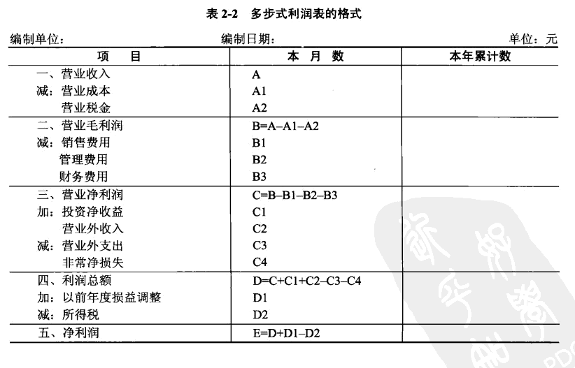
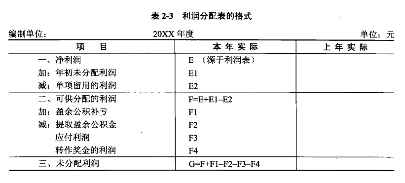

## 经济管理与应用数学

**这玩意不考！！！！！！！没啥用！！！！！！**

### 会计报表

#### 利润表

#### 利润分配表

### **现代企业组织结构**

第一阶段直线制到事业部制，第二阶段为组织结构的扁平化（矩阵制、团队型组织、网络型组织）

#### U型结构

直线职能制结构，按职能划分部门的纵向一体化的职能结构。例如销售、开发等部门。各部门独立性很小，均由企业高层领导直接进行管理，即企业实行集中控制和统一指挥。适用于市场稳定、产品品种少、需求价格弹性较大的环境。U型结构的缺点在于，高层领导由于陷入了日常开发和经营活动，缺乏精力考虑长远的战略发展，且行政机构越来越庞大，各部门协调越来越困难，造成信息和管理成本上升。

#### M型组织

战略决策和经营决策分离。根据业务按产品、服务、客户、地区等设立半自主性的经营事业部，公司的战略决策和经营决策由不同的部门和人员负责。高层领导负责企业长期经营决策。

#### 矩阵制结构

把既有按职能划分的垂直领导系统，又有按产品(项目)划分的横向领导关系的结构，称为矩阵制结构。

#### H型结构

H型结构是一种多个法人实体集合的母子体制，母子之间主要靠产权纽带来连接。

#### 模拟分权结构

模拟分权是一种介于U型结构和M型结构之间的结构形式，其优点除了调动各开发单位的积极性外，就是解决企业规模过大不易管理的问题。

#### 团队型架构（SMT）

团队型结构中以自我管理团队(Self-Managed Team,SMT)作为基本的构成单位。

#### 网络型结构

网络型组织(虚拟企业)是由多个独立的个人、部门和企业为了共同的任务而组成的联合体
