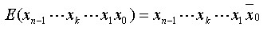

# **计算机的组成** 

计算机 = 控制器、运算器、内外存、IO

## 分类法：

Flynn分类：数据流、指令流、多倍性进行分类。 SISD（流水线单处理机）、SIMD（GPU）、MISD（理论上的）、MIDM（服务器、计算机）

- 单指令流单数据流机器(SISD)

  SISD机器是一种传统的串行计算机，其硬件不支持任何形式的并行计算，所有的指令都是串行执行，并且在某个时钟周期内，CPU只能处理一个数据流。早期的计算机都是SISD机器。

- 单指令流多数据流机器(SIMD)

  SIMD是采用一个指令流处理多个数据流。这类机器在数字信号处理、图像处理，以及多媒体信息处理等领域非常有效。Intel处理器实现的MMXTM、SSE(Streaming SIMD Extensions)、SSE2及SSE3扩展指令集，都能在单个时钟周期内处理多个数据单元。也就是说人们现在用的**单核计算机基本上都属于SIMD机器**、**还有GPU**。

- 多指令流单数据流机器(MISD)

  MISD是采用多个指令流来处理单个数据流。在实际情况中，采用多指令流处理多数据流才是更有效的方法，因此MISD只是作为理论模型出现，没有实际应用。

- 多指令流多数据流机器(MIMD)

  MIMD机器可以同时执行多个指令流，这些指令流分别对不同数据流进行操作。**最新的多核计算平台就属于MIMD的范畴，例如Intel和AMD的双核处理器**。

冯氏： 以单位时间内处理的最大二进制位数分类

Handler分类： 以指令执行并行度和流水线进行分类

Kuck分类： 与Flynn类似，强调流的概念而非数据流

## 存储器：

### 存储方式： 

- 顺序存储（线性存储/线性读取，磁带等）
- 直接存取（每个数据块唯一标识，直接移动到位置存取）
- 随机存取（与访问序列无关，随机存取）
- 相联存取（随机存取的一种方式，根据其内容而非地址来确定位置，cache使用该方式）

## 主存：

RAM（DRAM（一直刷新，不刷就丢）、SRAM（不断电不丢））、ROM（只读）、PROM（特殊设备可写）、EPROM（多次写，紫外线照射清数据后可写）、E2PROM（不需要清数据可写）、Flash（介于EPROM与E2PROM之间），CAM（写入时自动选择未用空单元，读取时不需要地址，给出内容即可读取）

## 辅存：

### 磁带

磁盘（磁盘的数据传输速率是指磁头找到地址后，单位时间写入或读出的字节数。R=TB/T，其中：TB为一个磁道上记录的字节数，T为磁盘每转一圈所需的时间，R为数据传输速率。）

### RAID冗余阵列，有8个级别：

- ***\*RAID0\****，啥也没有，非冗余，100%利用率
- ***\*RAID1\****，镜像拷贝，最安全，50%利用率
- RAID2，海明校验码，独立校验盘，需要访问所有盘，适合大量数据IO，不适合小量数据IO，实际很少使用。
- RAID3、4， 奇偶校验，独立校验盘，读取快，写入需要计算校验，很慢
- ***\*RAID5\****，奇偶校验，校验信息分布所有盘，适合IO请求率高，不适合高数据传输率，***\*写入慢，读取快\****，要求盘 N >= 3，最多允许坏1个盘（一份数据，分为N-1块存，再加一份校验数据，共N份分别存N个盘上，就算坏一个盘还可以反响计算得出），利用率 （N-1）/ N
- RAID6，RAID5基础上再加一个校验盘，要求盘N >= 4，最多允许坏2个盘，写更慢读快，利用率 (N - 2) / N
- RAID7，最优化的异步高I/O速率和高数据传输率的磁盘阵列
- RAID10，高可靠性与高性能的组合，要求N >= 4， RAID 0+ RAID 1，性价比较高，N/2磁盘利用率，N/2块盘同时写入，N块盘同时读取，先按RAID 0 分成两组，再分别对两组按RAID 1 方式镜像。
- RAID50，先5在0，类似
- RAID60，先6再0，类似

 

### 光盘

CD（Compact Disk，压缩盘）、CD-ROM（Compact Disc Read-Only Memory，只读压缩盘）、CD-I（CD-Interactive，交互式光盘）、DVD（Digital Video Disc，数字视频光盘）以及 EOD（Erasable Optical Disk，可擦除光盘）。

CD-ROM的读取目前有三种方式：恒定角速度、恒定线速度和部分恒定角速度

## Cache

CPU高速存储与内存之间的速率差异的折中，在CPU与内存间加上Cache、容量小但速度快。

### 命中率：

如果以h代表对Cache的访问命中率(“1-h”称为失效率，或者称为未命中率)，t1表示Cache的周期时间，t2表示内存的周期时间，以读操作为例，使用“Cache+主存储器”的系统的平均周期为t3。

 

 例如：设某计算机主存的读/写时间为100ns，有一个指令和数据合一的Cache，已知该Cache的读/写时间为10ns，取指令的命中率为98%，取数的命中率为95%。在执行某类程序时，约有1/5指令需要存/取一个操作数。假设指令流水线在任何时候都不阻塞，则设置Cache后，每条指令的平均访存时间约为：
		(2%×100ns + 98%×10ns)+ 1/5×(5%×100ns + 95%×10ns) = 14.7ns

### 映射机制：

- 直接映射： 随机存取存储器作为Cache存储器，硬件电路简单，多对一，一个主存块对应一个Cache位置。

- 全相联映射： 相联存储器组成的Cache存储器，主存的每一页可以映射Cache的任一页，较为灵活，电路难实现，适用于小容量cache。

  ​	`例如： 某Cache容量为16KB（即可用14位表示），每块的大小为16B（即可用4位表示），则说明其可分为1024块（可用10位表示）。则主存地址的最低4位为Cache的块内地址，然后接下来的中间10位为Cache块号。如果内存地址为1234E8F8H的话（一共32位），那么最后4位就是1000（对应十六进制数的最后一位“8”），而中间10位，则应从E8F（1110 1000 1111）中获取，得到10 1000 1111。因此，内存地址为1234E8F8H的单元装入的Cache地址为10 1000 1111 1000。`

- 组相联映射：直接和全相联的折中，直接相联确定组号，组内使用全相联确定块号。

  		`例如：容量为64块的Cache采用组相联方式映像，每块大小为128个字，每4块为一组。若主存容量为4096块，且以字编址，那么主存地址应该为多少位？主存区号为多少	位？这样的题目，首先根据主存与Cache块的容量需一致，即每个内存块的大小也是128个字，因此共有128×4096个字（219个字），即主存地址需要19位。因为Cache的容量为64块，所以内存需要分为4096/64个区，即26组，因此主存区号需6位`

### 淘汰机制

- FIFO（先进先出），排好队，一个一个来
- RAND（随机），随机选一个淘汰
- LFU（访问次数最少），淘汰访问次数最少的页使用的，非常合理的算法，难以实现。
- LRU（近期最少使用），淘汰最近没访问的页，命中率最高，将LFU中的多和少改为有和无，实现起来比较容易。

### 写入

- 写直达，写Cache同时写内存。
- 写回，写Cache时不写内存，淘汰时写内存。
- 标记法，Cache中加标记位，读取时置为1，写时只写内存，同时Cache标记位置为0，读取Cache时如果标记位为0，从内存取。

例题：

`某计算机的cache采用相联映象，cache容量为16K字节，每块8个字，每个字32位，并且将cache中每4块分为一组。若主存最大容量为4GB且按字节编址，则主存地址应为(10)位，组号应为(11)位。若cache的命中率为0.95，且cache的速度是主存的5倍，那么与不采用cache相比较，采用cache后速度大致提高到(12)倍。`

`（10）A. 24 B. 32 C. 36 D. 40`

`（11）A. 5 B. 6 C. 7 D. 8`

`（12）A. 3.33 B. 3.82 C. 4.17 D. 4.52`

`分析`

`主存最大容量为4GB且按字节编址，由于232=4GB，所以主存地址应为32位。因为每块8个字，每个字32位，并且将cache中每4块分为一组，则每组的大小为32/8*8*4 = 128字节。cache容量为16K字节，共可分成16K/128 = 128组，由于27=128，所以组号应为7位。设主存的存取周期为h，因cache的速度是主存的5倍，所以cache的存取周期为1/5h，且cache的命中率为0.95，则采用了cache以后，平均存取周期为h*(1-95%)+1/5h*95% = 0.24h，因此，速度提高了1/0.24 = 4.17倍。`

`答案`

`（10）B（11）C（12）C`

## IO

### 方式：

- 程序控制，IO与外设交换数据时，程序主动查询外设是否完成，方法简单，硬件开销少，CPU需要不停的查询。
- 程序中断，CPU无需等待IO，IO与外设自己交换数据，当完成时以中断通知CPU，CPU保存现场后转入IO完成数据交换，回来继续干活。
- DMA，CPU将控制权交于DMAC控制总线，主存与外设直接通讯。DMAC获取总线的3种方式：暂停方式、周期窃取方式和共享方式。
- 通道方式，通道是一种通过执行通道程序管理I/O操作的控制器，它使主机与I/O操作之间达到更高的并行程度。
- 输入输出处理机。输入输出处理机也称为外围处理机，它是一个专用处理机，也可以是一个通用的处理机，具有丰富的指令系统和完善的中断系统。

I/O设备管理软件一般分为4层：**中断处理程序、设备驱动程序、与设备无关的系统软件和用户级软件**

## 总线

### 分类

按相对于CPU的位置分，内部总线和外部总线，CPU内部的为内部总线，CPU与外设/存储器之间的为外部总线，在CPU与外设一定的情况下，总线速度是制约计算机整体性能的最大因素。

按功能分，地址总线、数据总线、控制总线，分别传输地址信息、数据信息、控制信号。

按相对于计算机的位置分，机内总线和机外总线，上述总线在计算机内部，为机内总线，机外总线例如IDE（电子集成驱动器）、SCSI（小型计算机系统接口）、USB（通用串行总线）、IEEE（美国电气电子协会）等与外设相连总线。

按功用分为局部总线、系统总线、通信总线。其中局部总线为传统ISA总线（工业标准结构）和CPU总线之间新加的一级总线。系统总线为计算机内部各部件之间连接和传输信息的信号线（ISA、EISA、MCA、VESA、PCI、AGP），通信总线为系统和设备之间进行通信的信号线。

### 标准

总线标准主要规定总线的机械结构规范、功能结构规范和电气规范。总线标准可以分为正式标准和工业标准，其中正式标准是由IEEE等国际组织正式确定和承认的标准，工业标准是首先由某一厂家提出，然后得到其他厂家广泛使用的标准。

### 接口分类

分为串行接口和并行接口。串行一次只能传1位信息，并行可以一次传多位（一般为8倍数）。串行适合长距离，速率慢，并行短距离，速率快。

### 常见接口

- ESDI，加强型小型设备接口
- IDE，集成设备电路，常用磁盘接口
- SCSI，可连接多个外设，以菊花链接入
- PCMCIA，笔记本接口规范
- IEEE-1394，构建在菊花链或树状的拓扑结构上的，它支持63个节点，每个节点可以支持多达16台设备的菊花链。该标准还支持最多1023条桥接的总线，这样就可以互连1023×63=64449个节点。
- USB，串行总线式的接口，以雏菊链接入，USB1.0的速度是12Mbps（1.5MB/s），USB2.0的速度达到了480Mbps，USB3.0的速度将达到4.8Gbps

## 体系结构

### CISC、RISC

X86结构为CISC结构，Arm为RISC结构，其中X64位X86-64位的。Arm-v8为ARM64位的。

| 序号  | 架构       | 特点                         | 代表性的厂商               | 运营机构         | 发明时间   |
| :---- | :--------- | :--------------------------- | :------------------------- | :--------------- | :--------- |
| **1** | **X86**    | **性能高，速度快，兼容性好** | **英特尔，AMD**            | **英特尔**       | **1978年** |
| **2** | **ARM**    | **成本低，低功耗**           | **苹果，谷歌，IBM，华为**  | **英国ARM公司**  | **1983年** |
| **3** | **RISC-V** | **模块化，极简，可拓展**     | **三星，英伟达，西部数据** | **RISC-V基金会** | **2014年** |
| **4** | **MIPS**   | **简洁，优化方便，高拓展性** | **龙芯**                   | **MIPS科技公司** | **1981年** |

| 序号  | 架构       | 特点                                                        |
| :---- | :--------- | :---------------------------------------------------------- |
| **1** | **X86**    | **英特尔和AMD的“专属”，在`PC市场`上独霸多年，地位不可撼动** |
| **2** | **ARM**    | **在`移动端`和`便捷设备`上有着不可替代的优势**              |
| **3** | **MIPS**   | **在`网关`、`机顶盒`等市场上非常受欢迎**                    |
| **4** | **RISC-V** | **虽然出来不久，但在`智能穿戴`产品上的应用广泛，前景广阔**  |

### 流水线

**计算**：分成n个子任务，每个子任务需要时间t，则完成该任务所需的时间即为n×t，若以传统的方式，则完成k个任务所需的时间是k×n×t，而使用流水线技术执行，则花费的时间是(n+k-1)×t

**吞吐率**，是指在单位时间内流水线所完成的任务数量或输出的结果数量。

**加速比**，完成同样一批任务，不使用流水线所用的时间与使用流水线所用的时间之比称为流水线的加速比

### 并行处理（多处理机系统）

- 超级标量处理机，配置了多个功能部件和指令译码电路，多流水线，同时执行多个操作，可以同时从存储器中取几条指令送入不同功能部件，硬件无法安排指令先后顺序，但程序编译时可以认为的对指令执行顺序进行排序。

- 超级流水线处理机。周期比其他结构的处理机短。与超级标量计算机一样，硬件不能调整指令的执行次序，而由编译程序解决优先问题。

- 超长指令字处理机。单指令流多操作码多数据的系统结构，编译时把并行执行的操作组合在一起，成为一条有多个操作段的超长指令，控制计算机中多个互相独立的功能部件，每个操作段控制一个功能部件，相当于同时执行多条指令。

- 向量处理机。是一种具有向量数据表示、并设置有相应的指令和硬件、能对向量的各个元素进行并行处理的计算机。当进行向量运算时，它的性能要比大型机好得多。

- 多处理机系统。具有两个或两个以上的处理机，共享I/O子系统，在操作系统统一控制下，通过共享主存或高速通信网络进行通信，协同求解一个个复杂的问题。

- 大规模并行处理机。并行处理机有时也称为阵列处理机，并行处理机使用按地址访问的随机存储器，以SIMD方式工作。主要用于要求大量高速进行向量矩阵运算的应用领域。MPP是由众多的微处理器（从几百到上万）组成的大规模的并行系统。MPP的出现成为计算机领域中一个研发热点，被用作开发万亿次甚至更高速的巨型机的主要结构。MPP可以采用市场上的出售的RISC处理器，所以有很高的性价比。

- 对称多处理机。SMP目前也基于RISC微处理器。它与MPP最大的差别在于存储系统。SMP有一个统一共享主存空间，而MPP则是每个微处理器都拥有自己的本地存储器。

  ​	

  

#### SMP、MPP、NUMA ：

SMP 多个CPU对称工作，无主次或从属关系，他们共享总线和内存。内存访问冲突将迅速增加，并且因为共享内存，内存可拓展性受限，随着CPU数量的增加，最终会造成CPU资源的浪费，使CPU性能的有效性大大降低

NUMA 多个CPU模块，每个CPU模块可以由多个CPU组成，并且具有独立的本地内存、I/O槽口等。节点之间可以通过互联模块(如称为Crossbar Switch)进行连接和信息交互，因此每个CPU可以访问整个系统的内存。互联机制影响，访问本地内存快，访问远端内存慢，所以不能实现线性增长。

MMP 由多个服务器通过互联网络连接而成，每个节点只访问自己的本地资源(内存、存储等)，是一种完全无共享(Share Nothing)结构。复杂，需要一种复杂的机制来调度和平衡各个节点的负载和并行处理过程，可拓展的资源比SMP要多，当需要处理的事务达到一定规模时，MPP的效率要比SMP好。

在计算机发展的某一个阶段，CPU的处理性能比较差，不如内存的性能强，所以诞生了SMP框架，多个CPU协同工作解决了CPU性能问题。后来CPU的性能发展上来了，所以可以更多的内存来提高性能，但是因为SMP的多个CPU共享内存，内存的可拓展性受到限制（毕竟主板可插内存数量有限），所以诞生了NUMA，NUMA有效的解决了内存拓展性的问题，但是呢NUMA访问远端内存的效率不如访问本地的，所以性能不能线性增长。而MMP不仅解决了拓展性问题，而且每个节点只访问自己的资源，从而实现了线性增长。

SSMP（可扩展的共享内存处理）的提出是为了在利用SMP优点的同时，提高他的可扩展性，主要措施有两点:

- 使用DSM
- 使用switch替代bus（内存总线)

例题：

用单台处理机顺序计算表达式 ，需(6)级。若用三台处理机并行计算此表达式，则只需(7)级。

（6）A. 4 B. 5 C. 6 D. 7

（7）A. 2 B. 3 C. 4 D. 5

用单台处理机顺序计算题目中的表达式时，可以先将表达式变换为：f = a+e(b+e(c+ed))画出树形流程图如图1-2所示，可见单台处理机需6步。

当采用三台处理机并行工作时，树形图如图1-3所示，此时三台处理机并行处理，只需4步即可完成。

**一般来说，将程序的模块划分得越小，程序模块间的数据相关性越大，通信的开销也越大。线程是程序中一个单一的顺序控制流程，模块越小就需要越多的线程，如果有大量的线程，会由于相互切换而影响性能，更多的线程也需要更多的内存空间，即开销更大**

### 互联网络

并行处理机互连方式：

- 恒等置换，相同编号的输入端与输出端一一对应互连

  

- 交换置换，二进制地址编号中第0位位值不同的输入端和输出端之间的连接

  

- 方体置换Cube，二进制地址编号中第k位位值不同的输入端和输出端之间的连接

  

- 均匀洗牌置换Shuffle，将输入端二进制地址循环左移一位得到对应的输出端二进制地址

  

- 蝶式置换：将输入端二进制地址的最高位和最低位互换位置得到对应的输出端二进制地址

  

- 位序颠倒置换：将输入端二进制地址的位序颠倒过来得到对应的输出端二进制地址

  

  例如：编号为0、1、2、3…15的16个处理器，采用单级互联网络联接。当互联函数为Cube3时，11号处理器连接到（1）号处理器上。若采用Shuffle互联函数，则11号处理器应连接到（2）号处理器上。

  （1）A . 2           B . 3             C . 7            D . 9

  （2）A . 2           B . 5             C . 7            D . 11

  答案：（1）B（2）C

  （1）Cube3为方体置换，将第三位互反即可。11二进制为1011，第三位取反，其它位不变，得出输出二进制为0011，转成十进制为3.

  （2）Shuffle互联函数，循环左移一位得到输出二进制，11二进制为1011，循环左移后为0111，转成十进制为7.

​	

