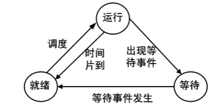
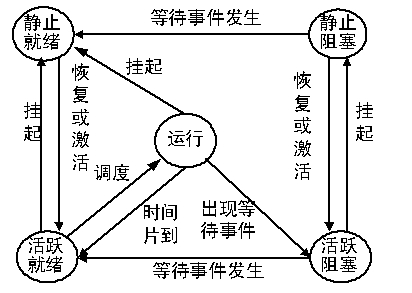
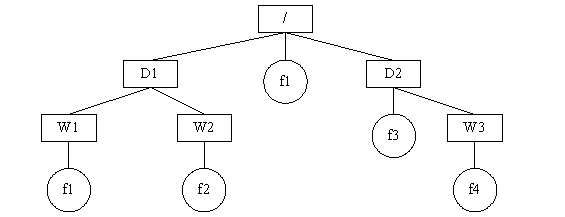
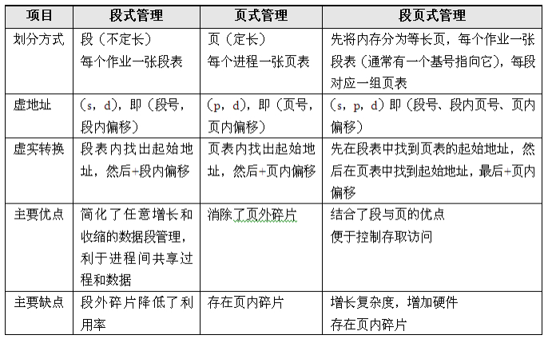
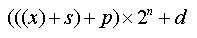
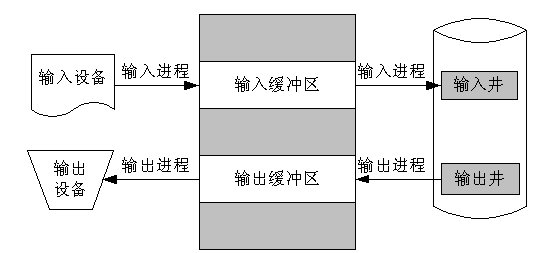

# 操作系统

## 类型

- 批处理操作系统

  主要特征有：用户脱机使用计算机、成批处理、多道程序运行

- 分时操作系统

  主要特征有：交互性、多用户同时性、独立性

- 实时操作系统

  主要特征有：提供即时响应、高可靠性

- 网络操作系统

  主要特征有：互操作性、协作处理

- 分布式操作系统

## 结构

- 无序结构

  各模块相对独立，模块之间通过规定的接口相互调用，面向过程的操作系统，优点是缩短了系统的开发周期，缺点是模块之间调用关系复杂、相互依赖

- 层次结构

  复杂的操作系统分解成若干个单向依赖的层次，层次结构清晰，有利于系统功能的增加或删改，易于保证可靠性，也便于维护和移植

- 面向对象结构

  对象是操作系统管理的信息和资源的抽象，是一种抽象的数据类型，由对象、对象操作、对象保护组成的操作系统。优点是适用于网络操作系统和分布式操作系统中。

- 对称多处理结构

  一个操作系统在系统中的所有处理机运行且共享同一内存，这样的系统就是一个对称多处理系统。优点是适合共享存储器结构的多处理机系统，即紧耦合的多处理机系统。

- 微内核

  系统的公共部分抽象出来，形成一个底层核心，提供最基本的服务，其他功能以服务器形式建立在微内核之上。

​		主要优点如下：

​		（1）统一的接口，在用户态和核心态之间无需进程识别。

​		（2）可伸缩性好，能适应硬件更新和应用变化。

​		（3）可移植性好，所有与具体机器特征相关的代码，全部隔离在微内核中，如果操作系统要移植到不同的硬件平台上，只需修改微内核中极少代码。

​		（4）实时性好，微内核可以方便地支持实时处理。

​		（5）安全可靠性高，微内核将安全性作为系统内部特性来进行设计，对外仅使用少量应用编程接口。

​		（6）支持分布式系统，支持多处理器的体系结构和高度并行的应用程序。

​		（7）真正面向对象的操作系统。

## 进程

进程具有动态性和并发性，程序是进程运行所对应的运行代码，一个进程对应于一个程序，一个程序可以同时对应于多个进程。

在操作系统中进程是进行系统资源分配、调度和管理的最小单位；线程（thread）这一概念，它是处理器分配资源的最小单位。

进程由程序、数据和进程控制块组成

### 三态模型

运行态：占有处理器正在运行。

就绪态：具备运行条件，等待系统分配处理器以便运行。

等待态（阻塞态）：不具备运行条件，正在等待某个事件的完成。

### 五态模型

### 信号量和PV

信号量：是一种特殊的变量，表现形式是一个整型S和一个队列。

P操作：S=S-1，若S<0，进程暂停执行，进入等待队列。

V操作：S=S+1，若S≤0，唤醒等待队列中的一个进程。

#### 作用

1. 互斥控制

   初始值S = 1 来确定一块临界资源，每次只允许一个进程使用。

2. 同步控制

   初始值S = 0 来进行同步控制，P操作必须等到V操作后执行。

3. 生产者-消费者问题

   使用empty、full、mutex三个信号量来表示状态，初始值： empty S = 缓冲区数量，full S = 0， mutex 用于互斥，限制只有一个进程在写缓冲，S = 1。

#### PV操作的图送分题，略过。

### 死锁问题

死锁指多个进程互相等待对方资源且自身不释放。

#### 必要条件

- 互斥条件

  资源每次只能被一个进程访问，资源是互斥的。

- 保持与等待

  进程需要资源被阻塞时，不释放自身资源，而是等待对方资源

- 不可抢占条件

  系统资源是不可抢占的，系统无法强制回收，只能主动释放

- 循环等待

​		若干个进程形成环链，每个都占用对方要申请的下一个资源。

#### 银行家算法

分配资源之前进行计算，是否会死锁，如果会，则不分配。

（1）当一个进程对资源的最大需求量不超过系统中的资源数时可以接纳该进程。

（2）进程可以分期请求资源，但请求的总数不能超过最大需求量。

（3）当系统现有的资源不能满足进程尚需资源数时，对进程的请求可以推迟分配，但总能使进程在有限的时间里得到资源。

（4）当系统现有的资源能满足进程尚需资源数时，必须测试系统现存的资源能否满足该进程尚需的最大资源数，若能满足则按当前的申请量分配资源，否则也要推迟分配。

#### 死锁解决策略

（1）死锁预防：破坏导致死锁必要条件中的任意一个就可以预防死锁。例如，要求用户申请资源时一次性申请所需要的全部资源，这就破坏了保持和等待条件；将资源分层，得到上一层资源后，才能够申请下一层资源，它破坏了环路等待条件。预防通常会降低系统的效率。

（2）死锁避免：避免是指进程在每次申请资源时判断这些操作是否安全，例如，使用银行家算法。死锁避免算法的执行会增加系统的开销。

（3）死锁检测：死锁预防和避免都是事前措施，而死锁的检测则是判断系统是否处于死锁状态，如果是，则执行死锁解除策略。

（4）死锁解除：这是与死锁检测结合使用的，它使用的方式就是剥夺。即将某进程所拥有的资源强行收回，分配给其他的进程。

## 管程与线程

管程由管程名、局部子管程的变量说明、使用共享资源并在数据集上进行操作的若干过程，以及对变量赋初值的语句等四个基本部分组成。每一个管程管理一个临界资源。

线程是处理器分配资源的最小单位，共享进程的资源和地址空间。

## 文件管理

### 文件组织逻辑

记录式结构有连续结构、多重结构、转置结构和顺序结构。

### 物理组织

常用的文件物理结构有连续文件、串联文件和索引文件。

### 树型目录结构

从树根开始，把全部目录文件名与数据文件名依次用“/”连接起来，构成该数据文件的路径名。对于上图，如果当前目录是D1，则访问文件f2的绝对路径是/D1/W2/f2，相对路径是W2/f2。如果当前目录是W1，则访问文件f2的绝对路径仍然是/D1/W2/f2，但相对路径变为../W2/f2

Windows系统中，有两种格式的文件，分别是FAT32（FAT16）文件和NTFS文件NTFS在使用中产生的磁盘碎片要比FAT32少，安全性也更高，而且支持单个文件的容量更大，超过了4GB，特别适合现在的大容量存储。NTFS可以支持的分区（如果采用动态磁盘则称为卷）大小可以达到2TB，而Windows 2000中的FAT32支持分区的大小最大为32GB。

## 存储空间管理

**1．空闲表法**

空闲表法属于连续分配，系统为外存上的所有空闲区建立一张空闲表，每个空闲区对应一个空闲表项，包括序号、第一空闲盘块号和空闲盘块数。

**2．空闲链表法**

将所有空闲盘区，拉成一条空闲链，根据构成链所用的基本元素的不同，可把链表分成两种形式：

（1）空闲盘块链。将磁盘上所有空闲区空间，以盘块为单位拉成一条链，当用户因创建文件而请求分配存储空间时，系统从链首开始，依次摘下适当数目的空闲盘块链给用户。当用户因删除文件而释放存储空间时，系统将回收的盘块依次插入空闲盘块链的末尾。空闲盘块链分配和回收一个盘块的过程非常简单，但在为一个文件分配盘块时，可能要重复多次操作。

（2）空闲盘区链。将磁盘上所有空闲盘区拉成一条链，在每个盘区上包含若干用于指示下一个空闲盘区的指针，指明盘区大小的信息。分配盘块时，通常采用首次适应算法（显式链接法）。在回收时，要将回收区与空闲盘区相合并。

**3．位图法**

位图（bitmap）用二进制位表示磁盘中的一个盘块的使用情况，0表示空闲，1表示已分配。磁盘上的所有盘块都与一个二进制位相对应，由所有的二进制位构成的集合，称为位图。位图法的优点是很容易找到一个或一组相邻的空闲盘块。位图小，可以把它保存在内存中，从而节省了磁盘的启动操作。

**4．成组链接法**

成组链接法将空闲表和空闲链表法结合形成的一种空闲盘块管理方法，适用于大型文件系统。

### 存储组织

虚拟存储器可以分为单一连续分区、固定分区、可变分区、可重定位分区、非请求页式、请求页式、段页式7种。

- 单一连续分区。把所有用户区都分配给唯一的用户作业，当作业被调度时，进程全部进入内存，一旦完成，所有内存恢复空闲，因此，它不支持多道程序设计
- 固定分区。这是支持多道程序设计的最简单的存储管理方法，它把内存划分成若干个固定的和大小不同的分区，每个分区能够装入一个作业，分区的大小是固定的，算法简单，但是容易生成较多的存储器碎片
- 可变分区。引入可变分区后虽然内存分配更灵活，也提高了内存利用率，但是由于系统在不断地分配和回收中，产生大量碎片。解决碎片的方法是拼接（紧凑），即向一个方向（例如向低地址端）移动已分配的作业，使那些零散的小空闲区在另一方向连成一片。分区的拼接技术，一方面是要求能够对业进行重定位，另一方面系统在拼接时要耗费较多的时间
- 可重定位分区。这是克服固定分区碎片问题的一种存储分配方法，它能够把相邻的空闲存储空间合并成一个完整的空区，还能够整理存储器内各个作业的存储位置，以达到消除存储碎片和紧缩存储空间的目的。紧缩工作需要花费大量的时间和系统资源。
- 页式。页式存储组织的基本原理是将各进程的虚拟空间划分为若干个长度相等的页，把内存空间以与页相等的大小划分为大小相等的片或页面，采用请求调页或预调页技术实现内外存的统一管理。页式存储组织的主要优点是利用率高，产生的内存碎片小，内存空间分配及管理简单。主要缺点是要有相应的硬件支持，增加了系统开销；请求调页的算法如选择不当，有可能产生抖动现象。
- 段式：一个作业是由若干个具有逻辑意义的段（如主程序、子程序、数据段等）组成。段式存储管理中，允许程序（作业）占据内存中若干分离的分区。段式存储管理的主要优点是便于多道程序共享内存，便于对存储器的保护，各段程序修改互不影响。其缺点是内存利用率低，内存碎片浪费大。
- 段页式。这是分段式和分页式结合的存储管理方法，充分利用了分段管理和分页管理的优点。作业按逻辑结构分段，段内分页，内存分块。作业只需部分页装入即可运行，所以支持虚拟存储，可实现动态连接和装配。

在现行的虚存组织方面，最常见的就是段页式管理。在进行虚实地址转换时，可以采用的公式如下：

其中x为基号，s为段号，p为段内页号，d为页内偏移，n的值为d的总位数，（x）表示x里的内容

### 存储管理

管理涉及载入（调入）、放置（放入分区）和置换（swapping）三个方面

#### 置换算法

OPT（最优算法），理想化，难以实现

RAND（随机），最简单，开销少

FIFO（先进先出），淘汰内存驻留时间最长的页，容易出现给进程页越多越容易缺页的问题（Belady现象）。

LRU（最近最少使用），淘汰最近使用最少的页。

#### 局部性原理

- 时间局部性是指最近访问存储位置，很可能不久的将来还要访问。
- 空间局部性是指存储访问有成组的倾向：当访问了某个位置后，很可能也要访问其附近的位置。

## 作业管理

系统为每一个作业建立—个作业控制块（Job Control Block，JCB）。系统通过JCB感知作业的存在。JCB包括的主要内容有作业名、作业状态、资源要求、作业控制方式、作业类型以及作业优先权等。

### 状态

提交、后备、执行、完成

### 调度

高级、中级、低级

#### 算法

- 先来先服务（FCFS）

  不利于短作业

- 短作业优先（SJF）

  长作业很难得到服务

- 响应比高者优先（HRN）

  折中，根据响应比，响应比R = (W+T)/T = 1+W/T，其中T为该作业估计需要的执行时间，W为作业在后备状态队列中的等待时间

- 优先级调度

  根据作业优先级来

## 磁盘调度算法

磁盘访问时间 = 寻道时间 + 旋转时间 + 读取时间，寻道时间（查找时间）是决定因素

算法：

- FCFS(FIFO)，先来先服务
- SSFT（最短寻道时间优先），选择距离当前磁头最短的作业，容易陷入局部化，导致饥饿。
- SCAN（电梯算法），磁头前进方向上最短查找时间优先算法。
- N-SCAN（N步SCAN）算法，对SCAN算法的改良，要求新来的作业不参与此次SCAN，等待下一次SCAN时才服务。
- C-SCAN（循环扫描）算法：这是对SCAN算法的另一种改良，是单向服务的N-SCAN算法，要求磁头只往一个方向扫。

## 虚设备与SPOOLING

SPOOLing系统主要包括：

- 输入井和输出井
- 输入缓冲区和输出缓冲区
- 输入进程和输出进程

特点是：

（1）提高了I/O速度。从对低速I/O设备进行的I/O操作变为对输入井或输出井的操作，如同脱机操作一样，提高了I/O速度，缓和了CPU与低速I/O设备速度不匹配的矛盾。

（2）设备并没有分配给任何进程。在输入井或输出井中，分配给进程的是一存储区和建立一张I/O请求表。

（3）实现了虚拟设备功能。多个进程同时使用一独享设备，而对每一进程而言，都认为自己独占这一设备，不过，该设备是逻辑上的设备。采用SPOOLing技术，可以将低速的独占设备改造成一种可共享的设备，而且一台物理设备可以对应若干台虚拟的同类设备。

## 网络操作系统

对等式网络操作系统： OS相等地分布在网络上的所有节点；

集中式网络操作系统：OS主要部分在中心节点（服务器），其他节点管理的少部分资源（客户），C/S的体系结构

网络OS除了单机系统的功能外，还要有： 提供高效可靠的网络通讯能力、 提供多项网络服务功能，例如，远程管理、文件传输、电子邮件、远程打印等。

具有以下特征：

（1）硬件独立。网络操作系统应当独立于具体的硬件平台，即系统应该可以运行于各种硬件平台之上。为此，Microsoft提出了HAL（Hardware Abstraction Layer，硬件抽象层）的概念。HAL与具体的硬件平台无关，一旦改变具体的硬件平台，只要改变其HAL，系统就可以作平稳转换。

`硬件抽象层HAL是位于操作系统 内核与硬件电路之间的接口层，其目的在于将硬件抽象化。它隐藏了特定平台的硬件接口细节,为操作系统提供虚拟硬件平台,使其具有硬件无关性,可在多种平台上进行移植。 从软硬件测试的角度来看，软硬件的测试工作都可分别基于硬件抽象层来完成，使得软硬件测试工作的并行进行成为可能。`

（2）网络特性。应当管理计算机资源并提供良好的用户界面。

（3）可移植性和可集成性。

（4）多用户、多任务。在多进程系统中，为了避免两个进程并行处理所带来的问题，可以采用多线程的处理方式。支持多处理机技术是对现代网络操作系统的基本要求。

## 分布式操作系统

分布式系统是指由多个分散计算机经过互连网络构成的统一计算机系统，其中各个物理和逻辑资源部件既相互配合，又高度自治地在全系统范围内实现资源管理和在动态基础上实现任务分配，并且能并行地运行分布式程序。

显著特点：

1. 具有干预互连的各处理机之间交互关系的责任。
2. 分布式操作系统的控制结构是分布式的。
3. 分布式操作系统按其逻辑功能可分为全局操作系统和局部操作系统两部分。
4. 分布式操作系统的基本调度单位不是一般系统中的进程，而是一种任务队列，即多个处理机上的并发进程的集合。
5. 分布式操作系统的组成情况与系统的耦合方式关系很大。
6. 分布式操作系统为加强各处理机间的动态协作，借鉴了网络操作系统中的消息传送协议技术，具体采取什么协议则根据系统的互连模式而定。

构造分布式操作系统有如下方法：

（1）从头开始。因为分布式操作系统不同于任何集中式操作系统 ，因而可以完全从头开始构造一个分布式操作系统。这种方式的优点在于可以给设计者以完全的自由度，不足之处在于其中所涉及到的所有系统软件和应用软件几乎要全部修改。

（2）修改、扩充现有的操作系统。对集中式操作系统进行修改和扩充，使其具有分布处理和通讯功能。这种方法通过尽量保持与集中式操作系统的相容性而使重新编写新软件的工作量减到最少。而且存在一个与开发期间的新版本进行比较的原始版本，这就给我们提供了测试新版本性能的基础。这种方法不利之处是开发期间的某些决策由于要考虑到如何与原操作系统相容而不得不采用折衷方案。

（3）层次式。在集中式操作系统和用户之间增加一个层次以提供分布处理和通讯功能。它类似于网络操作系统，具有前述两种方法的优点且不必修改现在的操作系统。不足之处在于所有对底层操作系统引用，由于必须经由中间层而使系统性能受到了衰减。

