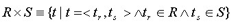
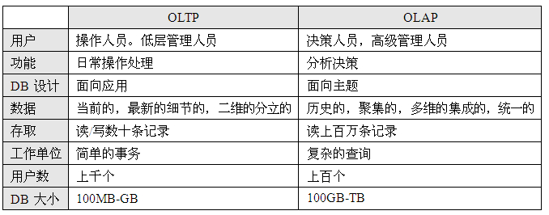
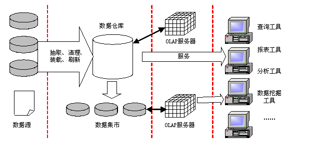

# 数据库

数据库系统是系统分析师考试的一个重点，无论是上午考试，还是案例分析试题和论文试题，都会涉及到数据库系统。根据考试大纲和培训指南的规定，本章要求考生掌握以下知识点：

（1）信息系统综合知识：包括常用的关系型数据库管理系统、数据仓库与数据挖掘技术、数据库设计和操作三个方面。

- 常用的关系型数据库管理系统：包括数据库系统的基本概念、关系代数与元组演算，SQL语句，实际应用系统中数据库的设计原则；数据建模技术；数据访问方法；数据性能建模。
- 数据仓库与数据挖掘技术：包括数据仓库环境（数据仓库的结构与分类）、数据仓库设计方法（数据仓库的数据模型与规范化）、数据集、非结构化数据与数据仓库、大型数据仓库；数据挖掘技术的基本概念、数据挖掘技术中的预处理功能、Data Cube计算；多种数据挖掘技术（空间数据挖掘、多媒体数据挖掘和文本数据挖掘）。
- 数据库设计和操作：包括熟练掌握范式的概念和用法，并能熟练运用；熟练掌握SQL的语法，并能熟练运用；理解数据分布概念。

（2）系统分析设计案例：包括数据库建模；根据具体案例的描述，说明某个具体的应用系统在如何进行后端数据库选择，并根据应用需求说明数据库如何设计。

（2）系统分析设计论文：包括数据库分析、数据库建模、数据库管理、数据库应用；数据仓库、数据集市和数据挖掘；结合项目实践，说明数据仓库在整个应用系统中的作用，如何分析并应用数据仓库。数据管理技术的发展大致经历了人工管理阶段、文件系统阶段、数据库阶段和高级数据库技术阶段。数据库是长期储存在计算机内的、有组织的、可共享的数据的集合。

数据库管理系统（DataBase Management System，DBMS）是一种负责数据库的定义、建立、操作、管理和维护的软件系统。其目的是保证数据安全可靠，提高数据库应用的简明性和方便性。DBMS的工作机理是把用户对数据的操作转化为对系统存储文件的操作，有效地实现数据库三级之间的转化。数据库管理系统的主要职能有：数据库的定义和建立、数据库的操作、数据库的控制、数据库的维护、故障恢复和数据通信。

数据库系统（DataBase System，DBS）是实现有组织地、动态地存储大量关联数据、方便多用户访问的计算机软件、硬件和数据资源组成的系统。一个典型的DBS包括数据库、硬件、软件（应用程序）和数据库管理员（DataBase Administrator，DBA）四个部分。根据计算机的系统结构，DBS可分成集中式、客户/服务器式、并行式和分布式四种。

与文件系统阶段相比，数据库技术的数据管理方式具有以下特点： 

（1）采用复杂的数据模型表示数据结构，数据冗余小，易扩充，实现了数据共享。

（2）具有较高的数据和程序独立性。包括数据库的物理独立性和逻辑独立性。

（3）数据库系统为用户提供了方便的用户接口。

（4）数据库系统提供四个方面的数据控制功能，分别是并发控制、恢复、完整性和安全性。数据库中各个应用程序所使用的数据由数据库系统统一规定， 按照一定的数据模型组织和建立，由系统统一管理和集中控制。

（5）增加了系统的灵活性。

高级数据库技术阶段的主要标志是分布式数据库系统和面向对象数据库系统的出现。分布式数据库系统的主要特点是数据在物理上分散存储，在逻辑上是统一的。分布式数据库系统的多数处理就地完成，各地的计算机由数据通信网络相联系；面向对象数据库系统是面向对象的程序设计技术与数据库技术相结合的产物。面向对象数据库系统的主要特点是具有面向对象技术的封装性和继承性，提高了软件的可重用性。

## 数据库模式

、

**三级模式 -- 三个抽象级**：

- 概念模式 -- 概念级数据库

  描述整个数据库中数据库的逻辑结构，概念模式是数据库中全体数据的逻辑结构和特征的描述，是所有用户的公共数据视图。一个数据库只有一个概念模式。

- 外模式 -- 用户级数据库

  用以描述用户看到或使用的那部分数据的逻辑结构，外模式是数据库用户（包括程序员和最终用户）能够看见和使用的局部数据的逻辑结构和特征的描述，是数据库用户的数据视图，是与某一应用有关的数据的逻辑表示。一个数据库可以有多个外模式。一个应用程序只能使用一个外模式。

- 内模式 -- 物理级数据库

  是整个数据库的最低层表示，不同于物理层，它假设外存是一个无限的线性地址空间。内模式是数据物理结构和存储方式的描述，是数据在数据库内部的表示方式。一个数据库只有一个内模式。

**独立性**：

三个抽象级间通过两级映射（外模式/模式映射，模式/内模式映射）进行相互转换，使得数据库的三级形成一个统一的整体。

- 物理独立性 -- 概念模式和内模式的映射转换

  物理独立性是指用户的应用程序与存储在磁盘上的数据库中的数据是相互独立的。当数据的物理存储改变时，应用程序不需要改变。

- 逻辑独立性 -- 外模式和概念模式的映射转换

  逻辑独立性是指用户的应用程序与数据库中的逻辑结构是相互独立的。当数据的逻辑结构改变时，应用程序不需要改变。

## 数据模型

数据模型主要有两大类，分别是概念数据模型（实体联系模型）和基本数据模型（结构数据模型）。

**概念数据模型**：主要用于数据库设计，靠 **E-R模型**来表示。

**基本数据模型**： 数据库系统的核心和基础，由**数据结构、数据操作、完整性约束**组成（数据结构是对系统静态特性的描述，数据操作是对系统动态特性的描述，完整性约束是一组完整性规则的集合）。

常用的基本数据模型：

- 层次模型
- 网状模型
- 关系模型
- 面向对象模型

### 关系模型

基本关系具有以下六条性质： 

（1）列是同质的，即每一列中的分量是同一类型的数据，来自同一个域。 

（2）不同的列可出自同一个域，称其中的每一列为一个属性，不同的属性要给予不同的属性名。 

（3）列的顺序无所谓，即列的次序可以任意交换。 

（4）任意两个元组不能完全相同。但在大多数实际关系数据库产品中，例如ORACLE等，如果用户没有定义有关的约束条件，它们都允许关系表中存在两个完全相同的元组。 

（5）行的顺序无所谓，即行的次序可以任意交换。 

（6）分量必须取原子值，即每一个分量都必须是不可分的数据项。

#### 规范化理论

关系模型可能存在的存储异常：

（1）**数据冗余**：如果某门课程有100个学生选修，那么在R的关系中就要出现100个元组，这门课程的任课教师姓名和地址也随之重复出现100次。

（2）**修改异常**：由于上述冗余问题，当需要修改这个教师的地址时，就要修改100个元组中的地址值，否则就会出现地址值不一致的现象。

（3）**插入异常**：如果不知道听课学生名单，这个教师的任课情况和家庭地址就无法进入数据库；否则就要在学生姓名处插入空值。

（4）**删除异常**：如果某门课程的任课教师要更改，那么原来任课教师的地址将随之丢失

#### 函数依赖

在R(U)中，如果X→Y，并且对于X的任何一个真子集X′，都有X′→Y不成立，则称Y对X**完全函数依赖**。（例如 学号+课程号 推出 成绩，前者两个缺一不可）

若X→Y，但Y不完全函数依赖于X，则称Y对X部分**函数依赖**。（例如学号+课程号 推出 姓名，前者只需要学号就行）

在R(U)中，如果X→Y（Y不是X的真子集），且Y→X不成立，Y→Z，则称Z对X**传递函数依赖**。（例如 学号 推出 班级， 班级 推出 班主任， 学号 推出 班主任）

推理规则：

- **并规则**：若X→Y和X→Z在R上成立，则X→YZ在R上成立 （例如 学号 推出 姓名 ， 学号 推出 班级 =》 学号 推出 （姓名，班级））
- **分解规则**：若X→Y在R上成立，且 ，则X→Z在R上成立（学号 推出 （班级 ，姓名） =》  学号 推出 姓名)
- **伪传递规则**：若X→Y和WY→Z在R上成立，则WX→Z在R上成立 （学号 推出 班级， 班级 课程号 推出 老师， 学号 课程号 推出 老师）

#### 范式

- 1NF

  所有元素不可再分

- 2NF

  不存在部分依赖

- 3NF

  不存在传递依赖

- BCNF

  每个属性不传递依赖所有候选键

#### 关系模式分解

保持函数依赖、无损联接

- **无损分解** 只需要计算下是否满足  **(R1∩R2)→(R1-R2)或(R1∩R2)→(R2-R1)**其中一条即可
- **保持函数依赖**： δ中每个模式Ri上的FD集是Fi。如果{F1，F2，……，Fk}与F是等价的（即相互逻辑蕴涵），即保持函数依赖。

## 数据操作

### 集合运算

并、差、交、笛卡尔积：

- 并
- 差
- 交
- 笛卡尔积

### 关系运算

- 投影

  

- 选择

  

- 自然连接

  

- 除法

  

- 外联接

  - 左外连接：R和S进行自然连接时，只把R中舍弃的元组放到新关系中。

  - 右外连接：R和S进行自然连接时，只把S中舍弃的元组放到新关系中。

  - 完全外连接：R和S进行自然连接时，只把R和S中舍弃的元组都放到新关系中

## **数据库访问接口**

访问接口是指分布式环境中保证操作系统、通信协议、数据库等之间进行对话，互操作的软件系统。不同DBMS和某些访问语言的透明性，即下面3个透明性：

- 网络透明性
- 服务器透明性
- 语言透明性

访问数据库接口方式：

1. **专用调用**

   使用每个数据库自带的库来进行，不具有通用性，执行效率高，编程简单。

2. **ODBC**

   开放数据库互连，以X/Open和 ISO/IEC的调用级接口规范为基础。基于SQL语言的，是一种在SQL和应用界面之间的标准接口，用ODBC生成的程序是与数据库或数据库引擎无关。

3. **JDBC**

   执行SQL语句的Java API。JDBC基于X/Open的SQL调用级接口（CLI，这是ODBC的基础），所有支持ODBC的数据库不加任何修改就能够与JDBC协同合作。

**JDBC与ODBC的比较**

它们的最大区别是，JDBC是基于Java的风格和优点，并强化了Java的风格和优点：

1. ODBC并不适合在Java中直接使用。ODBC是一个C语言实现的API，从Java程序调用本地的C程序会带来一系列类似安全性、完整性、健壮性的问题。
2. 完全精确地实现从C代码ODBC到Java API写的ODBC的翻译也并不令人满意。
3. ODBC并不容易学习，它将简单特性和复杂特性混杂在一起，甚至对非常简单的查询都有复杂的选项。
4. JDBC这样的Java API对于纯Java方案来说是必需的。当使用ODBC时，人们必须在每一台客户机上安装ODBC驱动器和驱动管理器。

| 序号 | 键         | ODBC                                                         | JDBC                                                         |
| ---- | ---------- | ------------------------------------------------------------ | ------------------------------------------------------------ |
| 1    | 代表       | ODBC代表开放式数据库连接，这从字面上意味着它与所有类型的语言（例如C，C ++，Java等）兼容。 | JDBC表示Java数据库连接，即仅与Java语言兼容。                 |
| 2    | 介绍       | ODBC是Microsoft在JDBC之前于1992年引入的。                    | JDBC是SUN MicroSystems在ODBC之后于1997年引入的。             |
| 3    | 平台依赖性 | ODBC依赖于平台，因为我们只能将ODBC用于Windows平台。          | 另一方面，JDBC与平台无关，可以用于任何平台。                 |
| 4    | 类型       | ODBC可以被视为一种过程类型，因为这些驱动程序中的大多数都是使用本机语言（例如C和C ++）开发的，而C和C ++是语言的过程类型。 | 另一方面，JDBC是纯面向对象的类型驱动程序。                   |
| 5    | 性能       | 与JDBC相比，ODBC的性能更快，因为数据的导入和导出更快且占用大量内存。 | 另一方面，JDBC的性能比本机ODBC慢，但是JDBC的平台独立性使其可以与任何操作系统（包括Mac和Linux），驱动程序版本或位（32位或64位）一起使用。 |

## **数据库的控制功能**

### 事务

DBMS运行的基本工作单位是事务，事务具有以下特性：

- **原子性**

  要么全做要么全都不做

- **一致性**

  事务的执行使数据库从一个一致性状态变到另一个一致性状态

- **持续性**

  事务一旦提交，它对数据库的改变必须是永久的，即便系统出现故障时也是如此

- **隔离性**

  事务的执行不能被其他事务干扰

从终端用户来看，事务是一个原子，是不可分割的操作序列。事务中包括的所有操作要么都做，要么都不做（就效果而言）。事务不应该丢失，或被分割地完成。

### **并发控制**

事务并发带来的问题

- **丢失更新（丢失修改）**

  刚写完的数据被别人给改了

- **读过时的数据（不可重复读）**

  刚读取的数据就被别人给更新了，再读就不一致了

- **读脏数据**

  刚读取的数据被别人给回滚了，读了个寂寞

### **封锁的类型**

- **X锁**

  T加X，只允许事务T读取和修改数据A，其他事务要等事务T解除X封锁以后，才能对数据A实现任何类型的封锁

- **S锁**

  T加S，允许事务T读取数据A，但不能修改数据A，在所有S封锁解除之前决不允许任何事务对数据A实现X封锁。

### **封锁协议**

- **一级封锁协议**

  事务T在修改数据R之前必须先对其加X锁，直到事务结束才释放。可防止丢失更新，但不能保证可重复读和不读脏数据（修改时加X锁，读取时没锁）。

- **二级封锁协议**

  事务T在读取数据R之前先对其加S锁，读完后即可释放S锁。二级封锁协议可防止丢失更新，还可防止读脏数据。但不能保证可重复读。

- **三级封锁协议**

  事务T在读取数据R之前先对其加S锁，直到事务结束才释放。三级封锁协议可防止丢失更新、防止读脏数据与数据重复读。

- **两段锁协议**

  所有事务必须分**两个阶段**对数据项加锁和解锁。

  **扩展阶段（加锁、生长）**是在对任何数据进行读、写操作之前，首先要申请并获得对该数据的封锁。（在对任何数据进行读操作之前要申请并获得S锁，在进行写操作之前要申请并获得X锁。加锁不成功，则事务进入等待状态，直到加锁成功才继续执行）

  **收缩阶段（解锁、衰退）**是在释放一个封锁之后，事务不能再申请和获得任何其他封锁。

  两段封锁法可以这样来实现：事务开始后就处于加锁阶段，一直到执行ROLLBACK和COMMIT之前都是加锁阶段。ROLLBACK和COMMIT使事务进入解锁阶段，即在ROLLBACK和COMMIT模块中DBMS释放所有封锁。遵循：

  1. 在对任何数据进行读、写操作之前，要申请并获得对该数据的封锁。
  2. 每个事务中，所有的封锁请求先于所有的解锁请求。

  两段锁协议和防止死锁的一次封锁法的异同之处。一次封锁法要求每个事务必须一次将所有要使用的数据全部加锁，否则就不能继续执行，因此一次封锁法遵守两段锁协议；但是两段锁协议并不要求事务必须一次将所有要使用的数据全部加锁，因此遵守**两段锁协议的事务可能发生死锁**。

  

封锁的粒度即是被封锁数据目标的大小，例如属性值、属性值集、元组、关系、某索引项（或整个索引）、整个关系数据库、物理页（块）等。**封锁粒度小则并发性高，但开销大；封锁粒度大则并发性低，但开销小**，综合平衡照顾不同需求以合理选取适当的封锁粒度是很重要的。

### 死锁

采用封锁的方法固然可以有效防止数据的不一致性，但封锁本身也会产生一些麻烦，最主要就是死锁问题。

1. 预防法

   采用一定的操作方式以避免死锁的出现。例如**顺序申请法**是指对封锁对象按序编号，用户申请封锁时必须按编号顺序（从小到大或反之）申请，这样能避免死锁发生；**一次申请法**是指用户在一个完整操作过程中必须一次性申请它所需要的所有封锁，并在操作结束后一次性归还所有封锁，这样能避免死锁的发生。

2. 解除法

   允许产生死锁，并在死锁产生后通过解锁程序以解除死锁。一个是死锁检测程序，用它测定死锁是否发生；另一个是解锁程序，一旦检测到系统已产生死锁，则启动解锁程序以解除死锁。

## **备份与恢复技术**

数据库系统中可能发生各种各样的**故障**：

- **事务内部的故障**

  有可能被事务程序发现，有可能是非预期（运算溢出、死锁等），事务没有按预期结束。需要回滚事务。

- **系统范围内的故障**

  PC或者系统除了问题，断电了、宕机挂了等等。需要数据库恢复子系统在系统重启时回滚非正常终止的所有事务。

- **介质故障**

  磁盘GG了，可能性小，破环较大

- **计算机病毒**

  有毒

### 备份

**冷备份、热备份**：

冷备是指备份期间不能操作数据库，这会降低数据库的可用性。热备份是指备份期间可以正常使用数据库，备份结束时后援副本上的数据并不能保证正确有效。

**全量备份、增量备份**：

全量备份备份全部数据库；增量备份则指每次只备份上次备份后更新过的数据。

### 日志文件

事务日志是针对数据库改变所做的记录，它可以记录针对数据库的任何操作，并将记录结果保存在独立的文件中。

日志文件是用来记录对数据库每一次更新活动的文件，在动态备份方式中，必须建立日志文件，后援副本和日志文件综合起来才能有效地恢复数据库。静态备份方式中，也可以建立日志文件，当数据库毁坏后可重新装入后援副本把数据库恢复到备份结束时刻的正确状态，然后利用日志文件，把已完成的事务进行重做处理，对故障发生时尚未完成的事务进行撤销处理。这样不必重新运行那些已完成的事务程序就可把数据库恢复到故障前某一时刻的正确状态。

写一个修改到数据库中和写一个表示这个修改的日志记录到日志文件中是两个不同的操作，有可能在这两个操作之间发生故障，即这两个写操作只完成了一个，如果先写了数据库修改，而在日志记录中没有登记这个修改，则以后就无法恢复这个修改了。因此，为了安全，应该先写日志文件，即首先把修改记录写到日志文件上，然后再写数据库的修改。**这就是“先写日志文件”的原则**。

### **数据恢复**

数据恢复的基本原理就是冗余，建立冗余的方法有数据备份和登录日志文件等。可根据故障的不同类型，采用不同的恢复策略。

1. **事务故障的恢复**

   事务故障的恢复是由系统自动完成的。（根据事务日志来回滚）

   ① 反向扫描日志文件，查找该事务的更新操作。

   ② 对该事务的更新操作执行逆操作。

   ③ 继续反向扫描日志文件，查找该事务的其他更新操作，并做同样处理。

   ④ 如此处理下去，直至读到此事务的开始标记，事务故障恢复完成。

2. **系统故障的恢复**

   系统故障的恢复在系统重新启动时自动完成，不需要用户干预。（起始点到系统故障点正向扫描日志，标记已提交和未完成，故障点逆向扫描日志对未完成的回滚，起始点正向扫描日志，对已提交的重做）

   ① 正向扫描日志文件，找出在故障发生前已经提交的事务，将其事务标识记入重（Redo）队列。同时找出故障发生时尚未完成的事务，将其事务标识记入撤销（Undo）队列。

   ② 对撤销队列中的各个事务进行撤销处理：反向扫描日志文件，对每个Undo事务的更新操作执行逆操作。

   ③ 对重做队列中的各个事务进行重做处理：正向扫描日志文件，对每个Redo事务重新执行日志文件登记的操作。

3. **介质故障与病毒破坏的恢复**

   （加载副本，故障点逆向到加载点将已提交事务标记，从加载点正向开始对标记事务重做）

   ① 装入最新的数据库后备副本，使数据库恢复到最近一次备份时的一致性状态。

   ② 从故障点开始反向扫描日志文件，找出已提交事务标识并记入Redo队列。

   ③ 从起始点开始正向扫描日志文件，根据Redo队列中的记录，重做已完成的任务，将数据库恢复至故障前某一时刻的一致状态。

4. **有检查点的恢复技术**

   检查点记录的内容可包括建立检查点时刻所有正在执行的事务清单，以及这些事务最近一个日志记录的地址。

   ① 从重新开始文件中找到最后一个检查点记录在日志文件中的地址，由该地址在日志文件中找到最后一个检查点记录。

   ② 由该检查点记录得到检查点建立时所有正在执行的事务清单队列（A）。

   ③ 建立重做队列（R）和撤销队列（U），把A队列放入U队列中，R队列为空。

   ④ 从检查点开始正向扫描日志文件，若有新开始的事务T1，则把T1放入U队列；若有提交的事务T2，则把T2从U队列移到R队列；直至日志文件结束。

   ⑤ 对U队列的每个事务执行Undo操作，对R队列的每个事务执行Redo操作。

## 安全性

DBS的安全靠两种，一种是DBMS本身提供的用户身份识别、视图、使用权限控制、审计等管理措施，另一种就是靠数据库的应用程序来实现对数据库访问进行控制和管理。

### 用户认证

口令、强身份认证。口令就是账号密码，强身份包含指纹、证书、卡等。

### 用户角色

一般可以将权限角色分为3类，分别是数据库登录权限类、资源管理权限类和DBA权限类。

数据库登录权限类用户只能查阅部分数据库信息，不能修改数据库中的任何数据。资源管理权限类可以在权限允许的范围内修改、查询数据库，还能将自己拥有的权限授予其他用户，可以申请审计。DBA权限类将具有数据库管理的全部权限。

### 数据授权

同一类功能操作权限的用户，对数据库中数据对象管理和使用的范围又可能是不同的，应该提供对数据对象的访问控制。例如：

（1）数据库级别：判断用户是否可以使用访问数据库里的数据对象，包括表、视图、存储过程。

（2）表级：判断用户是否可以访问关系里面的内容。

（3）行级：判断用户是否能访问关系中的一行记录的内容。

（4）属性级：判断用户是否能访问表关系中的一个列（属性、字段）的内容。

DBMS对于用户的访问存取控制有以下两个基本的原则：

（1）隔离原则：用户只能存取他自己所有的和已经取得授权的数据对象。

（2）控制原则：用户只能按他所取得的数据存取方式存取数据，不能越权。

### 数据库视图

视图可以被看成是虚拟表或存储查询。可通过视图访问的数据不作为独特的对象存储在数据库内。

（1）将用户限定在表中的特定行上。例如，只允许雇员看见工作跟踪表内记录其工作的行。

（2）将用户限定在特定列上。例如，对于那些不负责处理工资单的雇员，只允许他们看见雇员表中的姓名、工作电话和部门列，而不能看见任何包含工资信息或个人信息的列。

（3）将多个表中的列连接起来，使它们看起来像一个表。

（4）聚合信息而非提供详细信息。例如，显示一个列的和，或列的最大值和最小值。

### 审计功能

审计则是一种事后监督的手段。有两种方式的审计，即用户审计和系统审计。用户审计时，利用日志文件里面信息可以对用户进行审计分析。系统审计由DBA进行，其审计内容主要是系统一级命令及数据对象的使用情况。

## 数据库的完整性

数据库的完整性是指数据的正确性和相容性。

1. **完整性约束条件**

   对数据库中数据设置一些约束条件，这是数据的语义体现。数据的完整性约束条件一般在数据模式中给出，并在运行时做检查，当不满足条件时立即向用户通报以便采取措施。

2. **完整性控制**

   完整性控制机制应该具有定义功能（提供定义完整性约束条件的机制）和检查功能（检查用户发出的操作请求是否违背了完整性约束条件）。数据库的完整性可分为**实体完整性、参照完整性和用户定义的完整性**。

   - **实体完整性**

     实体完整性要求**主码中的任一属性不能为空**，所谓空值是“不知道”或“无意义”的值。

   - **参照完整性**

     参照完整性的合理性在于，R中的**外码**只能对S中的主码引用，**不能是S中主码没有的值**。例如选课表中的学号是外码，它是学生表的主键，若选课表中出现了某个学生表中没有的学号，即某个学生还没有注册，却已有了选课记录，这显然是不合理的。

     PS：

     ① 外码能否接受空值问题，根据实际应用决定。

     ② 在被参照关系中删除元组的问题：

     - 级联删除：将参照关系中所有外码值与被参照关系中要删除元组主码值相同的元组一起删除。如果参照关系同时又是另一个关系的被参照关系，则这种删除操作会继续级联下去。（删主键同时将参照的外码条目一起删了。例如删除某个学号，要将选课表中该学号的记录全干掉）
     - 受限删除（一般系统默认）：仅当参照关系中没有任何元组的外码值与被参照关系中要删除元组的主码值相同时，系统才可以执行删除操作，否则拒绝执行删除操作。（删主键时如果被别人引用，不给删。只有当选课记录里没这个学号的记录，才可以删学生表中的学号）
     - 置空删除：删除被参照关系的元组，并将参照关系中相应元组的外码值置为空值。（删学号后将选课表对应学号置空）

     ③ 在参照关系中插入元组的问题。

     - 受限插入：仅当被参照关系中存在相应的元组时，其主码值与参照关系插入元组的外码值相同时，系统才执行插入操作，否则拒绝此操作。（选课表里插一条，这条学号必须存在于学生表中，否则拒绝）
     - 递归插入：首先向被参照关系中插入相应的元组，其主码值等于参照关系插入元组的外码值，然后向参照关系插入元组。（选课表里插一条，还要在学生表里插入一条这个学号的记录）

   - **用户定义的完整性**

     用户定义的完整性就是针对某一具体关系数据库的约束条件，它反映某一具体应用所涉及的数据必须满足的语义要求。

   - **触发器**

     触发器的功能一般比完整性约束要强得多。其抽象的含义即是一个事件的发生必然触发（或导致）另外一些事件的发生，其中前面的事件称为触发事件，后面的事件称为结果事件。**触发器除了有完整性保护功能外，还有安全性保护功能。**

     一般而言，在完整性约束功能中，当系统检查出数据中有违反完整性约束条件时，则仅给出必要提示以通知用户，仅此而已。而触发器的功能则不仅仅起提示作用，它还会引起系统内自动进行某些操作以消除违反完整性约束条件所引起的负面影响。

## 数据库性能

### SQL的性能优化

写好SQL语句，别瞎搞，大部分数据库效率的问题都是由于SQL语句编写不善引起的。

### 数据库性能优化

对DBS本身性能进行优化：

（1）通过监视DBS的内存对象，获得系统性能指标，发现系统的性能缺陷及原因。

（2）针对导致系统性能缺陷的原因，进行相应的参数调整（如增加数据缓冲区的大小）。

（3）跟踪参数调整后系统的各项性能指标，看是否达到预期要求，否则继续调整。

### 查询优化

查询优化： **提高IO**（不同东西放到不同IO设备，例如机械硬盘和固态硬盘？）、**切割表**（横向、纵向）、**建立索引**、**分解查询**（把OR分开查，UNION 链接）、查询时用where**限制行数**、**慎用DISTINCT**、使用**IN时频繁的放前面**、**GROUP BY 和HAVING前就要去除多余的行**、数据的**处理工作放在服务器**上以减少网络的开销、**不用重复使用相同函数**（结果存变量）

（1）把数据、日志、索引放到不同的I/O设备上，增加读取速度。数据量（尺寸）越大，提高I/O越重要。

（2）纵向、横向分割表，减少表的尺寸。

（4）根据查询条件，建立索引，优化索引、优化访问方式，限制结果集的数据量。注意填充因子要适当（最好是使用默认值0）。索引应该尽量小，使用字节数小的列建索引好，不要对有限的几个值的列建单一索引。

（5）用OR的子句可以分解成多个查询，并且通过UNION 连接多个查询。它们的速度只与是否使用索引有关，如果查询需要用到联合索引，用UNION all执行的效率更高。 

（6）在查询SELECT语句中用WHERE子句限制返回的行数，避免表扫描。如果返回不必要的数据，浪费了服务器的I/O资源，加重了网络的负担降低性能。如果表很大，在表扫描的期间将表锁住，禁止其他的联接访问表，后果严重。

（7）注意使用DISTINCT，在没有必要时不要用，它同UNION一样会使查询变慢。

（8）在IN后面值的列表中，将出现最频繁的值放在最前面，出现得最少的放在最后面，减少判断的次数。

（9）一般在GROUP BY 和HAVING子句之前就能剔除多余的行，所以尽量不要用它们来做剔除行的工作。

（10）尽量将数据的处理工作放在服务器上，减少网络的开销，如使用存储过程。存储过程是编译好、优化过、并且被组织到一个执行规划里、且存储在数据库中的SQL语句（存储过程是数据库服务器端的一段程序），是控制流语言的集合，速度当然快。存储过程有两种类型。一种类似于SELECT查询，用于检索数据，检索到的数据能够以数据集的形式返回给客户。另一种类似于INSERT或DELETE查询，它不返回数据，只是执行一个动作。有的服务器允许同一个存储过程既可以返回数据又可以执行动作。

（11）不要在一句话里再三地使用相同的函数，浪费资源，将结果放在变量里再调用更快。

针对大量**只读查询**操作进行优化，常见的方法有：（**使用常量、物化视图、数据冗余、添加索引**）

（1）数据量小的数据，可以考虑不存储在数据库中，而是通过程序常量的方式解决。

（2）需要存储在数据库中的数据，可以考虑采用物化视图（索引视图）。当DBA在视图上创建索引时，这个视图就被物化（执行）了，并且结果集被永久地保存在唯一聚簇索引中，保存方式与一个有聚簇索引的表的保存方式相同。物化视图减除了为引用视图的查询动态建立结果集的管理开销，优化人员可以在查询中使用视图索引，而不需要在FROM子句中直接指定视图。

（3）数据存储时可以考虑适当的数据冗余，以减少数据库表之间的连接操作，提高查询效率。

（4）针对数据的特点，采取特定的索引类型。例如位图索引等。

## 数据库设计与建模

设计分为五个阶段：**规划、需求分析、概念设计、逻辑设计和物理设计**

1. **规划**

   规划阶段的主要任务是进行建立数据库的**必要性及可行性分析**

2. **需求分析**

   需求信息的收集、分析整理和评审。**形成 SRS**

3. **概念设计（概念结构设计）**

   概念数据模型与DBMS无关。根据SRS先设计各个应用的视图，然后再进行视图集成，以形成一个单一的概念数据模型。初步数据模型还要经过数据库设计者和用户的审查与修改，最后形成所需的概念数据模型。输出E-R模型。

4. **逻辑设计（逻辑结构设计）**

   把概念模式转换成DBMS能处理的模式。把概念设计阶段设计好的基本E-R图转换为与选用的具体机器上的DBMS所支持的数据模型相符合的逻辑结构，包括数据库模式和外模式。逻辑设计过程输出的信息有DBMS可处理的模式、子模式、应用程序设计指南、物理设计指南。

5. **物理设计（物理结构设计）**

   对一个给定的逻辑数据模型选取一个最适合应用环境的物理结构的过程，所谓数据库的物理结构主要指数据库在物理设备上的存储结构和存取方法。

## 实体联系模型

E-R模型简称E-R图，E-R图包括三个要素：

（1）**实体**（型）：用矩形框表示，框内标注实体名称。 

（2）**属性**：用椭圆形表示，并用连线与实体连接起来。 

（3）**实体之间的联系**：用菱形框表示，框内标注联系名称，并用连线将菱形框分别与有关实体相连，并在连线上注明联系类型。 

### 联系的类型

1:1、 1:n、 m:n 三种类型

### E-R图的集成

1.  **先设计各子系统的局部E-R图**

   （1）确定局部视图的范围。

   （2）识别实体及其标识。

   （3）确定实体间的联系。

   （4）分配实体及联系的属性

2. **将所有的分E-R图综合成一个系统的总体E-R图**，一般称为**视图的集成**。

   （1）多个局部E-R图一次集成。这种方式比较复杂，做起来难度较大。

   （2）逐步集成，用累加的方式一次集成两个局部E-R图。

   

各局部E-R图之间的冲突主要有三类：

（1）**属性冲突**：包括属性域冲突和属性取值冲突。属性冲突理论上好解决，只要换成相同的属性就可以了，但实际上需要各部门协商，解决起来并不简单。

（2）**命名冲突**：包括同名异义和异名同义。处理命名冲突通常也像处理属性冲突一样，通过讨论和协商等行政手段加以解决。

（3）**结构冲突**：包括同一对象在不同应用中具有不同的抽象，以及同一实体在不同局部E-R图中所包含的属性个数和属性排列次序不完全相同。

在初步的E-R图中，可能存在一些**冗余的数据和实体间冗余的联系**。冗余数据和冗余联系容易破坏数据库的完整性，给数据库维护增加困难，应当予以消除。消除冗余的主要方法为分析方法，即以**数据字典和数据流图**为依据，根据数据字典中关于数据项之间**逻辑关系的说明来消除冗余**。

### E-R图向关系模式转换

E-R图向关系模式的转换属于数据库的**逻辑设计阶段**的工作，规则如下：

（1）**一个实体转换为一个关系模式**，实体的属性就是关系的属性，实体的码（关键字）就是关系的码。

（2）一个**1:1**联系可以转换为一个**独立**的关系模式，也可以与任意一端对应的关系模式**合并**。

（3）一个**1:n**联系可以转换为一个**独立**的关系模式，也可以与任意n端对应的关系模式**合并**。

（4）一个**m:n**联系转换为一个**独立**的关系模式，与该联系相连的各实体的码以及联系本身的属性均转换为关系的属性，而关系的码为各实体码的组合。

（5）三个以上实体间的一个**多元联系**可以转换为一个**独立**的关系模式，与该联系相连的各实体的码以及联系本身的属性均转换为关系的属性，而关系的码为各实体码的组合。

**特殊情况**：

1. 多值属性的处理

   把该属性提升为一个实体。或者在转化为关系模式时，将实体的码与多值属性单独构成一个关系模式。（例如人的电话，可能有几个，需要单独拉一个关系存储）

2. BLOB型属性的处理

   处理BLOB的主要思想就是让文件处理器（如数据库管理器）不去理会文件是什么，而是关心如何去处理它。应该将BLOB字段与关系的码独立为一个关系模式。

3. 派生属性的处理

   派生属性可由其他属性计算得到，因此，在转化成关系模式时，通常不转换派生属性。

4. 对象-关系数据模型

   在对象-关系数据模型中，这里的关系模式就对应类，关系模式的属性就对应类的属性。

## 常见的关系型数据库管理系统

- **Oracle**

  Oracle 的结构包括数据库的内部结构、外存储结构、内存储结构和进程结构。

  Oracle数据库在运行中使用两种类型的内存结构，分别是系统全局区和程序全局区。系统全局区是数据库运行时存放系统数据的内存区域，它由所有服务器进程和客户进程共享；程序全局区是单个存放Oracle进程工作时需要的数据和控制信息的，程序全局区不能共享。

- **Sybase**

  为满足企业级分布式计算应用的要求，Sybase采用了基于构件方式的多层（常用三层）C/S体系结构。构件的主要优点是其自包含性和可重用性，系统中任何一个构件当被另一个具有同样功能的构件取代时，都无须对周围的构件进行重编码或修改。

  第一层为客户应用程序。第二层为基于构件方式的中间件层。第三层为服务器应用软件。

- **Informix**

  Informix动态服务器采用多线程体系结构实现。

- **SQL Server**

  SQL Server是微软公司的数据库产品，SQL Server的4个基本服务器组件包括Open Data Services、MS SQL Server、SQL Server Agent和MSDTC。

- **DB2**

  DB2是IBM公司研制的一种关系型数据库系统。DB2主要应用于大型应用系统，具有很好的网络支持能力，对大型分布式应用系统尤为适用。

  

## 分布式数据库系统

分布式数据库是由**一组数据**组成的，这组数据**分布在计算机网络的不同计算机**上，网络中的每个节点具有独立处理的能力（称为**场地自治**），它可以执行**局部应**用，同时，每个节点也能通过**网络通信子系统执行全局应用**。

特点：

（1）**数据独立性**：在分布式数据库系统中，数据独立性这一特性更加重要，并具有更多的内容。除了数据的**逻辑独立性**与**物理独立性**外，还有**数据分布独立性（分布透明性）**。

（2）**集中与自治共享结合的控制结构**：各局部的DBMS可以独立地管理局部数据库，具有**自治**的功能。同时，系统又设有集中控制机制，协调各局部DBMS的工作，**执行全局应用**。

（3）**适当增加数据冗余度**：在不同的场地**存储同一数据的多个副本**，这样可以提高系统的可靠性、可用性，同时也能提高系统性能。

（4）**全局的一致性、可串行性和可恢复性**。 

### 分布式数据存储

分布式数据存储可以从**数据分配和数据分片**两个角度考察。

**数据分配**：

（1）集中式：所有数据均安排在同一个场地上。 

（2）分割式：所有数据只有一份，分别被安置在若干个场地。 

（3）全复制式：数据在每个场地重复存储。 

（4）混合式：数据库分成若干可相交的子集，每一子集安置在一个或多个场地上，但是每一场地未必保存全部数据。

其中存储代价和可靠性是一对矛盾的因素，检索代价和更新代价也是一对矛盾的因素。要辩证的看待问题，折中**存储代价、可靠性、检**

**索代价、更新代价**来取最优。

**数据分片**（数据分片是指数据存放单位不是全部关系，而是关系的一个片段，也就是关系的一部分）：

（1）**水平分片**：按一定的条件把全局关系的所有元组划分成若干不相交的子集，每个子集为关系的一个片段。 

（2）**垂直分片**：把一个全局关系的属性集分成若干子集，并在这些子集上做投影运算，每个投影为垂直分片。 

（3）**混合型分片**：将水平分片与垂直分片方式综合使用则为混合型分片。

数据分片遵循以下准则：

（1）完备性条件：必须把全局关系的所有数据映射到各个片段中，绝不允许发生属于全局关系的某个数据不属于任何一个片段。 

（2）重构条件：划分所采用的方法必须确保能够由各个片段重建全局关系。

（3）不相交条件：要求一个全局关系被划分后得到的各个数据片段互相不重叠。

### 分布式数据库系统的体系结构

分为四级，分别是**全局外模式、全局概念模式、分片模式**和**分布模式**

（1）**全局外模式**：它们是全局应用的用户视图，是全局概念模式的子集。 

（2）**全局概念模式**：全局概念模式定义了分布式数据库中所有数据的逻辑结构。 

（3）**分片模式**：分片模式定义片段以及定义全局关系与片段之间的映象。这种映象是一对多的，即每个片段来自一个全局关系，而一个全局关系可分成多个片段。 

（4）**分布模式**：片段是全局关系的逻辑部分，一个片段在物理上可以分配到网络的不同节点上。分布模式根据数据分配策略的选择定义片段的存放场地。

数据分布独立性也称为**分布透明性**，是指用户**不必关心数据的逻辑分片**，**不必关心数据物理位置分配的细节**，也**不必关心各个场地上数据库数据模型**。分布透明性可归入物理独立性的范围，包括三个层次，分别是**分片透明性**、**位置透明性**和**局部数据模型透明性**

分布式DBMS的主要功能有：

（1）接受用户请求，并判定把它送到哪里，或必须访问哪些计算机才能满足该请求。

（2）访问网络数据字典，或者至少了解如何请求和使用其中的信息。 

（3）如果目标数据存储于系统的多个计算机上，就必须进行分布式处理。 

（4）通信接口功能，在用户、局部DBMS和其他计算机的DBMS之间进行协调。

（5）在一个异构型分布式处理环境中，还需提供数据和进程移植的支持。这里的异构型是指各个场地的硬件、软件之间存在一定差别。

## 数据仓库

数据处理工作分为两类： **OLTP**（On-Line Transaction Processing，联机事务处理）和**OLAP**（On-Line Analytical Processing，联机分析处理）。OLTP是传统的关系型数据库的主要应用，OLAP是数据仓库系统的主要应用。

### OLAP

OLAP的基本多维分析操作有**钻取、切片**和**切块、旋转**等。

（1）**钻取**：是改变维的层次，变换分析的粒度。**向上钻取**将低维细节概括到高纬度中，**向下钻取**将汇总数据深入到细节进行观察或增加新维。

（2）**切片和切块**：是在一部分维上选定值后，关心度量数据在剩余维上的分布。如果剩余的维只有两个，则是切片；如果有三个，则是切块。

（3）**旋转**：是变换维的方向，即在表格中重新安排维的放置（例如行列互换）。 

### 数据仓库

数据仓库（Data Warehouse）是一个**面向主题的、集成的、相对稳定的、且随时间变化**的的数据集合，用于**支持管理决策**。

### 数据仓库的特征

- 面向主题
- 集成的
- 相对稳定的（非易失的）
- 随时间变化

### 数据仓库的分类

- **企业仓库**

  收集跨越整个企业的各个主题的所有信息，提供全企业范围的数据集成，通常包含详细数据和汇总数据。

- **数据集市**

  包含对特定用户有用的、企业范围数据的一个子集，它的范围限定选定的主题。

- **虚拟仓库**

  虚拟仓库是操作型数据库上视图的集合。

### 数据聚集与立方

对某一事务可能会有多个观察的角度，这多个角度就构成了多维。数据仓库中多维的交点就是数据仓库用户要观察的事务。聚集是指按照维粒度、指标与计算元的不同，依据实际分析需要对底层数据进行记录行压缩、表联接、属性合并等预处理，是对底层的详细数据进行相应的统计的数据加工形式，包括求和、求平均值等。

聚集计算的结果是根据用户可能的查询预先计算好的汇总数据。汇总的形式多种多样，可以沿着数据仓库中的多维数据的任何一维或多维进行。如果维分层次，聚集还可以在任何一个层次上进行。维的某种组合对应的聚集数据称为一个方体，给定维集合的所有方体形成的方体格称为该维集合的数据立方（Data Cube）。数据立方的建立就是通过聚集实现的。数据仓库中的立方也称为多维立方，数据立方的维数超过3时就称为超立方体或超维数聚集。

数据聚集用于提升数据仓库系统进行联机分析处理时的性能，它通过在问题提出之前就准备好答案来缩短查询响应时间，是OLAP技术能够快速响应的基础。聚集降低了直接访问基础数据对前端应用的影响，减少了对基础数据的重复计算，使用聚集可以在一定程度上保证数据一致性

### 数据仓库的结构

数据仓库系统要包含数据源、数据准备区、数据仓库数据库、数据集市/知识挖掘库以及各种管理工具和应用工具

#### 参考框架

数据仓库的参考框架由数据仓库基本功能层、数据仓库管理层和数据仓库环境支持层组成。

#### 数据仓库的体系结构

- 数据源
- 数据的存储与管理
- OLAP服务器
- 前端工具

**简单转移**是指字段数据进行统一处理，以达到不同数据源提取到的数据的类型、结构、域上的统一；

**清洗**是对业务数据逻辑结构上的统一，进行字段间的合并，构成新的字段，并相应对数据进行处理；

**集成**是针对不同的业务数据，构建新的实体并组织数据；

**聚集和概括**是指对相关数据进行统计汇总等操作后做为数据仓库中的数据

## 数据挖掘技术

数据挖掘（Data Mining）技术是人们长期对数据库技术进行研究和开发的结果。

从技术上来看，数据挖掘就是从大量的、不完全的、有噪声的、模糊的、随机的实际应用数据中，提取隐含在其中的、人们事先不知道的、但又是潜在有用的信息和知识的过程。这个定义包括好几层含义：数据源必须是真实的、大量的、含噪声的；发现的是用户感兴趣的知识；发现的知识要可接受、可理解、可运用；并不要求发现放之四海而皆准的知识，仅支持特定的发现问题。

从业务角度来看，数据挖掘是一种新的业务信息处理技术，其主要特点是对业务数据库中的大量业务数据进行抽取、转换、分析和其他模型化处理，从中提取辅助业务决策的关键性数据。

### 数据挖掘的功能

数据挖掘与传统的数据分析（如查询、报表、联机应用分析）的本质区别是数据挖掘是在没有明确假设的前提下去挖掘信息、发现知识。具有以下5类功能：

（1）**自动预测趋势和行为**。数据挖掘自动在大型数据库中寻找预测性信息，以往需要进行大量手工分析的问题如今可以迅速直接由数据本身得出结论。

（2）**关联分析**。数据关联是数据库中存在的一类重要的可被发现的知识。若两个或多个变量的取值之间存在某种规律性，就称为关联。关联可分为简单关联、时序关联、因果关联。关联分析的目的是找出数据库中隐藏的关联网。有时并不知道数据库中数据的关联函数，即使知道也是不确定的，因此关联分析生成的规则带有可信度。

（3）**聚类**。数据库中的记录可被划分为一系列有意义的子集，即聚类。聚类增强了人们对客观现实的认识，是概念描述和偏差分析的先决条件。聚类技术主要包括传统的模式识别方法和数学分类学。

（4）**概念描述**。概念描述就是对某类对象的内涵进行描述，并概括这类对象的有关特征。概念描述分为特征性描述和区别性描述，前者描述某类对象的共同特征，后者描述不同类对象之间的区别。生成一个类的特征性描述只涉及该类对象中所有对象的共性。生成区别性描述的方法很多，如决策树方法、遗传算法等。

（5）**偏差检测**。数据库中的数据常有一些异常记录，从数据库中检测这些偏差很有意义。偏差包括很多潜在的知识，如分类中的反常实例、不满足规则的特例、观测结果与模型预测值的偏差、量值随时间的变化等。偏差检测的基本方法是，寻找观测结果与参照值之间有意义的差别。

### 数据挖掘常用技术

- 决策树
- 神经网络
- 遗传算法
- 关联规则挖掘算法

从功能上可以将数据挖掘的分析方法划分为6种，即关联分析、序列分析、分类分析、聚类分析、预测和时间序列分析。

（1）关联分析。关联分析主要用于发现不同事件之间的关联性，即一个事件发生的同时，另一个事件也经常发生。关联分析的重点在于快速发现那些有实用价值的关联发生的事件。其主要依据是事件发生的概率和条件概率应该符合一定的统计意义。 

（2）序列分析。序列分析技术主要用于发现一定时间间隔内接连发生的事件。这些事件构成一个序列，发现的序列应该具有普遍意义，其依据除了统计上的概率之外，还要加上时间的约束。 

（3）分类分析。分类分析通过分析具有类别的样本的特点，得到决定样本属于各种类别的规则或方法。利用这些规则和方法对未知类别的样本分类时应该具有一定的准确度。其主要方法有基于统计学的贝叶斯方法、神经网络方法、决策树方法等。 

（4）聚类分析。聚类分析是根据物以类聚的原理，将本身没有类别的样本聚集成不同的组，并且对每一个这样的组进行描述的过程。其主要依据是聚到同一个组中的样本应该彼此相似，而属于不同组的样本应该足够不相似。 

（5）预测。预测与分类分析相似，但预测是根据样本的已知特征估算某个连续类型的变量的取值的过程，而分类则只是用于判别样本所属的离散类别而已。预测常用的技术是回归分析。 

（6）时间序列分析。时间序列分析的是随时间而变化的事件序列，目的是预测未来发展趋势，或者寻找相似发展模式或者是发现周期性发展规律

### 数据挖掘的流程

1. 问题定义

   熟悉背景知识，搞清楚用户需求，对目标要有清晰的定义，知道我要做啥子！

2. 建立数据挖掘库

   一般建议把要挖掘的数据都收集到一个数据库中，而不是采用原有的数据库或者数据仓库，保持干净。

3. 分析数据

   从数据集中找出规律和趋势，用聚类分析区分类别，发现因素之间的相关性。

4. 调整数据

   要尽可能对问题解决的要求能进一步明确化、进一步量化。针对问题的需求对数据进行增删，按照对整个数据挖掘过程的新认识组合或生成一个新的变量，以体现对状态的有效描述

5. 模型化

   数据挖掘的核心环节，建立形成知识的模型，一般运用神经网络、决策树、数理统计、时间序列分析等方法来建立模型

6. 评价和解释

   对模型进行评估，确定哪些是有效的、有用的模式。

数据挖掘是一个多种专家合作的过程，也是一个在资金上和技术上高投入的过程。这一过程要反复进行，在反复过程中，不断地趋近事物的本质，不断地优选问题的解决方案。

### 数据挖掘技术的应用

#### 空间数据挖掘

空间数据挖掘（Spatial Data Mining，SDM）是在数据挖掘的基础之上，结合地理信息系统、遥感图像处理、全球定位系统、模式识别、可视化等相关的研究领域而形成的一个分支学科，也称为空间数据挖掘和知识发现（Spatial Data Mining and Knowledge Discovery，SDMKD）。

SDM是指从空间数据库中抽取没有清楚表现出来的隐含的知识和空间关系，并发现其中有用的特征和模式的理论、方法和技术。

SDMKD的过程大致可分为以下步骤：数据准备、数据选择、数据预处理、数据缩减或者数据变换、确定数据挖掘目标、确定知识发现算法、数据挖掘、模式解释、知识评价等，而数据挖掘只是其中的一个关键步骤。

#### 多媒体数据挖掘

多媒体数据挖掘（Multimedia Data Mining，MDM）就是于大量多媒体集中，通过综合分析视听特性和语义，发现隐含的、有效的、有价值的、可理解的模式，进而发现知识，得出事件的趋向和关联，为用户提供问题求解层次的决策支持能力。

MDM相对于传统的数据挖掘有几个需要解决的问题。首先，多媒体数据为非结构化、异构数据。要在这些非结构化的数据上进行挖掘以获取知识，必须将这些非结构化数据转化为结构数据，通过特征提取，用特征向量作为元数据建立元数据库，在此基础上进行数据挖掘。其次，多媒体数据的特征向量通常是数十维甚至数百维，如何对高维矢量进行数据挖掘也是要考虑的重要问题。

#### 文本数据挖掘

文本数据挖掘（Text Data Mining，TDM）是指从文本数据中抽取有价值的信息和知识的计算机处理技术。文本数据挖掘是应用驱动的，它在智能商务、信息检索、生物信息处理等方面都有广泛的应用。例如，客户关系管理、互联网搜索等.