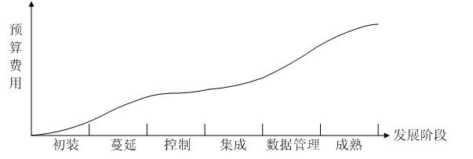
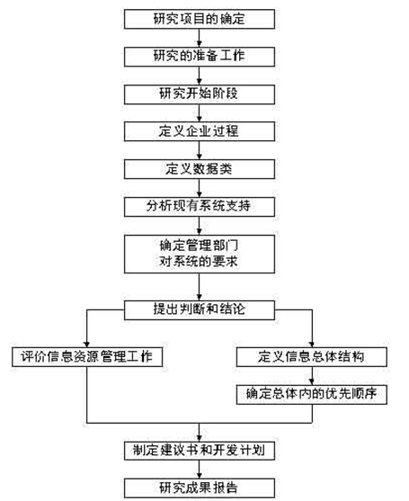

# 信息系统基础知识

**1. 信息系统综合知识**

包括信息化基础知识、政府信息化、企业信息化、信息资源管理、信息系统基础知识、系统集成等。

（1）信息化基础知识：包括信息与信息化；信息化对组织的意义；现代组织对信息化的需求；组织的信息化与软件工程或系统集成工程的不同特点。

（2）政府信息化与电子政务：包括电子政务的概念、内容和技术形式（政府职能、电子政务的模式、电子政务的实施）；中国政府信息化的策略和历程；电子政务建设的过程模式和技术模式。

（3）企业信息化与电子商务：包括企业信息化的概念、目的、规划、方法；企业资源计划的概念、功能和主要开发方法；企业业务流程重组；客户关系管理、产品数据管理在企业的应用；知识管理；企业门户；全程供应链管理的思想；商业智能；电子商务的类型、标准。

（4）信息资源管理。包括信息化基础设施平台、信息系统资源管理基础标准、信息资源规划的技术方法。

（5）信息系统基础知识。熟练掌握系统开发的5个阶段，熟练掌握每个阶段完成后需要向下一个阶段交付的文档，包括可行性分析报告、系统方案说明书、系统设计说明书、用户说明书；理解企业系统规划方法；理解战略数据规划方法；理解信息工程方法。

（6）企业应用集成：掌握控制集成、数据集成、表示集成的概念和方法，掌握外部资源的使用方法。

**2. 系统分析设计案例**

（1）企业信息化规划的概念和内容。

（2）企业信息战略规划方法：包括业务系统规划法、关键成功因素法、战略集合转化法。

（3）企业资源规划和实施：包括信息资源分类、标准、规范；调查信息需求和数据流、制定信息资源管理基础标准、建立业务概念设计模型；信息资源网建设；信息资源的开发、共享和应用。.

（4）CIO的主要职责：包括提供信息帮助企业决策、帮助企业制订长期发展战略、有效管理IT部门；制订信息系统发展规划、建立积极的IT文化。

（5）系统的扩展和集成：包括系统的扩展的时机、可行性分析，以及需求分析等；系统集成的概念、分类和主要的方法；系统扩展和集成的角色、流程和活动。

**3. 系统分析设计论文**

（1）企业信息系统（电子商务和电子政务、事务处理系统、决策支持系统）；企业信息化的组织和实施。

（2）传统企业应用集成的方式：传统企业应用集成的几个层次，结合实际说明每个层次的集成特点和主要解决的问题。

（3）事件驱动的企业应用系统集成：事件驱动的企业应用系统体系结构的定义和特点，结合项目实践说明事件驱动的企业应用集成系统中核心部件的体系结构、工作原理和运行模式。

## 信息系统

### 特性

整体性、层次性、目的性、稳定性、突变性、自组织性、相似性、相关性、环境适应性

### 理论

系统整体性原理、整体突变原理、层次性原理、开放性原理、目的性原理、环境共塑共生原理、秩序原理、生命周期原理

## 系统工程

### 霍尔三维

根据**知识维、逻辑维、时间维**将系统工程分为7个阶段，7个步奏和知识范围。

- 逻辑维 - 七个步骤 

  1. 明确问题
  2. 系统指标设计
  3. 系统方案综合
  4. 系统分析
  5. 系统选择
  6. 决策
  7. 实施计划

  确定干啥，定指标，出综合方案，方案分析，选择方案，搞决策，开干

- 时间维 - 七个阶段 

  1. 规划阶段
  2. 拟定阶段
  3. 研制阶段
  4. 生产阶段
  5. 安装阶段
  6. 运行阶段
  7. 更新阶段

  硅泥岩的生产安装运行更新

- 知识维 - 知识范围

  完成各阶段、各步骤所需的专业科学知识。

## 信息系统工程

信息系统就是输入数据，通过加工处理，产生信息的系统。面向管理是信息系统的显著特点。

### 信息系统分类

以数据环境分类：

- 数据文件

  没有使用数据库管理系统

- 应用数据库

  使用了数据库管理系统，但未实现共享。

- 主题数据库

  建立了一些数据库，与具体的应用有很大的独立性，数据经过设计，其存储结构与使用它的处理过程都是独立的，各种数据通过一些共享数据库被联系和体现

- 信息检索系统

  一些数据库被组织为能保证信息检索和快速查询的需要，而不是大量的事务管理

以应用层次分类：

- 战略级信息系统（企业最高管理层）
- 战术级信息系统（企业中层经理及其管理部门）
- 操作级信息系统（服务型企业的业务部门）
- 事务级信息系统（企业的管理业务人员）

### 生命周期

信息系统的生命周期可以分为**系统规划、系统分析、系统设计、系统实施、系统运行和维护**五个阶段

### 信息系统的发展

#### 诺兰模型

- **初装**

  刚买了电脑，少数人具备了初步应用能力

- **蔓延**

  初见成效，多部门开始使用，但有很多问题，如数据具有不一致性、共享性差等

- **控制**

  开始加强组织协调，开始统筹规划，用严格的控制代替了自由的蔓延，费用增长较慢

- **集成**

  控制的基础上，开始建立集中式数据库，硬件重新连接，在软件方面建立集中式数据库和能充分利用各种信息的系统。

- **数据管理**

  集成后进入数据管理阶段

- **成熟**

  满足组织各个管理层次的要求，实现真正的信息资源管理

## 信息系统建设

### 企业系统规划方法 BSP

是SDP和IE的基础，实现BSP的前提是企业内**有改善计算机信息系统的要求**，并且有为**建设这一系统而建立总的战略**的需要。

#### 原则

- 一个信息系统必须支持企业的战略目标。
- 一个信息系统的战略应当表达出企业的各个管理层次的需求
- 一个信息系统应该向整个企业提供一致的信息
- 一个信息系统应该适应组织机构和管理体制的改变
- 一个信息系统战略规划，应当由总体信息系统结构中的子系统开始实现

“自上而下”的系统规划、“自下而上”的分步实现。

#### 目标

- 为管理者提供一种形式化的、客观的方法，明确建立信息系统的优先顺序，而不考虑部门的狭隘利益，并避免主观性
- 为具有较长生命周期系统的建设和投资做准备
- 为了以最高效率支持企业目标，BSP提供数据处理资源的管理
- 增加负责人的信心
- 提供响应用户需求和优先级的系统，以改善信息系统管理部门和用户之间的关系
- 将数据作为一种企业资源加以确定

#### 步骤

PS： **BSP要求必须事先得到了最高领导者和某些最高管理部门参与研究的承诺。**在一开始时就要对**研究的范围和目标、应交付的成果取得一致意见**，避免事后的分歧，这是至关重要的。第一步要先选择研究组组长，要有一位企业领导用全部时间参加研究工作并指导研究组的活动。要确认参与研究的其他层次领导是否合适，并正确地解释由他们所在部门得到的材料

准备工作的主要成果应当是研究计划的制定，其内容包括研究计划、会谈日程、与主持单位一起做复查的时间表和研究报告大纲。

在研究开始阶段，主要是对企业情况进行介绍，全体研究组成员都要参加介绍会。

企业过程是企业资源管理所需要的、逻辑相关的一组决策和活动。

数据类型是和信息生命周期有关的，根据信息资源的4个周期，数据类一般也有存档类、事务类、计划类和统计类。

分析现有系统的支持的步骤包括考察信息系统对过程的支持、识别当前的数据使用情况、确定管理部门对系统的要求、提出判断和结论；

定义信息总体结构的步骤包括企业的信息结构图、确定主要系统、表示数据流向、识别子系统、先决条件的分析、信息结构的使用计划。

企业的信息结构图描绘了每一个系统的范围，产生、控制和使用的数据，系统之间的关系，对给定过程的支持，以及子系统间的数据共享。

确定总体结构中的优先顺序的过程为确定选择的标准、对子系统进行排序、描述优先子系统、选择实施方法。

信息资源管理（Information Resource Management，IRM）是指组织在业务活动中（如生产和经营活动）对信息的产生、获取、处理、存储、传输和使用进行全面的管理。信息资源管理的基础是数据管理。数据管理在于确定数据规划、数据应用、数据标准、数据内容、数据范围等。

信息资源管理的基本内容包括3个主题：

（1）资源管理的方向和控制，要从整个企业管理的全面来分析资源的管理。

（2）建立企业信息资源指导委员会，负责制定方针政策，控制和监督信息资源功能的实施。

（3）建立信息资源的组织机构，从事数据的计划和控制、数据获取以及数据的经营管理，并包括企业应用系统的开发。

通过BSP研究而提出的具体建议可能有以下4个方面：

（1）信息结构。包括对目前正在开发的系统所需要的修改，对作为未来方向和未来信息系统规划基础的信息机构的认可，对现有系统的过渡性改进。

（2）信息系统管理。包括加强数据管理以控制组织机构内的数据资源；改进信息系统的规划过程，使得更有效地支持企业和使用信息资源；提供一个测控系统，以保证未来的实施工作能顺利完成。

（3）分布式信息系统规划。包括分布信息系统的硬件配置，数据的组织和程序的开发。

（4）总体结构优先顺序。包括提出将被实现的优先级的系统，实行高优先级系统的先行系统的确定。

每个开发计划都应该包括项目的范围、主题和目标、预期成果、进度、潜在的效益、人员和职能、工具和技术、人员培训、通信、后勤和控制。

### 战略数据规划法 SDP

按照詹姆斯•马丁（James Martin）的观点，企业要搞信息化，首要任务应该是在企业战略目标的指导下做好企业战略数据规划。

#### 自顶向下的规划

规划工作应由核心设计小组来领导，一般它由4个人组成，他们将得到企业内各个用户部门的帮助，并从用户部门选取一些主要人员参加到设计小组中。核心设计小组应包括数据处理管理人员、系统分析领导者、资源管理人员、财务总监、业务经理、客户服务经理等。核心设计小组成员应由外来顾问进行培训指导。

信息资源规划者自顶向下进行全局规划，数据管理员自底向上进行详细设计，自底向上设计是自顶向下规划的延伸。

步骤如下：

（1）企业模型的建立。它大致分为三个阶段，逐步细化：

- 开发一个表示企业各职能范围的模型。
- 扩展上述模型，使它表示企业各处理过程。
- 继续扩展上述模型，使它能表示各处理过程。

（2）确定研究的边界。

（3）建立业务活动过程。

（4）实体和活动的确定。

（5）对所得规划结果进行审查。

马丁认为，自顶向下的全局规划工作应该在6个月内完成。

#### 企业模型的建立

企业模型表示该企业在经营管理中具有的职能，企业职能范围是企业中的主要业务领域。企业模型应具有完整性、适用性、持久性。

#### 主题数据库

战略数据规划的重要内容之一就是确定企业主题数据库，主题数据库的设计目的是为了加速应用项目的开发。

特征：

- 面向业务主题（不是面向单证报表）
- 信息共享（不是信息私有或部门所有）
- 一次一处输入系统（不是多次多处输入系统）
- 由基本表组成

主题数据库最主要的特征是面向业务主题，而不是面向应用程序，因而数据独立于程序。主题数据库应设计得尽可能的稳定，使能在较长时间内为企业的信息资源提供稳定的服务。

#### 战略数据规划的执行过程

执行过程包括企业的实体分析、实体活动分析、企业的重组、亲合性分析和分布数据规划

### 信息工程法 IE

信息、过程和技术构成了企业信息系统的三要素

#### 步骤

信息工程自上而下的把整个信息系统的开发过程分为4个实施阶段，

- 信息战略规划阶段
- 业务领域分析阶段
- 系统设计阶段
- 系统构建阶段

7个步骤：

- 信息战略规划

  分析并建立起企业信息需求的全面视图，产生企业的信息战略规划

- 业务领域分析

  对特定业务领域进行详细分析，产生业务领域说明

- 业务系统设计

  详细描述支持特定业务领域的应用系统，产生业务系统说明书

- 技术系统设计

  将业务系统设计的结果定制在特定的目标计算环境，产生技术系统说明书

- 系统构建

  建立系统的全部可执行部分并完成相应的用户规程和操作程序，实现系统构成。

- 系统转换

  将新构成的应用系统安装到生产环境中，以代替原有的系统

- 系统运行

  系统投入生产，并充分认识应用系统所带来的效益，完成系统运行

#### 信息战略规划

信息工程实施的起点

- 评估企业的信息需求

  确定企业使命、战略、目标、关键成功因素、企业业务流程、部门的信息需求等

- 建立企业总体信息结构

  确定企业的实体（数据的载体，用记录作为属性）并分析实体间的联系，建立结构化的实体关系图，建立CU矩阵

- 建立企业业务系统结构

  对CU矩阵进行实体活动分析，根据分析结果对企业进行重组

- 建立企业技术结构

  通过给出每个预期的数据库和文件的分布状况形成预期的数据存储/地点矩阵，进而形成每个地点数据分布决策表的办法建立数据分布矩阵。

- 提交信息战略规划

  提交完整的规划方案，通过此规划方案，可以行之有效的指导信息系统的建设。

#### 数据和资料的收集

为了制定企业信息战略规划，将涉及到有关制定企业计划的资料、有关组织结构的资料、有关业务活动的资料、现有系统的环境资料和当前技术环境的资料。

收集上述资料的主要途径是进行采访（用户调查）。在制定信息战略规划时，一般应采访3类人员，分别是最高管理者、中层管理者和其他相关人员。要对这些文档进行整理和复审。

#### 信息战略规划报告

信息战略规划报告是所有前期工作的总结，该报告将成为企业信息系统建设的依据。应包括摘要、规划和附录三个部分。

摘要通常不要超过5页，其内容应涉及下列主题：

（1）信息战略规划所涉及的范围。

（2）企业的业务目标和战略重点。

（3）信息技术对企业业务的影响。

（4）对现有信息环境的评价。

（5）推荐的系统战略（关于信息结构规划和业务系统结构规划的总结）。

（6）推荐的技术战略（关于技术结构的总结）。

（7）推荐的组织战略（关于信息系统组织进行机构改革的建议）。

（8）推荐的行动计划（要执行的主要项目、项目的持续时间、硬件设备获得的时间）。

规划是信息战略规划报告的主体内容，详细描述执行摘要中的相关要点、所使用的表格、图形和插图表达的重要信息。规划的篇幅一般在40～70页之间，不宜过长。其主要内容包括：

（1）阐述总体内容。包括规划的范围、规划委托人、规划组成员。

（2）业务环境描述。包括企业的任务、目标、关键成功因素、信息需求及组织结构。

（3）评价现有信息环境，确定在满足业务环境需求方面存在的问题。

（4）通过可选择方案和推荐的信息结构、业务系统结构、技术结构，阐明其优点、确定问题的解决方案。

（5）最后给出推荐的行动计划。

大部分规划的详细内容可包含在附录中。

## 信息系统规划方法

### 第一阶段

**以数据处理为核心，围绕职能部门需求的信息系统规划**，主要的方法包括**BSP方法**、**关键成功因素法**（Critical Success Factors，**CSF**）、**战略集合转化法**（Strategy Set Transformation，**SST**）

CSF方法就是通过分析找出使得企业成功的关键因素，然后再围绕这些关键因素来确定系统的需求，并进行规划。应用CSF方法大致可以分为确定企业目标、识别关键成功因素、确定关键信息需求三个步骤。

SST方法将整个组织的战略目标看成是一个“信息集合”，由使命、目标、战略与其它战略变量（如管理的习惯、改革的复杂性、重要的环境变量约束等等）组成。该方法的步骤是首先识别组织的战略集合，然后转化为信息系统战略，包括信息系统的目标、约束、及组织及设计原则等等，最后提交整个信息系统的结构。

CSF方法能抓住主要矛盾，使目标的识别突出重点。用这种方法所确定的目标和传统的方法衔接得比较好，但是一般最有利的只是在确定管理目标上。 

SST方法从另一个角度识别管理目标，它反映了各种人的要求，而且给出了按这种要求的分层，然后转化为信息系统目标的结构化方法。它能保证目标比较全面，疏漏较少，但它在突出重点方面不如前者。 

BSP方法虽然也首先强调目标，但它没有明显的目标引出过程。它通过管理人员酝酿“过程”引出了系统目标，企业目标到系统目标的转换是通过组织/系统、组织/过程以及系统/过程矩阵的分析得到的。**识别企业过程是BSP战略规划的中心**

### 第二阶段

要**以企业内部管理信息系统为核心，围绕企业整体需求进行**的信息系统规划，主要的方法包括**IE方法**、**战略系统规划法**（Strategic System Planning，SSP）、**战略栅格法**（Strategic Grid，SG）

SG方法的主要做法是从战略影响方面标出企业现有的和将来的IT应用组合的特征，也就是它对企业生存前景的影响。是一种了解企业中信息系统作用的诊断工具，它利用栅格表，依据现行的应用项目和预计将开发的应用项目的战略影响，确定出四种不同的信息系统战略规划条件，即战略、转变、工厂、支持（辅助）。

SSP首先通过分析企业的主要功能部分来定义企业的功能模型，再结合企业的信息需求，生成数据实体和主题数据库，从而获取企业全局数据结构。然后，进行全局信息系统体系结构的识别，最后提交信息系统的实施方案和计划。

### 第三阶段

**综合考虑企业内外环境的情况下，以集成为核心，围绕企业战略需求**进行的信息系统规划主要的方法包括**价值链分析法（Value-Chain Analysis，VCA）、战略一致性模型（Strategy Alignment Model，SAM）**

VCA方法视企业为一系列的输入、转换与输出的活动序列集合，每个活动都有可能相对于最终产品产生增值行为，从而增强企业的竞争地位。

SAM模型把企业战略规划和信息化战略规划的关系划分为内、外两大部分。其中，外部区域是指企业所面临的外部竞争环境，如产品或IT市场等；内部区域包括企业组织结构、整体信息架构和业务流程等。模型由企业经营战略、组织与业务流程、信息技术战略、信息架构和流程四大领域构成。

## 信息化基础

国家信息化体系的6个要素，分别是**信息资源、信息网络、信息技术应用、信息产业、信息化人才，以及信息化政策、法规、标准和规范**

### ERP 企业资源计划

企业的所有资源包括3大流，分别是**物质流、资金流和信息流**，企业资源计划（Enterprise Resources Planning，**ERP**）也就是对这3种资源进行全面集成管理的管理信息系统。

在设计和开发ERP系统时，应该把握住一个中心、两类业务、三条干线的总体思路。一个中心就是以财务数据库为中心；两类业务就是计划与执行；三条干线则是指供应链管理、生产管理和财务管理。在ERP设计时常用的工具包括：业务分析、数据流程图、实体关系图及功能模块图。

### CRM 客户关系管理

客户关系管理（Customer Relationship Management，**CRM**）是一种旨在**改善企业与客户之间关系**的新型管理机制。坚持**以客户为中心**的理念的基础上，重构包括**市场营销**和**客户服务**等业务流程。

CRM由两部分构成，即触发中心和挖掘中心，触发中心是指客户和CRM通过电话、传真、Web、E-mail等多种方式“触发”进行沟通；挖掘中心则是指CRM记录交流沟通的信息和进行智能分析。

CRM包含三方面的工作。一是客户服务与支持，即通过控制服务品质以赢得顾客的忠诚度，比如对客户快速准确的技术支持、对客户投诉的快速反应、对客户提供产品查询等。二是客户群维系，即通过与顾客的交流实现新的销售，比如通过交流赢得失去的客户等。三是商机管理，即利用数据库开展销售。

### SCM 供应链管理

供应链管理（Supply Chain Management，SCM）的**核心是供应链**。供应链是指一个整体的网络用来传送产品和服务，从原材料开始一直到最终客户（消费者），它凭借一个设计好的信息流、物流和现金流来完成。

供应链管理至少包括以下六大应用功能：**需求管理(预测和协作工具)、供应链计划(多工厂计划)、生产计划、生产调度、配送计划、运输计划**。

### PDM 产品数据管理

产品数据管理（Product Data Management，PDM）是一门用来管理所有**与产品相关信息**（包括零件信息、配置、文档、设计文件、结构、权限信息等）和所有**与产品相关过程**（包括过程定义和管理）的技术。

PDM产品应具有的九大功能，包括文档管理、工作流和过程管理、产品结构与配置管理、查看和批注、扫描和图像服务、设计检索和零件库、项目管理、电子协作、工具与“集成件”功能。

### PLM 产品生命周期管理

产品生命周期管理（Product Lifecycle Management，PLM）是一种应用于在单一地点的企业内部、分散在多个地点的企业内部，以及在产品研发领域具有协作关系的企业之间的，支持产品全生命周期的信息的创建、管理、分发和应用的一系列应用解决方案，它能够集成与产品相关的人力资源、流程、应用系统和信息。

PLM一般包括五个阶段，分别是培育期、成长期、成熟期、衰退期、结束期五个阶段。PLM通过培育期的研发成本最小化和成长期至结束期的企业利润最大化来达到降低成本和增加利润的目标。

### 知识管理

知识应有**外部化、内部化、中介化**和**认知化**4种功能。

知识管理就是对有价值的信息进行管理，包括知识的识别、获取、分解、储存、传递、共享、价值评判和保护，以及知识的资本化和产品化。

#### 知识的分类

- 显性知识

  以文字与数字来表达，而且以资料、科学法则、特定规格及手册等形式展现者皆属显性知识。

- 隐性知识

  难以表达、隐含于过程和行动中的非结构化知识，技术层面：包括一些非正式的个人技巧或技艺；认知层面：包括信念、理想、价值、心意与心智模型等深植于内心深处，而经常视为理所当然的东西。

#### 知识管理工具

知识管理工具是实现知识的**生成、编码和转移技术**的集合。

- 知识生成工具包括知识获取、知识合成和知识创新三大功能
- 知识编码则是通过标准的形式表现知识，使知识能够方便地被共享和交流
- 知识的转移工具就是要使知识能在组织内传播、分享

### BI 商业智能

商业智能（Business Intelligence，BI）是企业对商业数据的搜集、管理和分析的系统过程，目的是使企业的各级决策者获得知识或洞察力，帮助他们做出对企业更有利的决策。

BI系统主要包括**数据预处理、建立数据仓库、数据分析及数据展现**四个主要阶段。

### 企业门户

- 信息门户 EIP

  企业信息门户的基本作用是为人们提供企业信息，它强调对结构化与非结构化数据的收集、访问、管理和无缝集成。提供了一个单一的访问入口，例如静态网站

- 知识门户 EKP

  是企业员工日常工作所涉及相关主题内容的“总店”。企业知识门户的使用对象一般是企业员工，它的建立和使用可以大大提高企业范围内的知识共享，并由此提高企业员工的工作效率。 强调知识。

- 应用门户 EAP

  企业应用门户（Enterprise Application Portal，EAP）实际上是对企业业务流程的集成。它以商业流程和企业应用为核心，把商业流程中功能不同的应用模块通过门户技术集成在一起。企业员工和合作伙伴可以通过企业应用门户访问相应的应用系统，实现移动办公、进行网上交易等。

### 电子政务

- G2G

  政府对政府，例如 电子法规政策系统、电子公文系统、电子司法档案系统、电子财政管理系统、电子办公系统、电子培训系统和业绩评价系统

- G2E

  政府对公务员 

- G2B

  政府对企业， 例如 电子采购与招标、电子税务、电子证照办理、信息咨询服务、中小企业电子服务

- G2C

  政府对公民， 例如 教育培训服务、就业服务、电子医疗服务、社会保险网络服务、公民信息服务、交通管理服务、公民电子税务和电子证件服务

### 电子商务

- B2B
- B2C
- C2C

### DSS决策支持系统

决策支持系统（Decision Support System，DSS）是辅助决策者通过数据、模型和知识，以人机交互方式进行半结构化或非结构化决策的计算机应用系统。

- DSS不可以代替决策者
- DSS 用户直接参与开发
- 目的是辅助决策

基本特征：

（1）对准上层管理人员经常面临的结构化程度不高、说明不够充分的问题。

（2）把模型或分析技术与传统的数据存取技术及检索技术结合起来。

（3）易于为非计算机专业人员以交互会话的方式使用。

（4）强调对环境及用户决策方法改变的灵活性及适应性。

（5）支持但不是代替高层决策者制定决策

#### 基本结构

- 数据部分（数据库子系统）
- 模型部分（模型库子系统）
- 推理部分
- 人机交互部分（对话管理子系统）

#### DSS与MIS的比较

（1）DSS追求的目标是高效能，即想办法把事情办得尽可能好一些，以提高决策的能力和效果；而MIS追求的目标是高效益，即设法把事情办得快一些，以提高管理水平。  

（2）DSS着眼于决策，即着重考虑如何根据决策问题的需要，为决策者提供有价值的信息，这些信息通常由源数据经过加工、提炼、浓缩而得到；MIS着眼于信息，即着重考虑如何完成例行业务活动中的信息处理任务。  

（3）DSS的设计思想是实现一个具有巨大发展潜力的、适应性强的开放系统；而MIS的设计思想是实现一个相对稳定协调的工作系统。  

（4）DSS的设计原则是强调充分发挥人的经验、智慧、创造力，努力使系统设计有利于个人或组织决策行为的改善；而MIS的设计原则是强调系统的客观性，努力使系统设计符合组织的实际情况。  

（5）DSS的设计方法是以模型驱动的，重视决策模式的研究与模型、知识的使用，并且侧重采用以用户参加为主的、非线性的、自适应设计方法；而MIS的设计方法是以数据驱动的，以数据库设计为中心，并且强调采用线性的、结构化设计方法。  

（6）DSS通常由人机对话系统、数据库系统、模型库系统、知识库系统组成；而MIS通常由人机对话系统、数据库系统组成。  

（7）DSS能够帮助解决的是**半结构化和非结构化的决策问题**，并且以人机对话作为系统工作的主要方式；而**MIS只能解决结构化的决策问题**，并且人工干预日趋减少。这一点是DS5与MIS的主要区别

### EAI企业应用集成

企业应用集成（Enterprise Application Integration，EAI）是伴随着企业信息系统的发展而产生和演变的。

#### 企业内的集成

- **界面集成（表示集成）**

  把用户界面作为公共的集成点，把原有零散的系统界面集中在一个新的、通常是浏览器的界面之中。**各应用系统的界面集成起来，统一入口，使用户能够对集成系统产生一个“整体”的感觉**

- **平台集成**

  系统基础的集成，使得底层的结构、软件、硬件以及异构网络的特殊需求都必须得到集成。

- **数据集成**

  **是应用集成和业务过程集成的基础，可以提供企业之间的信息共享能力**

- **应用集成**

  这种集成能够为两个应用中的数据和函数提供接近实时的集成，**多个应用系统进行“绑定”**，使之**像一个实时运行的系统一样**接受信息输入和产生数据输出，实现多个系统功能的“叠加”

- **过程集成**

  过程集成包括业务管理、进程模拟等，还包括业务处理中每一步都需要的工具。

#### 企业间集成

EAI使得应用集成架构里的客户和业务伙伴，都可以通过集成供应链内的所有应用和数据库实现信息共享。

##### 集成模式

- 面向信息的集成技术

  在数据集成的层面上，信息集成技术仍然是必选的方法。信息集成采用的主要数据处理技术有数据复制、数据聚合和接口集成，其中，接口集成仍然是一种主流技术。标准化的适配器技术可以使企业从第三方供应商获取适配器，从而使集成技术简单化。

- 面向过程的集成技术

  是一种过程流集成的思想，它不需要处理用户界面开发、数据库逻辑、事务逻辑等，而只是处理系统之间的过程逻辑，和核心业务逻辑相分离。

- 面向服务的集成技术

  SOA，WebService，被认为是新一代的应用集成技术。
