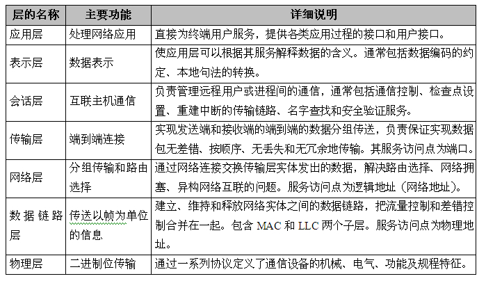
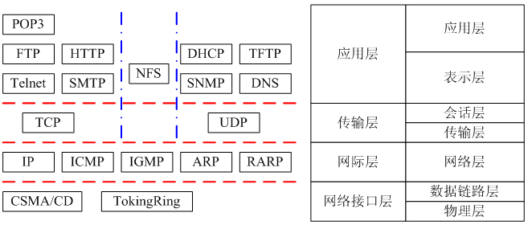
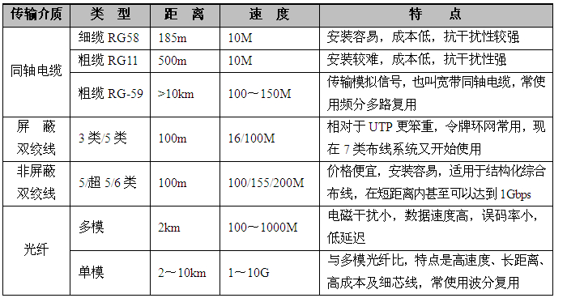
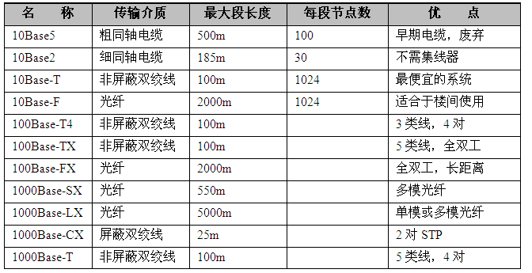
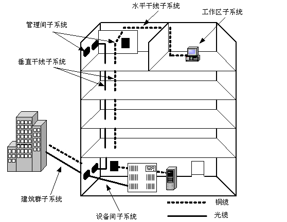

# 计算机网络

## 分类

- 局域网LAN
- 广域网WAN
- 城域网MAN

## 网络互连模型

OSI/RM 7层模型，下到上：

- 物理层

  面向硬件，定义了**通信设备**的**机械、电气、功能**和**规程**特征。

- 数据链路层

  功能为： **封装成帧、流量控制、差错控制、传输管理**

  数据链路层协议最典型是IEEE开发的802系列规范，该层分成了两个子层：LLC（逻辑链路控制层）、MAC（介质访问控制层）

- 网络层

  网络层用于从发送端向接收端传送分组，负责确保信息到达预定的目标。主要用于：1. 中间节点可以转发路过的分组；2. 解决异构网络互联问题。

- 传输层

  传输层实现发送端和接收端的端到端的数据分组传送，负责保证实现数据包无差错、按顺序、无丢失和无冗余地传输。主要目的是：1. 将大包打散发送并接收后重新组装；2.解决端对端的通信，将不同数据分发到各个程序端口。

- 会话层

  会话层主要负责管理远程用户或进程间的通信。会话层的规范具体包括通信控制、检查点设置、重建中断的传输链路、名字查找和安全验证服务。

- 表示层

  表示层关心的是所传送信息的语义与语法，负责将收到的数据转换为计算机内的表示方法或特定程序的表示方法。负责通信协议的转换、数据的翻译、数据的加密、数据的压缩、字符的转换等工作。

- 应用层

  应用层是直接提供服务给使用者的应用软件的层。

## 常见网络协议

### TCP/IP

TCP/IP协议族可被大致分为应用层、传输层、网际层和网络接口层四层。

#### 应用层

- **FTP** 

  文件传输协议，端口**21**/**20**，**20走数据，21走控制**。基于TCP，（木马Doly Trojan、Fore、Invisible FTP、WebEx、WinCrash和Blade Runner所开放的端口）

- **TFTP**

  简单文件传输，端口69，基于UDP

- **HTTP**

  **80**端口，超文本传输协议，基于TCP

- **SMTP**

  **发邮件**，可靠电子邮件传输协议，基于TCP，端口**25**（木马Antigen、Email Password Sender、Haebu Coceda、Shtrilitz Stealth、WinPC、WinSpy都开放这个端口）

- **POP3**

  端口**110**，tcp，**收邮件**

- DHCP

  动态主机配置协议，用于动态地分配客户端的TCP/IP，分配方案有固定、动态、自动三种。端口68。基于UDP。

- NFS

  允许一个系统在网络上与他人共享目录和文件，基于TCP/UDP，端口2049

- **Telnet**

  登陆仿真，允许用户登录进入远程主机系统。端口**23**，TCP

- DNS

  行域名解析服务器，端口53，UDP

- **SSH**

  远程登陆，端口**22**，tcp

- **HTTPS**

  端口**443**，tcp/udp

- SNMP

  解决Internet上的路由器管理问题而提出的协议，UDP协议的161和162号端口

#### 传输层

- TCP

  可靠的、面向连接的、全双工的数据传输服务，适用于传输数据量比较少，且对可靠性要求高的场合。

- UDP

  不可靠的、无连接的协议。适用于传输数据量大，对可靠性要求不是很高，但要求速度快的场合

#### 网际层

包括**IP**、**ICMP**（Internet Control Message Protocol，网际控制报文协议）、**IGMP**（Internet Group Management Protocol，网际组管理协议），以及**ARP**（Address Resolution Protocol，地址解析协议）和**RARP**（Reverse Address Resolution Protocol，反向地址解析协议）。这些协议处理信息的路由及主机地址解析。

- IP

  无连接的和不可靠的，提供端到端的分组分发功能，提供了数据分块和重组功能。

- ICMP

  ICMP是一个专门用于发送差错报文的协议。

- IGMP

  IGMP允许Internet主机参加多播，也即是IP主机用做向相邻多目路由器报告多目组成员的协议。

- ARP

  ARP用于动态地完成IP地址向物理地址的转换。

- RARP

  RARP用于动态完成物理地址向IP地址的转换

#### 网络接口层

该层处理数据的格式化并将数据传输到网络电缆，为TCP/IP的实现基础，其中可包含IEEE802.3的CSMA/CD、IEEE802.5的TokenRing等。

###### CSMA/CD

争用型的介质访问控制协议，工作在数据链路层。CSMA/CD控制过程包含四个处理内容，分别是侦听、发送、检测、冲突处理。CSMA/CD控制方式的优点是原理比较简单，技术上易实现，网络中各工作站处于平等地位，不需集中控制，不提供优先级控制。但在网络负载增大时，发送时间增长，发送效率急剧下降。

- 侦听

  发送数据前先监听信道是否空闲，若空闲，则立即发送数据

- 发送

  发送数据时，边发送边继续监听

- 检测

  监听到冲突，则立即停止发送数据。等待一段随机时间，再重新尝试

- 冲突处理

  若在侦听中发现线路忙，则等待一个延时后再次侦听，若仍然忙，则继续延迟等待，一直到可以发送为止。每次延时的时间不一致，由退避算法确定延时值；若发送过程中发现数据碰撞，先发送阻塞信息，强化冲突，再进行侦听工作，以待下次重新发送。

退避算法：

- 非坚持的CSMA：线路忙，等待一段时间，再侦听；不忙时，立即发送。这种算法能减少冲突，但信道利用率降低。
- 1坚持的CSMA：线路忙，继续侦听；不忙时，立即发送。这种算法能提高信道利用率，但增大了冲突。
- p坚持的CSMA：线路忙，继续侦听；不忙时，根据p概率进行发送，另外的1-p概率为继续侦听（p是一个指定概率值）。这种算法的好处是有效平衡，但比较复杂。

## 网络地址与子网掩码

### IP地址的分类

IP地址是一个4字节（共32位）的数字，被分为4段，每段8位，段与段之间用句点分隔。

IP地址可分为5类，分别是A类、B类、C类、D类和E类，大量使用的仅为A类、B类、C类。

- A类地址

  第一位为1，后七位为网络号，剩下24位主机号。  第一段取值1-126，全世界总共只有126个可能的A类网络，每个A类网络最多可以连接224-2(两个保留地址)台主机。

- B类地址

  最前面2位是10，然后用14位来标识网络号，16位标识主机号。第一段取值介于128～191之间，前两段为网络号，后两段主机号。B类地址适用于中等规模的网络，每个B类网络最多可以连接216-2台主机。

- C类地址

  最前面3位是110，然后用21位来标识网络号，8位标识主机号。第一段取值介于192～223之间，前三段合在一起表示网络号。最后一段标识网络上的主机号。适用于校园网等小型网络，每个C类网络最多可以有28-2台主机。

- D、E类地址

  D类最前面4位为1110，主要用于多点广播。E类前5位11110，保留。DE都不分网络地址和主机地址。

### 子网掩码

掩码是一个32位二进制数字，用点分十进制来描述，默认情况下，掩码包含两个域，分别为网络域和主机域。通过使用掩码可将本地可管理的网络地址部分划分成多个子网。

例如：

假设某个IP地址为176.68.160.12/22，则表示使用22位作为网络地址，那么主机地址就占10位。该IP地址是个B类地址，掩码为255.255.252.0。

### IPV6

与IPV4相比，IPV6具有以下几点优势：

- IPv6具有更大的地址空间
- IPv6使用更小的路由表
- IPv6增加了增强的组播支持及对流的支持
- IPv6加入了对自动配置的支持
- IPv6具有更高的安全性

## 通信设备

### 多路复用

- 频分多路复用 FDM

  FDM按频谱划分信道，多路基带信号被调制在不同的频谱上。FDM的优点是信道复用率高，允许复用路数多，分路也很方便。因此，FDM已成为现代模拟通信中最主要的一种复用方式，在模拟式遥测、有线通信、微波接力通信和卫星通信中得到广泛应

- 时分多路复用 TDM

  TDM将一条物理信道按时间分成若干个时间片轮流地分配给多个信号使用。TDM不仅仅局限于传输数字信号，也可以同时交叉传输模拟信号。

### 传输介质

- 双绞线
- 同轴电缆
- 光线

## 网络设备

- 网卡

  **工作于数据链路层**，负责主机向媒体收/发信号，实现帧一级协议的有关功能。

- 集线器

  **工作于物理层**，它收集多个端口传来的数据帧并广播出去。

- 中继器

  工作在**物理层**。因为信号在传输媒体的线路上传输一段距离后必然会发生衰减或者畸变，通过重发器放大增强信号并进行转发就可以保证信号可靠传输。

- 网桥

  桥接器（bridge），工作在**数据链路层**，在网桥中可以进行两个网段之间的数据链路层的协议转换。

- 交换机

  相当于一个具有很多个端口的多端口网桥，即是一种在LAN中互联多个网段，并可进行数据链路层和物理层协议转换的网络互联设备。

  交换机可以分为二层交换机、三层交换机和多层交换机。

  - **二层交换机工作在数据链路层**，起到多端口网桥的作用，主要用于局域网互联。
  - **三层交换机工作在网络层**，利用IP地址进行交换，相当于带路由功能的二层交换机。
  - **多层交换机工作在高层（传输层以上）**，这是带协议转换的交换机。

- 路由器

  路由器工作于**网络层**，它根据IP地址转发数据报，处理的是网络层的协议数据单元。

- 网关

  也称为网间连接器、信关或联网机，是**网络层**以上的中继系统。

- 调制解调器

  调制解调器工作于**物理层**，它的主要作用是信号变换，即把模拟信号变换成数字信号，或者把数字信号变换成模拟信号

## 综合布线系统

- 工作区子系统

  终端设备连接到信息插座之间的设备组成

- 水平区子系统（水平干线子系统、水平子系统）

  水平区子系统应由工作区用的信息插座，以及楼层分配线设备至信息插座的水平电缆、楼层配线设备和跳线等组成。

- 管理间子系统

  设置在楼层分配线设备的房间内

- 垂直干线子系统（垂直子系统、干线子系统）

  提供位于不同楼层的设备间和布线框间的多条连接路径

- 设备间子系统

  设备间是在每一幢大楼的适当地点设置进线设备，网络管理及管理人员值班的场所

- 建筑群子系统（楼宇子系统）

  将一栋建筑的线缆延伸到建筑群内的其他建筑的通信设备和设施

## 网络规划与设计

### 规划

（1）**网络的功能要求**。任何网络都不可能是一个可以进行各种各样工作的“万能网”，因此，必须针对每一个具体的网络，依据使用要求、实现成本、未来发展、总预算投资等因素仔细地反复推敲，尤其是分析出网络系统要完成的所有功能。

（2）**网络的性能要求**。根据对网络系统的相应时间、事物，处理的实时性进行研究，确定系统需要的存储量及备用的存储量。根据网络的工作站权限、容错程度、网络安全性方面的要求等，确定采取何种措施及方案。

（3）**网络运行环境的要求**。根据整个局域网运行时所需要的环境要求，确定使用哪种网络操作系统、应用系统以及相应的应用软件和共享资源。

（4）**网络的可扩充性和可维护性要求**。如何增加工作站、怎样与其他网络联网、对软件/硬件的升级换代有何要求与限制等，都要在网络设计时加以考虑，以保证网络的可扩充性和可维护性。通常新建网络时都会给这个局域网提出一些有关使用寿命、维护代价等的要求。

### 设计

层次式方法： 核心层、汇聚层和接入层。

- **接入层**

  **直接面向用户**连接或访问网络的部分称为接入层，具有**低成本和高端口**密度特性。

- **汇聚层**

  接入层和核心层之间的部分称为分布层或汇聚层，完成**网络访问策略控制、数据包处理、过滤、寻址**，以及**其他数据处理**的任务

- **核心层**

  将网络主干部分，有更高的**可靠性，性能和吞吐量**，只完成**数据交换**的特殊任务。
