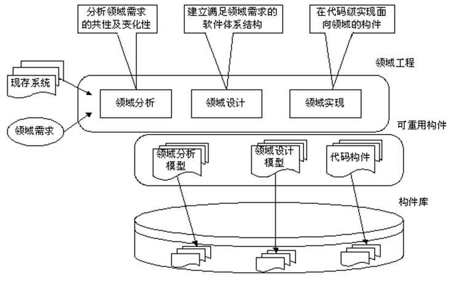

# 构件与软件重用

构件（component，组件）是一个功能相对独立的具有可重用价值的软件单元。在面向对象方法中，一个构件由一组对象构成，包含了一些协作的类的集合，它们共同工作来提供一种系统功能。

## 软件重用

可重用性（可复用性）是指系统和（或）其组成部分能在其他系统中重复使用的程度。

- **水平式重用**

  **重用不同应用领域中的软件元素**，例如数据结构、排序算法、人机界面构件等。**标准函数库**是一种典型的原始的**水平式重用**机制。

- **垂直式重用**

  在一类具有**较多公共性的应用领域之间重用软件构件**。

## 构件标准

构件是软件系统可替换的、物理的组成部分，它封装了实现体（实现某个职能），并提供了一组接口的实现方法。

构件标准：

- CORBA （OMG）

  CORBA技术规范的主要内容包括接口定义语言、接口池、动态调用接口、对象适配器等

- COM （Microsoft）

  能够支持在局域网、广域网甚至Internet上不同计算机的对象之间的通信

- DCOM（Microsoft）

  分布式COM

- EJB (SUN)

  会话Bean、实体Bean和消息驱动Bean

## 构建获取

领域是一组具有相似或相近软件需求的应用系统所覆盖的功能区域，领域工程是一组相似或相近系统的应用工程建立基本能力和必备基础的过程。

特点：

- 可重用信息具有领域特定性，即可重用性不是信息的一种孤立的属性，它依赖于特定的问题和特定的问题解决方法
- 领域具有内聚性和稳定性，即关于领域的解决方法是充分内聚和充分稳定的。

过程：

- 领域分析
- 领域设计
- 领域实现

构件获取的途径：

（1）从现有构件中获得符合要求的构件，直接使用或作适应性修改，得到可重用的构件。

（2）通过遗留工程，将具有潜在重用价值的构件提取出来，得到可重用的构件。

（3）从市场上购买现成的商业构件，即COTS构件。

（4）开发新的符合要求的构件。

一个组织在进行以上决策时，必须考虑到不同方式获取构件的一次性成本和以后的维护成本（直接成本和间接成本），然后做出最优的选择

## 构件管理

对大量的构件进行有效的管理，以方便构件的存储、检索和提取，是成功重用构件的必要保证。构件管理的内容包括构件描述、构件分类、构件库组织、人员及权限管理和用户意见反馈等。

### 构件分类：

- **关键字分类法**
- **刻面分类法**
- **超文本方法**

把软件系统看成是构件的集合，那么从构件的外部形态来看，构件分为：

- 独立而成熟的构件
- 有限制的构件
- 适应性构件
- 装配的构件
- 可修改的构件

## 构件重用

构件开发的目的是重用，为了让构件在新的软件项目中发挥作用，库的使用者必须完成以下工作：检索与提取构件，理解与评价构件、修改构件，最后将构件组装到新的软件产品中

### 检索与提取构件

- 基于关键字的检索
- 刻面检索法
- 超文本检索法
- 其他检索法

### 理解和评价构件

要使库中的构件在当前的开发项目中发挥作用，准确地理解构件是至关重要的。

- CASE工具对构件进行扫描，将各类信息存入某种浏览数据库，然后回答构件用户的各类查询，进而帮助理解。
- 逆向工程是理解构件的另一种重要手段。它试图通过对构件的分析，结合领域知识，半自动地生成相应的设计信息，然后借助设计信息完成对构件的理解和修改。

对构件可重用的评价，是通过收集并分析构件的用户在实际重用该构件的历史过程中的各种反馈信息来完成的。

### 修改构件

理想的情形是对构件库中的构件不作修改而直接用于新的软件项目。但是，在大多数情况下，必须对构件进行或多或少的修改，以适应新的需求。为了减少构件修改的工作量，要求开发人员尽量使构件的功能、行为和接口设计更为抽象化、通用化和参数化。

### 构建组装

- 基于功能的组装技术

  基于功能的组装技术采用子程序调用和参数传递的方式将构件组装起来。它要求库中的构件以子程序/过程/函数的形式出现，并且接口说明必须清晰。

- 基于数据的组装技术

  基于数据的组装技术首先根据当前软件问题的核心数据结构设计出一个框架，然后根据框架中各结点的需求提取构件并进行适应性修改，再将构件逐个分配至框架中的适当位置

- 面向对象的组装技术

  面向对象方法比其他软件开发方法更适合支持软件重用。在面向对象的软件开发方法中，如果从类库中检索出来的基类能够完全满足新软件项目的需求，则可以直接应用。否则，必须以类库中的基类为父类采用构造法或子类法生成子类。

# 中间件技术

中间件是位于平台（硬件和操作系统）和应用之间的通用服务，这些服务具有标准的程序接口和协议。

- 中间件是一类软件，而非一种软件。

- 中间件不仅仅实现互连，还要实现应用之间的互操作。

- 中间件是基于分布式处理的软件，最突出的特点是其网络通信功能。 

为上层应用屏蔽了异构平台的差异，屏蔽了底层操作系统的复杂性，缩短了应用开发周期等，功能：

（1）负责客户机和服务器间的连接和通信。

（2）提供客户机与应用层的高效率通信机制。 

（3）提供应用层不同服务之间的互操作机制。 

（4）提供应用层与数据库之间的连接和控制机制。

（5）提供一个多层结构应用开发和运行的平台。

（6）提供一个应用开发框架，支持模块化的应用开发。

（7）屏蔽硬件、操作系统、网络和数据库。

（8）提供交易管理机制，保证交易的一致性。

（9）提供应用的负载均衡和高可用性。

（10）提供应用的安全机制与管理功能。

（11）提供一组通用的服务去执行不同的功能，为的是避免重复的工作和使应用之间可以协作

## 分类

按层次划分为：

- 底层型中间件

  JVM、CLR、ACE、JDBC、ODBC等

- 通用型中间件

  CORBA、EJB、COM/DCOM

- 集成型中间件

  Work Flow、EAI

  

由于中间件需要屏蔽分布环境中异构的操作系统和网络协议，它必须能够提供分布环境下的通讯服务，我们将这种通讯服务称之为平台。

基于目的和实现机制的不同，我们将平台分为RPC、MOM、ORB三类。

### RPC 远程过程调用

RPC是一种广泛使用的分布式应用程序处理方法。一个应用程序使用RPC来远程执行一个位于不同地址空间里的过程，并且从效果上看和执行本地调用相同。一个RPC应用分为两个部分，分别是服务器和客户机。服务器提供一个或多个远程过程，客户机向服务器发出远程调用。

在RPC模型中，客户机和服务器只要具备了相应的RPC接口，并且具有RPC运行支持，就可以完成相应的互操作，而不必限制于特定的服务器。

在Java开发环境中，可以使用Java远程方法调用（Remote Methode Invocation，RMI）来代替RPC。RMI提供了Java程序语言的远程通信功能，这种特性使客户机上运行的程序可以调用远程服务器上的对象，使Java编程人员能够在网络环境中分布操作。

### MOM 消息中间件

利用高效可靠的消息传递机制进行平台无关的数据交流，并基于数据通信来进行分布式系统的集成。通过提供消息传递和消息排队模型，MOM可在分布环境下扩展进程间的通信，并支持多通讯协议、语言、应用程序、硬件和软件平台。

特点：

（1）**通讯程序可在不同的时间运行**：程序不在网络上直接相互通话，而是间接地将消息放入消息队列，因为程序间没有直接的联系。所以它们不必同时运行。消息放入适当的队列时，目标程序甚至根本不需要正在运行；即使目标程序在运行，也不意味着要立即处理该消息。 

（2）**对应用程序的结构没有约束**：在复杂的应用场合中，通讯程序之间不仅可以是一对一的关系，还可以进行一对多和多对一方式，甚至是上述多种方式的组合。多种通讯方式的构造并没有增加应用程序的复杂性。 

（3）**程序与网络复杂性相隔离**：程序将消息放入消息队列或从消息队列中取出消息来进行通讯，与此关联的全部活动，比如维护消息队列、维护程序和队列之间的关系、处理网络的重新启动和在网络中移动消息等是MOM的任务，程序不直接与其它程序通话，并且它们不涉及网络通讯的复杂性。

### ORB 对象请求代理

它的作用在于提供一个通信框架，透明地在异构的分布计算环境中传递对象请求。CORBA规范包括了ORB的所有标准接口。ORB是对象总线，它在CORBA规范中处于核心地位，定义异构环境下对象透明地发送请求和接收响应的基本机制，是建立对象之间C/S关系的中间件。ORB拦截请求调用，并负责找到可以实现请求的对象、传送参数、调用相应的方法、返回结果等。客户机对象并不知道与服务器对象通讯、激活或存储服务器对象的机制，也不必知道服务器对象位于何处、它是用何种语言实现的、使用什么操作系统或其他不属于对象接口的系统成分。

客户机和服务器角色只是用来协调对象之间的相互作用，根据相应的场合，ORB上的对象可以是客户机，也可以是服务器，甚至兼有两者。当对象发出一个请求时，它是处于客户机角色；当它在接收请求时，它就处于服务器角色。大部分的对象都是既扮演客户机角色又扮演服务器角色。另外由于ORB负责对象请求的传送和服务器的管理，客户机和服务器之间并不直接连接，因此，与RPC所支持的单纯的C/S结构相比，ORB可以支持更加复杂的结构。 

- IDL（Interface Definition Language，接口定义语言）定义客户机和服务器之间的静态接口

- 静态IDL Stubs 被称为静态调用接口，由IDL编译器编译目标对象的IDL接口描述文件而自动产生，客户程序与它直接相连。

- 静态IDL Skeletons 是静态IDL Stubs在服务器端的对应，在请求的接收端提供与存根类似的服务

- 动态Skeletons 接口（Dynamic Skeleton Interface，DSI）允许动态调用对象，对象实现需要实现动态调用例程的接口

- POA（Portable Object Adapter，可携带对象适配器）是一个引导客户端的请求到具体的对象应用的机制

- ORB负责处理底层网络细节

  

  

# J2EE与.NET

## J2EE

J2EE为设计、开发、装配和部署企业级应用程序提供了一个基于构件的解决方案。

### EJB

EJB是Java服务器端的构件模型。EJB容器作为EJB构件的执行环境，提供服务器端的系统级功能，包括线程管理、状态管理和安全管理等。

- 使用Java开发的EJB具有一次编写到处运行的优点
- 按照标准开发的EJB构件可以部署到任何一个支持EJB标准的应用服务器中
- 使用EJB开发企业应用，可以缩短开发周期，开发人员只需要将注意力集中在业务逻辑的实现上，底层服务完全由EJB容器提供
- 使用EJB开发的业务逻辑部分具有很好的移植性，不需要更改EJB的代码，开发人员能够将EJB从一种操作环境移植到另一种操作环境

### JDBC

JDBC是Java语言连接数据库的标准

### Servlet

在Servlet技术中封装了HTTP协议，开发者不需要处理复杂的网络连接和数据包，就可以扩展Web服务器的功能。

### JSP

是一种高层的Servlet，使用JSP可以直接在HTML代码中嵌入Java代码，并提交给服务器运行。使用JSP便于逻辑和表现形式的分离。

### JMS

JMS是一个消息标准，它允许J2EE应用程序建立、发送、接收和阅读消息它使得建立连接简单的、可靠的和异步的分布式通信成为可能

### JNDI

JNDI提供命名的目录功能，为应用程序提供标准的目录操作的方法，例如，获得对象的关联属性、根据它们的属性搜寻对象等。

### JTA

JTA提供事务处理的标准接口，EJB使用JTA与事务处理服务器通信。

### Java Mail API

J2EE应用程序可以使用Java Mail API来发送电子邮件。

### JAXP

JAXP支持DOM、SAX（Simple API for XML，简单应用程序接口）、XSLT（eXtensible Stylesheet Language for Transformation）转换引擎。JAXP使得应用程序可以更简单的处理XML。

### JCA

JCA是对J2EE标准集的重要的补充，它注重的是用于将Java程序连接到非Java程序和软件包的中间件的开发。

### JAAS Java认证和授权服务

JAAS提供灵活和可伸缩的机制来保证客户端或服务器端的Java程序，它让开发者能够将一些标准的安全机制通过一种通用的，可配置的方式集成到系统中。

## .NET

Microsoft .NET平台包括5个部分：

- Microsoft 

   操作系统是.NET平台的基础 

- .NET Enterprise Servers  

  提供了包括Application Center 2008、BizTalk Server 2008、Commerce Server 2008等一系列服务器产品，通过这些产品可以缩短构建大型企业应用系统的周期

- .NET Building Block Services

  指的是一些成型的服务

- .NET Framework

  位于整个.NET平台的中央，为开发.NET应用提供低层的支持。

- Visual Studio.NET

  是.NET应用程序的集成开发环境

## 比较分析

要对J2EE和.NET进行比较，我们需要明确它们的目标，这两个平台都是为了解决构建企业计算等大型平台而出现的。在这两个平台中都包含了一系列的技术，通过这些技术可以缩短开发周期，提高开发效率，节省构造成本，同时这两个平台都在安全性、扩展性、性能方面做出了努力，都提供了一系列的技术可供选择。从这个角度来说，这两个平台都实现了他们的目标，都是成功的。因为这两个平台要解决的问题类似，所以很多技术也非常类似，有些概念甚至仅仅是名称上的差别而已，**两个平台的类似之处远远多于相异之处**。

在开发语言的选择范围中，**.NET的语言选择范围相当大**；而构建J2EE应用，在语言选择方面，则**只能使用Java语言**。

在对企业计算的支持方面，虽然技术都是完备的，但二者还是有较大的差别。.NET虽然可以宣称平台中的技术是标准，但与J2EE不同，**.NET的标准并没有完全的开放**。可能使用.NET来开发企业计算平台唯一可以不选用Microsoft产品的就是数据库了，然而在.NET中ADO.NET直接支持的也仅仅是MS SQL Server和Access，对于其它的数据库（例如DB2），都必须使用OLE DB来访问（后来，增加了对Oracle的支持）。而使用J2EE的选择余地则很大。**J2EE是一种开放式的标准**，任何厂商都可以根据这些标准来开发自己的产品。无论是开发工具还是应用服务器和操作系统都有极大的选择余地，这有助于降低系统成本，减少开发费用。同样，由于J2EE的开放性，它也可以支持更多的技术标准。也就是说，虽然.NET中的技术标准可以构造完整的分布式应用，但J2EE的选择范围更多

对于需要进行平台选择的企业和开发者来说，根据自己的实际需要（例如开发团队的现状、遗留系统的现状、客户的要求等），才能做出最恰当的选择。

# 新技术

## Saas、Paas、Iaas

### Saas

SaaS具有四大特点，即低建设成本、低维护成本、低应用门槛、低投入风险。

特点：

- SaaS不仅减少了或取消了传统的软件授权费用，而且厂商将应用软件部署在统一的服务器上，免除了最终用户的服务器硬件、网络安全设备和软件升级维护的支出，除了个人电脑和互联网连接之外，客户不需要其它IT投资，就可以通过互联网获得所需要软件和服务。
- 大量的新技术（例如，Web服务等）提供了更简单、更灵活、更实用的SaaS。
- SaaS供应商通常是按照客户所租用的软件模块来进行收费的，因此，用户可以根据需求按需订购软件应用服务，而且SaaS的供应商会负责系统的部署、升级和维护。

SaaS为诸多用户在线提供较通用的软件系统，其关键技术如下：

（1）基于Internet和Web访问技术，以减少在客户端安装软件系统的工作量。

（2）网络和数据安全技术，以保证用户数据访问的网络安全。

（3）数据可靠存储技术，以保证用户关键数据的存储安全。

（4）软件快速开发和部署以及在线更新的技术，以支持用户不断变化的用户需求。

（5）数据集成技术，以解决信息孤岛问题，为用户提供多方位的信息服务。

（6）软件的计费管理，从而根据用户对软件系统的使用情况来收取费用。

对于部署在Internet中的软件系统，其用户是谁，用户的数量等都是未知的，因此，这就要求SaaS必须具有强大的安全性和可扩展性。

SaaS的安全性包括数据的安全性和网络安全性，具体可从以下方面进行考虑：

（1）数据中心的物理安全性和保护。

（2）数据是否有异地备份。

（3）数据是否有授权访问。

（4）应用是否采用物理或逻辑隔离。

（5）网络访问的安全性，是否采用了安全的通信协议。

（6）网络访问时有符合安全标准的认证和授权。

SaaS的扩展性包括平台的扩展性和应用的扩展性，具体可从以下方面进行考虑：

（1）平台是否具有扩展性，是否采用了分布式存储系统，分布式文件系统，分布式数据库等。

（2）平台是否解决了负载均衡和热备份问题。

（3）应用的扩展性包括用户能否在已存在的软件结构上，按需再增加额外的工具或功能。

（4）应用能否从其他应用程序中读取数据，或者存储数据。

（5）能否通过参数化配置来满足特定应用需求。

## 虚拟计算

虚拟计算（virtual computing）的本质是资源共享，虚拟计算的理论就是解决资源共享的理论。虚拟计算技术不仅能使我们更有效地共享现有的资源，而且能通过重组等手段，为我们提供更多、更完善的共享服务。

### P2P计算

P2P技术是一种用于不同PC用户之间、不经过中继设备直接交换数据或服务的技术。它打破了传统的C/S模式，在P2P中，每个节点的地位都是相同的，具备客户端和服务器双重特性，可以同时作为服务使用者和服务提供者。

P2P技术不仅能利用服务器的资源，同时能合理地使用用户计算机的空闲资源。使用P2P技术提供高质量和大容量的流媒体服务系统成为可能。

#### 关键技术

P2P计算的关键技术包括：

（1）P2P网络的拓扑结构的维护。

（2）节点的功能角色划分。

（3）资源和服务如何标识，大量结点如何命名、组织。

（4）资源和服务如何查找和定位。

（5）P2P网络中节点的动态变化的处理，确定结点的加入/离开方式、出错恢复等问题。

（6）P2P网络的安全性。

（7）如何穿越NAT（Network Address Translation，网络地址转换）和防火墙进行Peer节点之间的直接通信

#### 应用

（1）即时通信软件，例如ICQ、Yahoo Messenger、MSN Messenger等。

（2）数据存储软件，例如Farsite、Ocean Store等。

（3）文件数据共享软件，例如Napster等。

（4）数据搜索及查询软件，例如Infrasearch、Pointera等。

（5）协同计算软件，例如Netbatch、Groove等。

P2P计算应用的主要优点如下：

（1）每一个Peer都是平等的参与者，承担服务使用者和服务提供者两个角色。

（2）Peer之间进行直接通信，可充分利用网络带宽，减少网络的拥塞状况，使得资源的有效利用率大大提高。

（3）没有中央节点的集中控制，系统的伸缩性较强，避免单点故障，提高系统的容错性。

（4）为资源分布在多个节点，更好的实现了整个网络的负载均衡。

基于P2P计算的应用的主要缺点如下：

（1）P2P网络的分散性、自治性、动态性等特点，造成系统管理复杂。

（2）P2P的动态性造成了某些情况下访问结果是不可预见的。

（3）P2P系统的匿名性等特点可能会带来系统的安全漏洞

### 云计算

云计算（Cloud Computing）是分布式处理、并行处理和网格计算的发展，或者说是这些概念的商业实现。云计算的基本原理是，通过使计算分布在大量的分布式计算机上，而非本地计算机或远程服务器中，企业数据中心的运行将更与互联网相似。

#### 形式

- SaaS

  软件即服务

- 实用计算（Utility Computing）

  这种云计算是为IT行业创造虚拟的数据中心使得其能够把内存、I/O设备、存储和计算能力集中起来成为一个虚拟的资源池来为整个网络提供服务。

- 网络服务

  Saas延伸，网络服务提供者们能够提供API让开发者能够开发更多基于互联网的应用，而不是提供单机程序。

- Paas

  把**开发环境作为一种服务来提供**。开发商可以**使用中间商的设备来开发自己的程序**，并通过互联网和其服务器传到用户手中。

- 管理服务提供商（management Service Provider，MSP）

  这种应用更多的是面向IT行业而不是终端用户，常用于邮件病毒扫描、程序监控等等

- 商业服务平台

  SaaS和MSP的混合应用，该类云计算为用户和提供商之间的互动提供了一个平台。

- 互联网整合

  将互联网上提供类似服务的公司整合起来，以便用户能够更方便的比较和选择自己的服务供应商

#### 特点

（1）云计算提供了最可靠、最安全的数据存储中心，用户不用再担心数据丢失、病毒入侵等麻烦。 

（2）云计算对用户端的设备要求最低，使用起来也最方便。 

（3）云计算可以轻松实现不同设备间的数据与应用共享。 

（4）云计算为我们使用网络提供了几乎无限多的可能，为存储和管理数据提供了几乎无限多的空间，也为我们完成各类应用提供了几乎无限强大的计算能力。

（5）云计算为系统安全带来诸多好处，主要体现在以下几个方面：数据集中存储、事件快速反应、密码可靠性测试、日志、提升安全软件的性能、可靠的构造、安全性测试。

### 普适计算

所谓普适，就是无处不在的意思。在普适计算（Pervasive Computing或Ubiquitous Computing）时代，人与计算机是一对多的关系。普适计算按应用可以分为智能环境感知技术、无缝的可移动性、普遍的信息访问、觉察上下文计算、可以穿戴的计算。

#### 组成

（1）新的嵌入式系统：以嵌入式计算机为技术核心，面向用户、面向产品、面向应用，软硬件可裁减的，适用于对功能、可靠性、成本、体积、功耗等综合性严格要求的专用计算机系统。

（2）系统软件：是构成普适计算基础的软件部分。它能对联网设备、物体、计算实体进行管理，为它们之间的数据交换、消息交互、服务发现、任务协调等提供系统级的支持。

（3）普适网络：普适计算是网络计算的自然延伸，无线网络将成为普适计算的中心。

（4）交换模式：能实现频繁而复杂的交换方式。

#### 特性

- 间断连接

  指服务器能否不时地与用户（特别是移动用户）保持联系。用户必须能够存取服务器信息，在中断联系的情况下，可以处理这些信息。

- 轻量计算

  即计算资源相对有限

#### 关键问题

目前，普适计算还没有太多的应用，因为它还有许多问题未能解决，主要问题如下：

（1）发现。当新设备进入或者已有设备添加新的模块时，系统如何发现它，并且和它交互。

（2）感知。如何感知万事万物，即如何辨别服务主体在时间、空间、身边物资的变化。

（3）分析关键因素。在判断上下文中找到关键因数，这需要建立庞大的资源库和情境模型。

（4）强壮性。无线通讯中，模块间不可能实时的联系，这样服务的对象很有可能一段时间不在服务区（进入盲点），数据不可避免的丢失。系统这应该视为正常而不是故障。

（5）微型化，可持久性。如果设备耗电量大，我们就得把精力耗费在更换动力系统上。

## 多核技术

多内核是指在一枚处理器中集成两个或多个完整的计算引擎（内核）。

多核和多CPU之间的对比：

| 多核                                                     | 多处理器                                                     |
| -------------------------------------------------------- | ------------------------------------------------------------ |
| 多核处理器具有一个具有多个读取和执行指令的核心的处理器。 | 多处理器具有两个或多个允许同时处理程序的处理器。             |
| 多核可以更快地执行单个程序。                             | 多处理器可以更快地执行多个程序。                             |
| 多核处理器不如多处理器可靠。                             | 多处理器更加可靠，因为有多个处理器可用，并且一个处理器的故障不会影响其他处理器。 |
| 多核配置简单。                                           | 多处理器需要复杂的配置。                                     |
| 多核的流量较少。                                         | 多处理器具有更多流量。                                       |
| 多核很便宜，因为只有一个处理器。                         | 与多核相比，多处理器价格昂贵。                               |

- 多核和多处理器都用于提高程序的计算速度。
- 多核系统具有单个处理器和多个称为核心的执行单元，而多处理器系统具有两个或更多处理器。
- 与多核处理器相比，多处理器更可靠，但与多处理器相比，多核处理器的流量更少。
- 多核系统对于执行单个程序更有效，而多处理器对于同时执行多个程序更有效。
- 现代计算机具有多个处理器，每个处理器包含多个内核。

多核处理器己成主流CPU,操作系统应适应处理器的发展，因此多核操作系统已成为操作系统主流。多核操作系统的设计方法与单核相比存在很大差异，除了考虑单核基本功能设计外，还应突破与多核相关技术。主要包括了以下几点：

1. 核结构：操作系统的核心功能与CPU的内核结构密切相关，多核结构的不同影响着内核的多核工作方式。
2. Cache设计:多核操作系统内核设计方法与多核Cache的设计相关，解决多核Cache一致性问题与单核相比要复杂得多。
3. 核间通信：核间通信技术是多核操作系统必须解决的关键技术，核间通信的优劣直接影响着多核操作系统的效能。
4. 任务调度：任务调度是操作系统的核心功能，其调度策略的选择与单核或多核结构紧密相关，多核的任务调度需要考虑核间负载平衡问题以及任务同步问题。
5. 中断处理：中断处理是多核结构中需要共享的资源，与单核设计不同的是在多核情况下需要考虑中断与核的依赖关系。
6. 存储器墙设计：存储器墙设计是多核硬件结构设计中必须解决的空间隔离技术，不属于操作系统设计范畴。
7. 同步互斥：多核环境下的共享资源同步互斥，是多核操作系统必须解决的关键技术，在多核环境下共享资源同步互斥也是保障系统安全的有效方法。
8. 总体设计：多核的总体设计主要考虑系统架构设计，是一种软硬件的整体考虑，虽然要提出对软件的需求，但并不是多核操作系统最需要突破的技术。

## SOC 片上系统

SoC也称为系统级芯片，它是一个产品，是一个有专用目标的集成电路，其中包含完整系统并有嵌入式软件的全部内容。同时它又是一种技术，用以实现从确定系统功能开始，到软/硬件划分，并完成设计的整个过程。从狭义角度讲，SoC是信息系统核心的芯片集成，是将系统关键部件集成在一块芯片上；从广义角度讲，SoC是一个微小型系统。

SOC具有以下几方面的优势，因而创造其产品价值与市场需求：降低耗电量、减少体积、增加系统功能、提高速度、节省成本。

