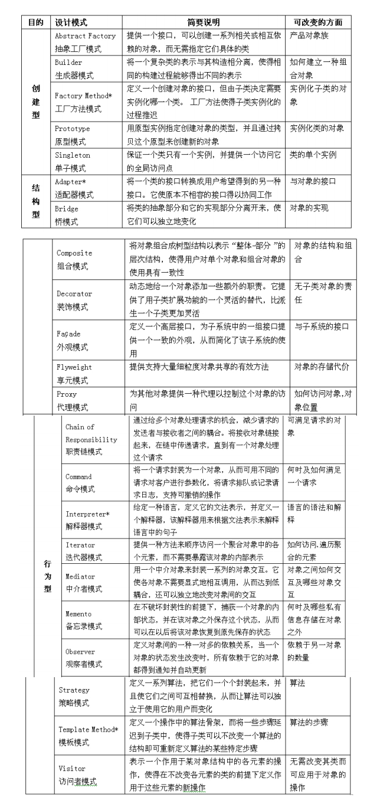

# 面向对象方法OO

面向对象（Object-Oriented，OO）方法是当前的主流开发方法。

（1）信息系统综合知识：包括统一建模语言、面向对象分析与设计、面向对象软件的测试、设计模式等。

- 统一建模语言：熟练掌握UML（2.x版）的图形表示、含义和用法。

- 面向对象的分析：熟练掌握继承、抽象、封装、多态的概念和用法；面向对象分析的基本概念；利用UML对系统需求建模，熟练掌握基于场景的建模。

- 面向对象的设计：面向对象设计方法；利用UML对软件设计建模；熟练掌握面向对象程序设计；掌握设计模式。

- 面向对象软件的测试：面向对象软件的测试层次。
- 设计模式：经典的GoF23种模式的定义和结构。

（2）系统分析设计案例：包括对象业务流的提取和确认、用例驱动的开发方式、面向对象建模技术等。

- 对象业务流的提取和确认：在面向对象的系统中，提取基于对象的业务流程，使用对象交互（活动图，顺序图等）的方式确认业务流程。

- 用例驱动的开发方式：说明用例驱动开发的原则和注意事项，结合具体案例，给出采用用例开发的方式和具体过程。
- 面向对象建模技术：结合具体案例，说明在采用某种具体的面向对象建模技术（UML等）进行系统建模时需要考虑的因素，并给出具体的模型；面向对象的系统分析方法，能够结合案例采用某种方法进行具体分析；当采用面向对象分析方法进行系统分析时，系统的功能划分方式和数据资源分布。

（3）系统分析设计论文：包括结合项目实践说明如何采用面向对象的思想和技术进行系统分析、系统设计、系统构建；面向对象软件的测试策略。

OO 包含 OOA 、OOD、 OOPD（面向对象的分析、面向对象的设计和面向对象的程序设计）

- 对象

  在计算机系统中，对象是指**一组属性**及这组属性上的**专用操作**的**封装体**。属性可以是一些数据，也可以是另一个对象。每个对象都有它自己的属性值，表示该对象的状态，用户只能看见对象封装界面上的信息，对象的内部实现对用户是隐蔽的。一个对象通常可由三部分组成，分别是对象名、属性和操作（方法）。

- 类

  类是一组具有相同属性和相同操作的对象的集合。一个类中的每个对象都是这个类的一个实例（instance）。一个类通常可由三部分组成，分别是类名、属性和操作（方法）

- 继承

  继承是在某个类的层次关联中不同的类共享属性和操作的一种机制。一个父类可以有多个子类，这些子类都是父类的特例。

- 封装

  面向对象系统中的封装单位是对象，对象之间只能通过接口进行信息交流，外部不能对对象中的数据随意地进行访问。封装的优点体现在以下三个方面：好的封装能减少耦合；类内部的实现可以自由改变；一个类有更清晰的接口

- 消息

  消息是对象间通信的手段、一个对象通过向另一对象发送消息来请求其服务。一个消息通常包括接收对象名、调用的操作名和适当的参数（如有必要）

- 多态性

  多态性是指同一个操作作用于不同的对象时可以有不同的解释，并产生不同的执行结果。

## UML 统一建模语言

UML是一种定义良好、易于表达、功能强大且普遍适用的建模语言。

### 结构

### **构造块**

- 事物

  UML重要组成部分

- 关系

  把事物联系起来

- 图

  多个相互关系起来的事务组成的组

#### 事物

- **结构事物**

  静态部分，分为 类、接口、协作、用例、活动类、构件、节点

- **行为事物**

  动态部分，分为 交互、状态机

- **分组事物**

  组织部分，即 包，包是一种将有组织的元素分组的机制。结构事物、行为事物甚至其他的分组事物都有可能放在一个包中。

- **注释事物**

  注释事物是UML模型的解释部分

#### 关系

UML之间的关系：

- **依赖**

  一个事物发生变化会影响另一个事物

- **关联**

  描述一组对象之间连接的结构关系

- **泛化**

  一般化和特殊化的关系

- **实现**

  一个类指定了由另一个类保证执行的契约

用例之间的关系：

- **include** 包含

  当可以从两个或两个以上的原始用例中提取公共行为，或者发现能够使用一个构件来实现某一个用例很重要的部分功能时，应该使用包含关系来表示它们。

- **extend** 扩展

  如果一个用例明显地混合了两种或两种以上的不同场景，即根据情况可能发生多种事情。

- **泛化**

  用例可以被特别列举为一个或多个子用例，这被称做用例泛化。

类间关系：

- **关联关系**

  描述了给定类的单独对象之间语义上的连接。

- **依赖关系**

  有两个元素X、Y，如果修改元素X的定义可能会引起对另一个元素Y的定义的修改，则称元素Y依赖于元素X。

- **泛化关系**

  泛化关系描述了一般事物与该事物中的特殊种类之间的关系，也就是父类与子类之间的关系。

- **聚合关系**

  聚合是一种特殊形式的关联，它是传递和反对称的。聚合表示类之间的关系是整体与部分的关系。部分可以脱离整体。例如汽车和车轮

- **组合关系**

  比聚合更严谨，部分脱离不了整体，例如公司和部门。

- **实现关系**

  将说明和实现联系起来。接口是对行为而非实现的说明，而类中则包含了实现的结构。

#### 图

（1）类图（class diagram）：描述一组类、接口、协作和它们之间的关系。在面向对象系统的建模中，最常见的图就是类图。类图给出了系统的静态设计视图，活动类的类图给出了系统的静态进程视图。

（2）对象图（object diagram）：描述一组对象及它们之间的关系。对象图描述了在类图中所建立的事物实例的静态快照。和类图一样，这些图给出了系统的静态设计视图或静态进程视图，但它们是从真实案例或原型案例的角度建立的。 

（3）构件图（component diagram）：描述一个封装的类和它的接口、端口，以及由内嵌的构件和连接件构成的内部结构。构件图用于表示系统的静态设计实现视图。对于由小的部件构建大的系统来说，构件图是很重要的。构件图是类图的变体。

（4）组合结构图（composite structure diagram）：描述结构化类（例如构件或类）的内部结构，包括结构化类与系统其余部分的交互点。它显示联合执行包含结构化类的行为的构件配置。组合结构图用于画出结构化类的内部内容。

（5）用例图（use case diagram）：描述一组用例、参与者（一种特殊的类）及它们之间的关系。用例图给出系统的静态用例视图。这些图在对系统的行为进行组织和建模时是非常重要的。 

（6）顺序图（sequence diagram，序列图）：是一种交互图（interaction diagram），交互图展现了一种交互，它由一组对象或角色以及它们之间可能发送的消息构成。交互图专注于系统的动态视图。顺序图是强调消息的时间次序的交互图。

（7）通信图（communication diagram）：也是一种交互图，它强调收发消息的对象或角色的结构组织。顺序图和通信图表达了类似的基本概念，但每种图所强调的概念不同，顺序图强调的是时序，通信图则强调消息流经的数据结构。

（8）定时图（timing diagram，计时图）：也是一种交互图，它强调消息跨越不同对象或角色的实际时间，而不仅仅只是关心消息的相对顺序。

（9）状态图（state diagram）：描述一个状态机，它由状态、转移、事件和活动组成。状态图给出了对象的动态视图。它对于接口、类或协作的行为建模尤为重要，而且它强调事件导致的对象行为，这非常有助于对反应式系统建模。 

（10）活动图（activity diagram）：将进程或其他计算的结构展示为计算内部一步步的控制流和数据流。活动图专注于系统的动态视图。它对系统的功能建模特别重要，并强调对象间的控制流程。 

（11）部署图（deployment diagram）：描述对运行时的处理节点及在其中生存的构件的配置。部署图给出了体系结构的静态部署视图，通常一个节点包含一个或多个部署图。

（12）制品图（artifact diagram）：描述计算机中一个系统的物理结构。制品包括文件、数据库和类似的物理比特集合。制品图通常与部署图一起使用。制品也给出了它们实现的类和构件。 

（13）包图（package diagram）：描述由模型本身分解而成的组织单元，以及它们的依赖关系。

（14）交互概览图（interaction overview diagram）：是活动图和顺序图的混合物。

### **公共机制**

公共机制是指达到特定目标的公共UML方法，包含：

- 规则说明

  规格说明是事物语义的文本描述，它是模型真正的核心

- 修饰

  UML为每一个事物设置了一个简单的记号

- 公共分类

  - 类与对象
  - 接口和实现

- 扩展机制

  - 约束（添加新规则来扩展事物的语义）
  - 构造型（用于定义新的事物）
  - 标记值（添加新的特殊信息来扩展事物的规格说明）

### **规则**

UML用于描述事物的语义规则

- 范围
- 可见性
- 完整性
- 执行

### 4+1视图

（1）逻辑视图：以问题域的语汇组成的类和对象集合。

（2）进程视图：可执行线程和进程作为活动类的建模，它是逻辑视图的一次执行实例，描绘了所设计的并发与同步结构。

（3）实现视图：对组成基于系统的物理代码的文件和构件进行建模。

（4）部署视图：把构件部署到一组物理的、可计算的节点上，表示软件到硬件的映射及分布结构。

（5）用例视图：最基本的需求分析模型。

## OOA

OOA就是直接将问题域中客观存在的事物或概念识别为对象，建立分析模型，用对象的属性和服务分别描述事物的静态特征和行为，并且保留问题域中事物之间关系的原貌。

### 用例模型

OOA的基本任务是运用面向对象方法，对问题域和系统责任进行分析和理解，正确认识其中的事物及它们之间的关系，找出描述问题域及系统责任所需的类和对象，定义它们的属性和服务，以及它们之间所形成的结构、静态联系和动态联系。最终产生一个符合用户需求，并能直接反映问题域和系统责任的OOA模型及其详细说明。

构建用例模型阶段：

1. **识别参与者**

   参与者是系统之外与系统进行交互的任何事物，参与者可以是使用系统的用户，也可以是其他外部系统、外部设备等外部实体。

2. **合并需求取得用例**

   为每一个参与者确定用例，将特征分配给相应的参与者，然后进行合并操作，最后绘制成用例图。

3. **细化用例描述**

   其内容至少包括**用例名、参与者、目标、前置条件、事件流（基本事件流、扩展事件流）、后置条件**等，其他的还可以包括**非功能需求、用例优先级**等

### 分析模型

领域模型又称为概念模型或域模型，也就是找到代表那些事物与概念的对象，即概念类。概念类可以从用例模型中获得灵感，经过完善将形成分析模型中的分析类。在迭代开发过程中，每一个用例对应一个类图，描述参与这个用例实现的所有概念类，建立分析模型包括以下基本活动：

1. **发现领域对象，定义概念类**

   从名词与名词短语中提取对象与属性，动词与动词短语中提取操作与关联

2. **识别对象的属性**

   属性是描述对象静态特征的一个数据项。可以与用户进行交谈，提出问题来帮助寻找对象的属性。

   定义属性的原则：

   - 仅定义与系统责任和系统目标有关的属性
   - 使用简单数据类型来定义属性
   - 不使用可由其他属性导出的属性（冗余属性）
   - 不为对象关联定义属性

   对属性加以说明，包括名称和解释、数据类型，以及其他的一些要求。

3. **识别类间关系**

   包括建立类的泛化关系、对象的关联关系，理清类之间的层次关系，决定类之间的关系类型，确定关系的多重性和角色的导向性。

4. **为类添加职责**

   找到了反映问题域本质的主要概念类，而且还理清它们之间的协作关系之后，我们就可以为这些类添加其相应的职责：

   - 类所维护的知识

   - 类能够执行的行为

   可以使用状态图来描述系统中单个对象的行为

5. **建立交互图**

   多个对象的行为通常采用对象交互来表示，UML 2.0提供的交互图有顺序图、交互概览图、通信图和定时图。最常用的

   是顺序图。

## OOD

面向对象设计是把分析阶段得到的需求转变成符合成本和质量要求的、抽象的系统实现方案的过程。

基本准则是：**模块化、抽象、信息隐藏、高内聚和低耦合**

OOD原则：

- **单一职责**

  内聚的体现，一个类只负责一个职责

- **开闭原则**

  对修改关闭，对扩展开放

- **李氏替换**

  子类可以替换他们的基类

- **依赖倒置**

  高层模块不依赖于底层模块，二者都依赖抽象。即抽象不依赖细节。

- **接口隔离**

  应该提供尽可能小的单独的接口，而不是大的接口

- **组合重用**

  多用组合，少用继承

- **迪米特原则**

  最少知识法则，一个类对其他类应该更可能少的了解

  

## OOT

面向对象软件在编程方面具有类继承、接口封装支持等的显著特性，对软件测试的影响是非常大的，它大大提高了软件的可重用性，但由于对语言特性的支持导致数据屏蔽，有时候为了辅助测试还必须把操作加入接口中，软件测试随之改变也就成为必然。

传统测试模式与面向对象的测试模式最主要的区别在于，面向对象的测试更关注对象而不是完成输入/输出的单一功能，这样的话测试可以在分析与设计阶段就先行介入，使得测试更好地配合软件生产过程并为之服务。

OOT的优点：

（1）更早地定义出测试用例，甚至在需求被确定之前，可以帮助系统分析员和设计师更好地理解需求并且保证需求是可测试的。

（2）由于错误的修改成本与错误发现的时间成正比，早期介入可以降低成本。

（3）尽早地编写系统测试用例以便开发人员与测试人员对系统需求的理解保持一致

（4）面向对象的测试模式更注重于软件的实质，例如，对于可复用的设计方式，采用面向对象的测试方法可以只专注于那些未覆盖的错误，而传统测试模式无法做到这一点。

OOT从低到高分为：

1. 算法层

   测试类中定义的每个方法

2. 类层

   测试封装在同一个类中的所有方法与属性之间的相互作用

3. 模板层

   也称为主题层，测试一组协同工作的类或对象之间的相互作用

4. 系统层

   把各个子系统组装成完整的面向对象软件系统，在组装过程中同时进行测试

## 设计模式

# 构件与软件重用

构件（component，组件）是一个功能相对独立的具有可重用价值的软件单元。在面向对象方法中，一个构件由一组对象构成，包含了一些协作的类的集合，它们共同工作来提供一种系统功能。

