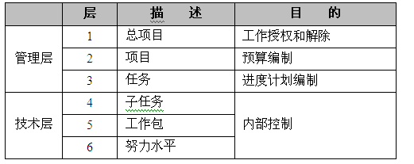
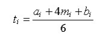
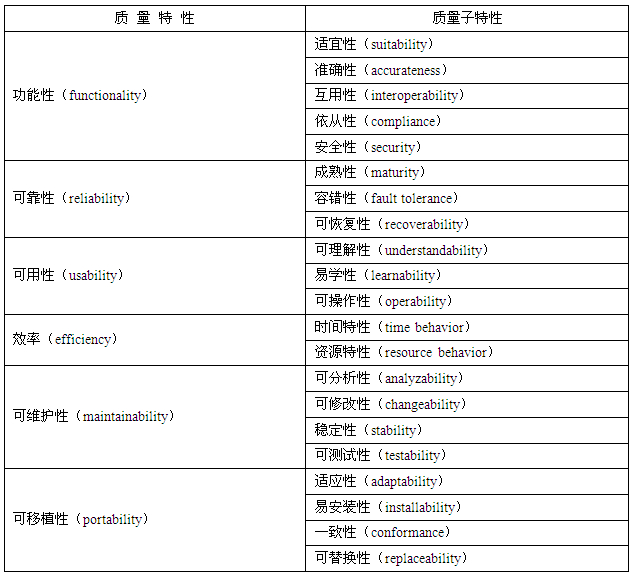
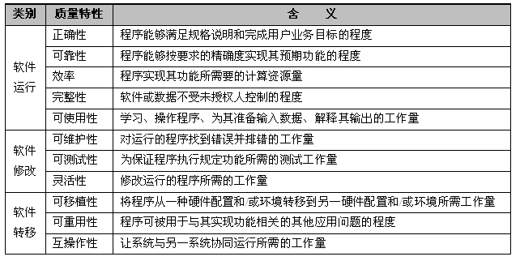
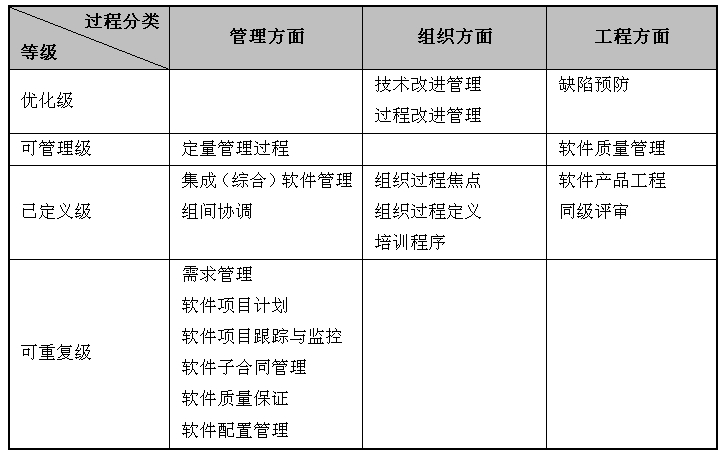

# 项管

- 信息系统综合知识

包括项目管理各领域和软件过程改进。

（1）项目计划管理：包括工作量估算、项目计划的制订、监督和控制。

（2）项目范围管理：包括工作分解结构、范围确认和控制。

（3）项目进度管理：包括活动资源估算、活动历时估算、进度控制。

（4）项目配置管理：包括版本控制、变更控制、配置控制、审计控制。

（5）项目成本管理：包括项目估算、成本预算、成本控制。

（6）项目风险管理：包括项目风险管理的概念、项目风险管理的过程、定性风险分析和定量风险分析、项目风险管理的应对方法。

（7）软件质量管理：包括软件质量管理的定义、主要的软件质量属性、软件质量控制的主要活动（包括软件评审、测试等）、

（8）过程成熟度：包括CMM/CMMI的概念、CMM/CMMI的级别。

（9）软件资源管理：包括理解程序库管理的意义；理解版本管理的意义，掌握版本管理的方法和工具。

- 系统分析与设计案例

包括系统开发规划、软件过程改进、软件项目管理各领域等知识。

（1）系统开发规划：理解系统开发计划的组成部分，包括：进度安排计划、人员投入计划、质量保证计划、风险管理计划、文档编制计划、配置管理计划；着重掌握系统配置管理计划的内容

（2）软件过程改进：掌握CMM/CMMI概念、CMM/CMMI过程；软件过程能力的评估和评估模型。

（3）范围管理：范围计划编制和工作分解结构的创建、范围确认和控制。

（4）进度管理：活动排序、活动资源估算、活动历时估算、进度控制。

（5）成本管理：成本管理过程，包括资源计划、成本估算、成本预算、成本控制等；软件成本估算的方法。

（6）质量管理：质量计划编制、质量保证和质量控制。

（7）人力资源管理：人力资源计划编制；项目团队组建、建设和管理；沟通管理。

（8）风险管理：软件开发项目管理中风险管理的概念；风险的主要类型；软件开发项目管理中风险管理的过程，包括风险管理规划、项目风险识别、定性风险分析、定量风险分析、风险应对计划、风险监督与控制。

（9）文档编制与沟通能力：可行性研究报告、项目开发计划、需求规格说明书、数据要求规格说明书、测试计划、测试分析报告、技术报告、项目开发总结报告。

（10）计划变更与控制：理解变更管理的不可避免性、复杂性；理解变更管理的任务；掌握配置库；理解基线的含义；理解基线和配置项的关系。

- 系统分析设计论文

包括项目管理和软件过程改进实践。

（1）项目管理：结合项目实践说明项目管理的范围管理；结合项目实践说明如何管理项目的进度；结合项目实践说明如何管理项目的成本；结合项目实践说明如何管理项目的质量；结合项目实践说明如何管理项目的进度；结合项目实践说明如何进行项目人力资源管理；结合项目实践说明如何进行项目风险管理。

（2）软件过程改进实践：软件过程能力成熟度模型；软件过程能力的评估与改进；制订项目计划和预算。

## 生命周期

- 概念阶段
- 开发阶段
- 实施阶段
- 结束阶段

## 项目计划管理

项目管理计划是项目组织根据项目目标的规定，对项目实施过程中进行的各项活动做出周密安排。

项目计划是促使管理者展望未来，预见未来可能发生的问题，制定适当的对策，来减少实现目标过程中的不确定性。计划是项目实施的依据和指南，可以确立项目组各成员及工作的责任范围和地位，促进项目干系人之间的交流与沟通，使项目组成员明确自己的奋斗目标、实现目标的方法、途径及期限，并确保以时间、成本及其他资源需求的最小化实现项目目标。

- 项目计划作为一个重要的项目阶段，在项目过程中承上启下，必须按照批准的项目总目标，总任务做详细的计划；
- 计划文件经批准后作为项目的工作指南，必须在项目实施中贯彻执行，必须防止计划的失误和失败。

### 计划内容

- 工作计划

  工作计划主要说明采取什么方法组织实施项目，研究如何最佳地利用资源，用尽可能少的资源获取最佳效益。具体包括工作细则、工作检查及相应措施等。工作计划也需要时间、物资、技术资源，必须反映到项目总计划中去。

- 人员组织计划

  人员组织计划主要是表明工作分解结构图中的各项工作任务应该由谁来承担，以及各项工作间的关系如何。其表达形式主要有框图式、职责分工说明式和混合式三种。

- 设备采购供应计划

  在项目管理过程中，多数的项目都会涉及到仪器设备的采购、订货等供应问题。有的非标准设备还包括试制和验收等环节。如果是进口设备，还存在选货、订货和运货等环节。设备采购问题会直接影响到项目的质量及成本。

- 其他资源供应计划

  大型项目不仅需要设备的及时供应，还有许多项目建设所需的材料、半成品、物件等资源的供应问题，预先安排一个切实可行的物资、技术资源供应计划，将会直接关系到项目的工期和成本

- 变更控制计划

  由于项目的一次性特点，在项目实施过程中，计划与实际不符的情况是经常发生的

- 进度计划

  根据实际条件和合同要求，以拟建项目的竣工投产或交付使用时间为目标，按照合理的顺序所安排的实施日程

- 成本投资计划

  包括各层次项目单元计划成本；项目“时间—计划成本”曲线和项目的成本模型（即时间—累计计划成本曲线）；项目现金流量（包括支付计划和收入计划）；项目资金筹集（贷款）计划等

- 文件控制计划

  由一些能保证项目顺利完成的文件管理方案构成，需要阐明文件控制方式、细则，负责建立并维护好项目文件，以供项目组成员在项目实施期间使用。

- 支持计划

  项目管理有众多的支持手段，主要有软件支持、培训支持和行政支持，还有项目考评、文件、批准或签署、系统测试、安装等支持方式。

  

## 项目监督与控制

项目监督与控制的目的是提供对项目进展的理解，从而在项目表现明显偏离计划时能够采取适当的纠正措施。

项目监督控制的手段主要是通过在预定的里程碑处，或者项目进度表或工作分解结构中的控制级别，将实际的工作产品和任务属性、工作量、成本，以及进度与计划进行对比来确定进展情况。

适当的可视性使得项目与计划发生重要的偏差时能够及时采取纠正措施。

项目控制可采取正规和非正规两种方式。正规控制通过定期的和不定期的进展情况汇报和检查，以及项目进展报告进行。非正规则是项目经理频繁地到项目管理现场，同项目管理人员交流，了解情况，及时解决问题。正规和非正规两种控制过程步骤相同，都是PDCA（Plan、Do、Check、Action，计划、执行、检查、行动）循环。

根据控制的时间先后，项目控制可分为预先控制、过程控制和事后控制。

根据控制的对象不同，项目控制可分为直接控制和间接控制。直接控制着眼于产生偏差的根源，而间接控制着眼于偏差本身。

## 范围管理

项目范围是为了达到项目目标，为了交付具有某种特制的产品和服务，项目所规定要做的。项目的范围管理就是要确定哪些工作是项目应该做的，哪些不应该包括在项目中。项目范围是项目目标的更具体的表达。

- 产品范围

  指信息系统产品或者服务所应该包含的功能，

- 项目范围

  指为了能够交付信息系统项目所必须做的工作

### 范围管理计划

项目范围管理计划说明项目组将如何进行项目的范围管理。项目范围管理计划可能在项目管理计划之中，也可能作为单独的一项。根据不同的项目，可以是详细的或者概括的，可以是正式的或者非正式的。

范围计划编制的输出是范围管理计划，项目的范围管理计划是对项目的范围进行确定、记载、核实管理和控制的行动指南，与项目范围计划不同，范围计划是描述的是项目的边界，而范围管理计划是如何保证项目边界应该采取的行为。

项目的范围管理计划包括如下内容：

（1）如何从项目初步的范围说明书来编制详细的范围说明书。

（2）如何进行更加详细的项目范围说明书编制WBS，如何核准和维持编制的WBS。

（3）如何确认和验收项目所完成的可交付成果。

（4）如何进行变更请求的批准。

### 范围定义

范围定义可以增加项目时间、费用和资源估算的准确度，定义实施项目控制的依据，明确相关责任人在项目中的责任，明确项目的范围、合理性、目标，以及主要可交付成果。

范围定义所编制的详细的范围说明书根据项目的主要可交付成果、假设和制约因素，具体地说明和确定项目的范围。项目范围定义是在项目方案决定之后才进行的，但是在进行项目范围定义的过程中，必然又对项目的目标和方案进行疑问，如果在此期间发现项目的目标和方案有错误，应该立即提出疑问。

### 创建工作分解结构

WBS是面向可交付物的项目元素的层次分解，它组织并定义了整个项目范围。当一个项目的WBS分解完成后，项目相关人员对完成的WBS应该给予确认，并对此达成共识，然后才能据此进行时间估算和成本估算。

WBS的上面3层通常由客户指定，不应该和具体的某个部门相联系，下面3层由项目组内部进行控制。这样分层的特点有：

（1）每层中的所有要素之和是下一层的工作之和。

（2）每个工作要素应该具体指派一个层次，而不应该指派给多个层次。

（3）WBS需要有投入工作的范围描述，这样才能使所有的人对要完成的工作有全面的了解。

最底层的工作单元称为工作包，由于它应该便于完整地分派给不同的人或组织，所以要求明确各工作单元直接的界面。工作包应该非常具体，以便承担者能明确自己的任务、努力的目标和承担的责任，工作包是基层任务或工作的指派，同时其具有检测和报告工作的作用。

### 范围变更

范围变更是对达成一致的、WBS定义的项目范围的修改。范围变更的原因包括项目外部环境发生变化（如法律、对手的新产品等），范围计划不周，有错误或者遗漏，出现了新的技术、手段和方案，项目实施组织发生了变化，项目业主对项目或者项目产品的要求发生变化等。

范围变更控制是指对有关项目范围的变更实施控制，审批项目范围变更的一系列过程，包括书面文件、跟踪系统和授权变更所必须的批准级别。

在整个项目周期内，项目范围发生变化，则要进行范围变更控制，范围变更控制的主要工作有：

（1）影响造成项目变化的因素，并尽量使这些因素向有利的方面发展。

（2）判断项目变化范围是否已经发生。

（3）一旦范围变化已经发生，就要采取实际的处理措施。

范围控制管理依赖于范围变更控制系统。

## 成本管理

### 成本估算

- 自顶向下

  从整体出发， 根据过往经验估算

- 自底向上

  从待开发部分出发，确定每个子任务工作量并叠加

- 差别估算法

  综合法，将已开发和待开发部分分开分别计算

### 成本预算

- 直接成本
- 间接成本

## 计划评审技术

PERT技术（Plan Evaluation and Review Technique，计划评审技术）和CPM都是安排项目进度，制定项目进度计划的最常用的方法。

活动的时间估计

- 乐观时间
- 悲观时间
- 最可能时间

假定三个估计服从β分布，由此可算出每个活动的期望ti：  

## 甘特图

甘特图（Gantt图）也称为横道图或条形图，把计划和进度安排两种智能结合在一起。用水平线段表示活动的工作阶段，线段的起点和终点分别对应着活动的开始时间和完成时间，线段的长度表示完成活动所需的时间。

甘特图的优点是

- 标明了各活动的计划进度和当前进度
- 能动态地反映项目进展情况
- 能反映活动之间的静态的逻辑关系

缺点是

- 难以反映多个活动之间存在的复杂的逻辑关系
- 没有指出影响项目生命周期的关键所在
- 不利于合理地组织安排整个系统
- 不利于对整个系统进行动态优化管理

## 时标网络图

克服了甘特图的缺点，用带有时标的网状图表示各子任务的进度情况，以反映各子任务在进度上的依赖关系。

## 配置管理

配置管理是一个管理学科，它对配置项的开发和支持生存期给予技术和管理上的指导。

配置管理是标识和确定系统中配置项的过程，在系统整个生存期内控制这些配置项的投放和更动，记录并报告配置的状态和变动要求，验证配置项的完整性和正确性，并对下列工作进行技术和行动指导与监督的一套规范：

（1）对配置项的功能特性和物理特性进行标识和文件编制工作。

（2）控制这些特性的变动情况。

（3）记录并报告这些变动进行的处理和实现的状态。

配置管理的目的：

- 运用配置标识、配置控制、配置状态和配置审计，建立和维护工作产品的完整性

配置管理过程的活动有：

- 过程实施、配置标识、配置控制、配置状态报告、配置评价、发行管理和交付。

**CMMI把配置管理分为9大部分：**

- **制定配置管理计划**
- **识别配置项**
- **建立配置管理系统**
- **创建或发行基线**
- **跟踪变更**
- **控制变更**
- **建立配置管理记录**
- **执行配置审核**
- **版本控制**

## 质量管理

国家标准《GB/T 16260.1-2006 软件工程　产品质量 第1部分：质量模型》。该标准定义了6个质量特性和21个质量子特性：

McCall质量模型：

## 软件过程改进

在软件过程改进方面，主要考查软件过程能力成熟度模型（Capability Maturity Model，CMM）和能力成熟度模型集成（Capability Maturity Model Integration，CMMI）。

### CMM

CMM模型分级：

1. **初始级**
2. **可重复级**
3. **已定义级**
4. **已管理级**
5. **优化级**

### CMMI

CMMI 模型分级

1. **初始级**
2. **已管理级**
3. **严格定义级**
4. **定量管理级**
5. **优化级**