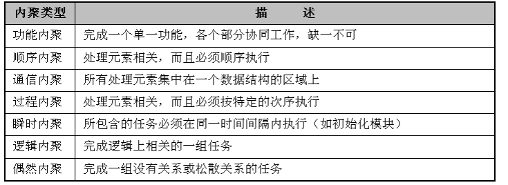
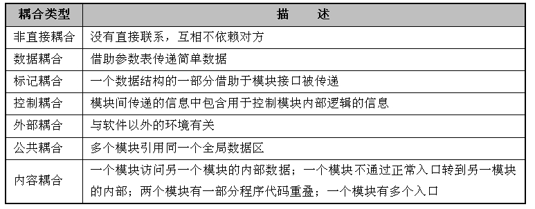

# 软件设计

从工程管理角度来看，软件设计可分为**概要设计**和**详细设计**两个阶段。

- 概要设计也称为高层设计或总体设计，即将软件需求转化为数据结构和软件的系统结构。

  概要设计主要包括设计软件的结构、确定系统由哪些模块组成，以及每个模块之间的关系。它采用的是结构图（包括模块、调用和数据）来描述程序的结构，还可以使用层次图和HIPO（层次图加输入/处理/输出图）。

- 详细设计也称为低层设计，即对结构图进行细化，得到详细的数据结构与算法。

  它采用自顶向下、逐步求精的设计方式和单入口单出口的控制结构。经常使用的工具包括程序流程图、盒图、PAD图（Problem Analysis Diagram，问题分析图）及PDL（Program Design Language，伪代码）。

## 软件设计活动

软件设计包括4个既独立又相互联系的活动，即**数据设计、软件结构设计、人机界面设计**和**过程设计**。

- 数据设计

  数据设计将分析时创建的信息域模型变换成实现软件所需的数据结构。在E-R图中定义的数据对象和关系，以及数据字典中描述的详细数据内容为数据设计活动奠定了基础

- 软件结构设计

  主要目标是开发一个模块化的程序结构，并表示出模块间的控制关系。将程序结构和数据结构相结合，为数据在程序中的流动定义了接口。

- 人机界面设计（接口设计）

  描述了软件内部、软件和协作系统之间，以及软件与人（用户）之间如何通信。包含以下三个方面：

  - 设计软件模块间的接口
  - 设计模块和其他非人的信息生产者和消费者（比如外部实体）之间的接口
  - 设计人（用户）和计算机间的接口

- 过程设计

  过程设计应该在数据设计、体系结构设计和接口设计完成之后进行。所有的程序都可以建立在一组已有的逻辑构成元素上，这一组逻辑构成元素强调了“对功能域的维护”，其中每个逻辑构成元素都有可预测的逻辑结构，即从顶端进入，从底端退出，可以很容易地理解过程流。

## 结构化设计 SD

SD包括体系结构设计、接口设计、数据设计和过程设计等任务。它是一种面向数据流的设计方法，是以结构化分析阶段所产生的成果为基础，进一步自顶而下、逐步求精和模块化的过程。

在结构化方法中，模块化是一个很重要的概念，每个模块可以独立地开发、测试。这是一种复杂问题的“分而治之”原则，其目的是使程序的结构清晰、易于测试与修改。

### 抽象化

对软件进行模块设计的时候，可以有不同的抽象层次。在最高的抽象层次上，可以使用问题所处环境的语言描述问题的解法。而在较低的抽象层次上，则宜采用过程化的方法。

- 过程的抽象
- 数据的抽象
- 控制的抽象

### 自顶向下，逐步求精

将软件的体系结构按自顶向下方式，对各个层次的过程细节和数据细节逐层细化，直到用程序设计语言的语句能够实现为止，从而最后确立整个体系结构。

### 信息隐蔽

信息隐蔽是开发整体程序结构时使用的法则，即将每个程序的成分隐蔽或封装在一个单一的设计模块中，并且尽可能少地暴露其内部的处理过程。

通过信息隐蔽可以提高软件的可修改性、可测试性和可移植性，它也是现代软件设计的一个关键性原则。

### 模块独立

模块独立是指每个模块完成一个相对独立的特定子功能，并且与其他模块之间的联系最简单。简单来说就是高内聚低耦合。

- **保持模块的大小适中；**
- **尽可能减少调用的深度；**
- **直接调用该模块的次数应该尽量多，但调用其他模块的次数则不宜过多；**
- **保证模块是单入口、单出口的；**
- **模块的作用域应该在模块之内；**
- **功能应该是可预测的**

**内聚类型**：

**耦合类型**：

# 工作流设计

工作流（Work Flow）就是自动运作的业务过程部分或整体，表现为参与者对文件、信息或任务按照规程采取行动，并令其在参与者之间传递。

工作流管理（Workflow Management，WFM）是人与电脑共同工作的自动化协调、控制和通讯。

工作流管理系统（Workflow Management System，WFMS）通过软件定义、创建工作流并管理其执行。

