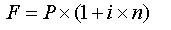
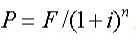
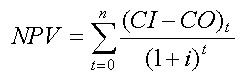
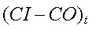
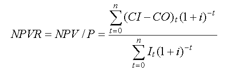
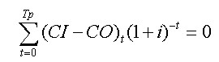

# 软件工程 

- 信息系统综合知识

  （1）软件工程基础知识：包括软件生存周期及其模型；软件需求分析与定义；软件设计；软件测试与审计；软件维护；文档编制标准。
  （2）需求分析和设计方法：包括需求的分类；结构化分析（数据流建模、控制流和控制规格说明）；分析设计图示（掌握数据流图的含义和用法、理解数据字典的含义和用法、熟练掌握流程图的含义和用法）；模块设计（内聚、耦合）；人机界面设计。
  （3）开发环境与开发工具：包括集成开发环境；开发工具（分析设计工具、编程工具、测试工具等）；软件开发平台的比较。
  （4）应用系统构建：包括熟练掌握分析与设计方法，并能熟练运用；熟练掌握程序设计方法和程序设计语言，并能熟练运用；熟练掌握测试方法，并能熟练运用。
  （5）软件测试与审计：包括单元测试、集成测试和系统测试的概念；测试用例的设计；软件需求评审；软件验证评审、功能检查、综合检查和管理评审。
  （6）系统运行：包括系统成本管理和用户管理；数据资源管理和网络资源管理；系统转换。
  （7）系统维护：包括了解维护的几种手段（日常检查、定期维护、预防性维护、事后维护、远程维护）；针对系统特点，会熟练运用以上几种维护手段进行系统维护。

- 系统分析设计案例
  （1）系统计划：包括可行性准则（运行可行性、技术可行性、进度可行性、经济可行性）；成本效益分析技术（成本的种类、有形收益和无形收益、投资回收期、投资回报率、净现值分析）；系统方案的制订、评价和改进（系统方案的内容；候选方案的可行性评价（候选系统矩阵、可行性分析矩阵）；建议方案报告的内容和格式。
  （2）需求获取和分析：包括业务模型的抽取、决策及图形化和公式化（了解业务建模的主要方法，掌握业务模型的决策方法；会使用某种标准的图形化注记方式对描述业务模型，并能够对业务模型进行公式化描述）、业务功能的模型化（在结合具体案例描述的基础上，采用合适的方式对业务功能进行建模，并给出一定的分析描述）、主要需求分析方法论（在理解现有流行需求分析方法的基础上，结合问题描述，说明采用何种需求分析方法比较适合该具体问题。

  （3）系统分析：包括业务流程分析（几种流行的业务流程分析方法，结合项目实际说明在某种具体情况下该如何采用何种业务流程分析方法，并给出流程分析模型）、系统功能划分与数据资源分布（当采用结构化进行系统分析时，系统的功能划分方式和数据资源分布）、流行的系统分析方法论（了解结构化的系统分析方法，能够结合案例采用某种方法进行具体分析）。

  （4）系统设计：包括处理流程设计（根据案例描述，说明该采用何种处理流程的设计与建模，并进行具体的流程建模，给出处理流程模型）、系统测试计划以及测试的实施（根据具体系统及其问题的叙述，给出对应的系统的测试计划及实施方案）。

  （5）系统运行和维护：包括软件维护的实施和管理（软件维护的基本概念、基本原理和基本方法；软件维护的影响因素和主要的控制管理方法；软件维护的成本管理；软件维护管理中的角色、流程和活动）、新旧系统的转换交接（遗留系统的基本概念；新旧系统转换交接的时机、可行性分析、需求分析等；遗留系统的演化策略（淘汰、继承、改造、集成）；新旧系统的转换交接中的数据转换和迁移）

- 系统分析设计论文

  （1）系统计划和分析：包括根据组织发展战略评估项目的价值，寻找商业机会；系统分析方法（结构化分析、数据建模、面向对象分析、快速分析）。

  （2）需求工程：包括需求收集；需求建模；需求管理；确认需求。

  （3）系统维护和系统测试：包括验证系统出现的问题，对问题程序进行基准测试，分析和调试问题程序；结合项目实践说明软件系统测试的策略性方法：验证与确认，软件测试的组织，传统软件体系结构的测试策略；适应用户新需求，调整和改进现有系统。

## 软件开发生命周期

## 软件开发方法

- 从开发风范上看，软件方法学可分为**自顶向下**开发方法和**自底向上**开发方法。

- 从性质上看，软件方法学可分为**形式化**方法与**非形式化**方法。

- 从适用范围上看，软件方法学可分为**整体性**方法和**局部性**方法。

  

### 净室方法

净室软件工程（净室方法）是软件开发的一种形式化方法，它可以生成高质量的软件。强调将正确性验证（而不是测试）作为发现和消除错误的主要机制，使用统计的测试来获取认证被交付的软件的可靠性所必需的出错率信息。

净室方法是一种严格的软件工程方法，它是一种强调正确性的数学验证和软件可靠性的认证的软件过程模型，其目标和结果是非常低的出错率，这是使用非形式化方法难于或不可能达到的。

### 结构化方法

结构化方法属于自顶向下的开发方法，其基本思想是“自顶向下，逐步求精”，强调开发方法的结构合理性及所开发软件的结构合理性。

结构化开发方法提出了一组提高软件结构合理性的准则，如分解与抽象、模块独立性、信息隐蔽等。针对软件生存周期各个不同的阶段，它包括了结构化分析（Structured Analysis，SA）、结构化设计（Structured Design，SD）和结构化程序设计（Structured Programing，SP）等方法。

#### 基本原则

（1）面向用户的观点。在开发过程中，开发人员应该始终与用户保持联系，从调查研究入手，充分理解用户的信息需求和业务活动，不断地让用户了解工作的进展情况，校准工作方向。

（2）严格区分工作阶段，每个阶段有明确的任务和应得的成果。

（3）按照系统的观点，自顶向下地完成系统的开发工作。

（4）充分考虑变化的情况。在系统设计中，把系统的可变更性放在首位。

（5）工作成果文献化、文档化。

#### SA

SA方法给出一组帮助系统分析人员产生功能规约的原理与技术。它一般利用图形表达用户需求，使用的手段主要有数据流图、数据字典、结构化语

言、判定表及判定树等。

SA方法的步骤如下：

（1）分析当前的情况，做出反映当前物理模型的数据流图（Data Flow Diagram，DFD）。

（2）推导出等价的逻辑模型的DFD。

（3）设计新的逻辑系统，生成数据字典和基元描述。

（4）建立人机接口，提出可供选择的目标系统物理模型的DFD。

（5）确定各种方案的成本和风险等级，据此对各种方案进行分析。

（6）选择一种方案。

（7）建立完整的需求规约。

#### SD

SD方法给出一组帮助设计人员在模块层次上区分设计质量的原理与技术。以数据流图为基础得到软件的模块结构，从整个程序的结构出发，利用模块结构图表述程序模块之间的关系。

SD的步骤如下：

（1）评审和细化数据流图。

（2）确定数据流图的类型。

（3）把数据流图映射到软件模块结构，设计出模块结构的上层。

（4）基于数据流图逐步分解高层模块，设计中下层模块。

（5）对模块结构进行优化，得到更为合理的软件结构。

（6）描述模块接口。

设计原则是：

（1）使每个模块执行一个功能（坚持功能性内聚）

（2）每个模块使用过程语句（或函数方式等）调用其他模块。

（3）模块间传送的参数作为数据使用。

（4）模块间共用的信息（如参数等）尽量少

#### 缺点

（1）开发周期长。一方面使用户在较长的时间内不能得到一个可实际运行的物理系统，另一方面难于适应环境变化。

（2）早期的结构化方法注重系统功能，兼顾数据结构方面不多。

（3）结构化程度较低的系统，在开发初期难于锁定功能要求。

### 面向对象方法

面向对象方法是当前的主流开发方法，拥有大量不同的方法，主要包括OMT（Object Model Technology，对象建模技术）方法、Coad/Yourdon方法、OOSE（Object-Oriented Software Engineering，面向对象的软件工程）及Booch方法等，而OMT、OOSE及Booch最后统一成为UML（United Model Language，统一建模语言）。

### 原型法

**原型法适合于用户需求不明确的场合。**

#### 分类

按是否实现功能分：

- 水平原型

  未实现功能

- 垂直原型

  实现一部分功能，用于复杂算法

  

按最终结果来分：

- 演化型原型

- 抛弃型原型

  

#### 选择

在需求分析阶段要使用原型化方法，必须从系统结构、逻辑结构、用户特征、应用约束、项目管理和项目环境等多方面来考虑，以决定是否采用原型化方法。

（1）系统结构：联机事务处理系统，相互关联的应用系统适合于用原型化方法，而批处理、批修改等结构不适宜用原型化方法。

（2）逻辑结构：有结构的系统，如操作支持系统、管理信息系统、记录管理系统等适于用原型化方法，而基于大量算法的系统不适宜用原型化方法。

（3）用户特征：不满足于预先做系统定义说明，愿意为定义和修改原型投资，不易肯定详细需求，愿意承担决策的责任，准备积极参与的用户是适合使用原型的用户。

（4）应用约束：对已经运行系统的补充，不能用原型化方法。

（5）项目管理：只有项目负责人愿意使用原型化方法，才适于用原型化的方法。

（6）项目环境：需求说明技术应当根据每个项目的实际环境来选择。

当系统规模很大、要求复杂、系统服务不清晰时，在需求分析阶段先开发一个系统原型是很值得的。特别是当性能要求比较高时，在系统原型上先做一些试验也是很有必要的。

#### 生存期

#### 开发技术

构造原型的一些技术包括可执行规格说明、基于场景的设计、自动程序设计、专用语言、可复用的软件构件、简化假设和面向对象技术等。其中前三种还适用于用户界面的设计。

- 可执行规格说明

  说明系统要做什么。包含形式化规格说明、有限状态模型和可执行的数据流图

- 基于场景的设计

  它提供了输入─处理─输出的屏幕格式和有关对话的模型

- 自动程序设计

  可以自动地或半自动地把用户的非过程性问题规格说明转换为某种高级语言程序

- 专用语言

  在原型开发中使用专用语言，可方便用户和软件开发者在计划中的系统特性方面的交流

- 软件复用技术

  软件复用技术可分为两大类：合成技术和生成技术

- 简化假设

  简化假设是在开发过程中使设计者迅速得到一个简化的系统所做的假设

- 面向对象技术

- 通常是指OO程序设计语言和面向对象的数据库等有关分析与设计技术的综合。

## 逆向工程

#### 再工程

再工程是对现有软件系统的重新开发过程，包括**逆向工程**（Reverse Engineering，反向工程）、新需求的考虑（**软件重构**）和**正向工程**三个步骤。

**再工程不仅能从已有的程序中重新获得设计信息，而且还能使用这些信息改建或重构现有的系统，以改进它的综合质量**。一般，软件人员利用再工程**重新实现已存在的程序，同时加进新的功能或改善它的性能**。

#### 软件重构

软件重构是对源代码、数据进行修改，使其易于修改和维护，以适应将来的变更。通常软件重构并不修改软件体系结构，而是关注模块的细节。

软件重构的意义在于提高软件质量和生产率，减少维护工作量，提高软件可维护性。

#### 逆向工程

**逆向工程是分析程序**，力图在比源代码更高的抽象层次上建立程序表示的过程。逆向工程是一个**设计恢复的过程**，其工具可以**从已有的程序中抽取数据结构、体系结构和程序设计信息**。

## 软件开发模型

### 瀑布模型

优势：

有利于大型软件开发过程中人员的组织与管理，有利于软件开发方法和工具的研究与使用，从而提高了大型软件项目开发的质量和效率。

缺点：

（1）由于开发模型呈线性，所以当开发成果尚未经过测试时，用户无法看到软件的效果。这样，软件与用户见面的时间间隔较长，也增加了一定的风险。

（2）在软件开发前期未发现的错误传到后面的开发活动中时，可能会扩散，进而可能会导致整个软件项目开发失败。

（3）在软件需求分析阶段，完全确定用户的所有需求是比较困难的，甚至可以说是不太可能的

**瀑布模型适用于需求明确或很少变更的项目**

### 演化模型

在快速开发一个原型的基础上，根据用户在调用原型的过程中提出的反馈意见和建议，对原型进行改进，获得原型的新版本，重复这一过程，直到演化成最终的软件产品

### 螺旋模型

瀑布模型和变换模型相结合，综合了两者的优点，并增加了**风险分析**。每旋转一圈都要经过**制订计划、风险分析、实施工程及客户评价**等活动，并开发原型的一个新版本。

### 喷泉模型

为软件复用和生存周期中多项开发活动的集成提供了支持，主要支持**面向对象的开发方法**。开发活动中，**分析、设计和编码之间不存在明显的边界。**

### 增量模型

融合了瀑布模型的基本成分（重复的应用）和原型实现的迭代特征。**增量模型强调每一个增量均发布一个可操作的产品**。增量模型像原型实现模型和其他演化方法一样，本质上是迭代的。增量能够**有计划地管理技术风险**。增量模型的缺点是如果增量包之间存在相交的情况且不能很好地处理，就必须做全盘的系统分析。

### 迭代模型

迭代包括产生产品发布（稳定、可执行的产品版本）的全部开发活动和要使用该发布必需的所有其他外围元素。在迭代模型中，每一次的迭代都会产生一个可以发布的产品，这个产品是最终产品的一个子集。迭代模型适用于项目事先不能完整定义产品所有需求、计划多期开发的软件开发。例如XP、RUP等，无一例外地都推荐、主张采用能显著减少风险的迭代模型

### 构件组装模型

是利用模块化方法，将整个系统模块化，并在一定构件模型的支持下，复用构件库中的一个或多个软件构件，通过组合手段高效率、高质量地构造应用软件系统的过程。CBSD模型融合了螺旋模型的许多特征，本质上是演化型的，开发过程是迭代的。

CBSD方法由软件的需求分析和定义、体系结构设计、构件库的建立、应用软件构建、测试和发布5个阶段组成。

CBSD的优点：

- 开发的过程就是构件组装的过程，维护的过程就是构件升级、替换和扩充的过程，提高了软件开发的效率
- 允许多个项目同时开发，降低了费用，提高了可维护性，可实现分步提交软件产品

缺点：

- 自定义的组装结构标准，缺乏通用的组装结构标准，引入具有较大的风险
- 可重用性和软件高效性不易协调
- 过分依赖于构件，构件库的质量影响着产品质量

### V模型

测试先行的模型，强调测试与开发同样重要。

（1）**单元测试的主要目的是针对编码过程中可能存在的各种错误**。例如，用户输入验证过程中的边界值错误。

（2）**集成测试的主要目的是针对详细设计中可能存在的问题**，尤其是检查各单元与其他程序部分之间的接口中可能存在的错误。

（3）**系统测试主要针对概要设计**，检查系统作为一个整体是否有效地得到运行。例如，在产品设置中是否达到了预期的高性能。

（4）**验收测试通常由业务专家或用户进行**，以确认产品能真正符合用户业务上的需要。

### 快速应用开发

RAD模型是一个增量型的软件开发过程模型，强调极短的开发周期。通过大量使用可复用构件，采用基于构件的建造方法赢得快速开发。其流程：

业务建模、数据建模、过程建模、应用生成、测试及交付。

- 业务建模

  可以使用DFD来描述各业务信息流等信息

- 数据建模

  可以使用E-R图来描述各数据对象集合、属性等信息，并与其他数据对象的关系构成数据模型

- 过程建模

  数据对象在信息流中完成各业务的功能。数据对象的CURD，细化DFD的处理框

- 应用程序生成

  使用4GL（第四代语言）写出处理程序，重用已有构件、创建新的构件，构件新的应用程序

- 测试与交付

  对应用程序做总体测试，对新建构件做功能测试

RAD模型通过大量使用可复用构件加快了开发速度，对信息系统的开发特别有效。但有一些缺陷：

- 并非所有应用都适合RAD，RAD要求高模块化，不能高模块化的功能无法使用
- 开发者和客户必须很短时间内完成需求分析
- RAD只能用于信息系统开发，不适合高技术风险的项目

### 敏捷开发

强调程序员团队与业务专家之间的紧密协作、面对面沟通、频繁交付新的软件版本、紧凑而自我组织型的团队、能够很好地适应需求变化的代码编写和团队组织方法，也更注重人的作用。 

极限编程（Extreme Programming，XP）、自适应软件开发（ASD）、水晶方法（Crystal）、特性驱动开发（FDD）、并列争球法（Scrum）等。

其基本原则包含：

从开发者角度：

- 短平快会议（Stand Up）
- 小版本发布（Frequent Release）
- 较少的文档（Minimal Documentation）
- 合作为重（Collaborative Focus）
- 客户直接参与（Customer Engagement）
- 自动化测试 （Automated Testing）
- 适应性计划调整 （Adaptive Planning）
- 结对编程 （Pair Programming）

从管理者的角度：

- 测试驱动开发（Test-Driven Development）

- 持续集成（Continuous Integration）

- 重构（Refactoring）

  

`PS： 敏捷方法主要适用于小规模软件的开发和小型团队的开发。这些方法所提出来的一些所谓的“最佳实践”并非对每个项目都是最佳的，需要项目团队根据实际情况决定。而且，敏捷方法的有些原则在应用中不一定能得到贯彻和执行。因此，在实际工作中，我们可以“取其精华，去其糟粕”，把敏捷方法和其他方法结合起来。`

#### XP

XP是一种轻量（敏捷）、高效、低风险、柔性、可预测、科学且充满乐趣的软件开发方式，适用于小型或中型软件开发团队，并且客户的需求模糊或需求多变。

XP的核心是其总结的4大价值观，即**沟通、简单、反馈和勇气**。

XP的5个原则是**快速反馈、简单性假设、逐步修改、提倡更改和优质工作**

而在XP方法中，贯彻的是“**小步快走**”的开发原则，因此工作质量决不可打折扣，通常采用**测试先行**的编码方式来提供支持

12个最佳实践：**计划游戏、小型发布、隐喻、简单设计、测试先行、重构、结对编程、集体代码所有制、持续集成、每周工作40小时、现场客户和编码标准**

#### ASD

核心是三个非线性的，重迭的开发阶段，**猜测，合作，学习**。

- **猜测**

  **就是对目标做一个分析，给出一个大的方向，但不要太具体，但是大方向一定要对。给团队提供目标，让团队每个人为这个目标而兴奋，项目组中要定期的散焦，在一个过程开始时不要太关注于细节实现，而过程进行时要从散焦变成聚焦，逐步协商合作，统一每个人的思想，逼近正确目标，以为后续的工作提供可靠的保证**

- **合作**

  **第一个障碍是强权管理，第二个障碍是个人主义。相互信任、相互尊重、相互参与、相互承诺是创造双赢的核心。无论是和客户也好，还是人与人之间也好，还是公司与公司也好，协作绝对是一个人，一个团队，一个公司最具竞争力的核心。能不能在内部和外部出现协作，是能否自动适应各种环境的重要因素。协作需要的是努力得整合自己和别人观点的分歧。**

- **学习**

  **学习是一种态度。自我批评、反馈、信息共享是其核心。我们一定要不停地问自己至少下面三个问题：和客户讨论时，我们要反复地问，“我们在做正确的事吗？”，在设计编码测试时，我们要反复地问，“我们用正确的手段做这件事吗？”，在事后分析时，我们也要反复地问，“还能有更好的方法做这件事吗？”，在项目过程中要给予这种时间进行反馈、自我批评、并交流个人的心得体会。于是，我们就在一种高速—慢速—再高速—再慢速—超高速的发展。**

ASD强调开发方法的适应性（Adaptive），这一思想来源于复杂系统的混沌理论。

自适应软件开发（ASD）有六个基本的原则：

①在自适应软件开发中，有一个使命作为指导，它设立了项目的目标，但不描述如何达到这个目标；

②特征被视为客户价值的关键，因此，项目是围绕着构造的构件来组织并实现特征；

③过程中的迭代是很重要的，因此重做与做同样重要，变化也包含其中；

④变化不视为是一种更正，而是对软件开发实际情况的调整；

⑤确定的交付时间迫使开发人员认真考虑每一个生产版本的关键需求；

⑥风险也包含其中，它使开发人员首先跟踪最艰难的问题。

#### Scrum

核心是迭代，增量交付，按照30天进行迭代开发交互可实际运行的软件。

Scrum采用了迭代、循序渐进的方法，通过频繁的、小规模的迭代开发来保证项目的进展和质量，同时通过不断地接受客户反馈和变更需求，使得产品更加符合客户需求。SCRUM 敏捷开发还通过强调团队协作和沟通，加强了开发过程中各方之间的合作，提高了团队效率和质量。这些特点都使得 SCRUM 敏捷开发在当今快速变化的市场环境中越来越受到欢迎。

SCRUM 框架包括 **3种角色身份、5类事件活动，3套工件资料和5个价值观** 。

SCRUM 团队由产品负责人、ScrumMaster 和开发团队三种角色组成。

SCRUM 事件包括 Sprint、Sprint Planning、Daily Scrum、Sprint Review 和 Sprint Retrospective 五类活动。

SCRUM 工件包括产品积压清单、Sprint 积压清单和增量产品内容。

SCRUM 推崇的五个价值观。

- - 承诺 – 愿意对目标做出承诺
  - 专注 – 把你的心思和能力都用到你承诺的工作上去
  - 开放 – SCRUM 把项目中的一切开放给每个人看
  - 尊重 – 每个人都有他独特的背景和经验
  - 勇气 – 有勇气做出承诺，履行承诺，接受别人的尊重

Sprint 过程：

​	开发团队每个迭代都会在一定时间内完成一部分可用的产品增量，这个过程称为 Sprint 。通常持续1-4周时间不等

- 开发团队会先将产品需求拆解成一系列任务，并在每个 Sprint 开始时选取部分任务进行开发。
- Sprint 过程中，开发团队每天进行15分钟的站立会议（Daily Scrum），讨论项目进度和问题，并根据任务进展情况逐步推进开发工作
- Sprint 结束后，开发团队进行产品演示和评审，将开发完成的部分产品展示给相关利益相关者，并收集反馈意见，以进一步完善产品

`潜在可交付的产品增量是要求每一个 Sprint 结束都产生用户可用的软件，也被称为“潜在可交付的产品增量”（Potential shippable product increment, PSPI）。能否每个 Sprint 生成满足质量定义的PSPI 是 SCRUM 执行效果的试金石。`

`这里关键的是团队内有一致同意的 DOD（完成的定义），基于其中的内容来判断是否迭代内所有东西都做完了。同样，随着时间推移，团队 DOD 内容会不断修改完善 。“潜在可交付”并不意味着构建出的东西必须实际交付，交付是产品负责人的业务决策，基于发布计划来确定。`

拆分和优化：

- 拆分组织：把组织拆分成小规模、跨职能的自组织团队。

- 拆分产品：把工作拆分成一系列小而具体的交付物，按优先级排序，估算每项任务的相对工作量。

- 拆分时间：把时间拆分成固定大小的短迭代（通常为1~4周），在每个迭代结束时对可交付的产品增量进行演示。

- 优化商业价值：每个迭代结束后跟客户一起检查发布目标，据此优化发布计划，更新产品代办事项列表的优先级。

- 优化流程：每个迭代结束后进行回顾，对团队的实践过程做优化。

  

SCRUM 敏捷开发方法的应用可带来以下几方面的好处：

- 快速交付：SCRUM敏捷开发方法强调快速迭代和优先级管理，可以使开发团队更加专注于高价值的功能开发，提高交付速度。
- 灵活性：SCRUM敏捷开发方法允许在开发过程中根据实际情况进行调整和变更，使开发团队更加灵活应对变化。
- 高客户满意度：SCRUM敏捷开发方法强调与客户的协作和反馈，能够更好地满足客户需求，提高客户满意度。
- 高质量：SCRUM敏捷开发方法注重测试和反馈，可以在开发过程中发现和解决问题，提高产品质量。
- 更好的团队协作：SCRUM敏捷开发方法强调团队协作和沟通，可以提高团队协作效率和工作积极性。

#### Crystal

水晶法认为每一个不同的项目都需要一套不同的策略、约定和方法论，认为人对软件质量有重要的影响，因此随着项目质量和开发人员素质的提高，项目和过程的质量也随之提高。通过更好的交流和经常性的交互，软件的生产力得到提高。

Crystal方法特点：

- **以人为中心**：这意味着流程的设计以优先考虑参与人员的方式进行。除此之外，它还能确保流程易于更改，从而促进员工成长，提高团队的积极性。
- **自适应**：Crystal是一种系列方法，团队可以根据自己的要求检索并找到适合自己团队的方法。换句话说，这意味着该方法不会有固定的流程、标准和工具。也就是说，他们可以对流程、标准和工具随意调整，以满足团队和当前正在运行的项目的需求。Crystal是灵活的。
- **超轻量** **级**：超轻量级意味着没有大量的文档，没有严格的规则或管理，也没有特定的报告。Crystal方法通过保持工作团队、参与的团队成员与客户之间的交互透明，让事情变得易于解决。

建议遵循以下策略标准：

- 定期增量交付；
- 基于软件交付和重大决策而不是书面文档的里程碑来跟踪进度；
- 直接用户参与；
- 功能的自动化回归测试；
- 每个版本有两个用户视图。这就意味着，至少会有两个用户检查已发布的功能，以避免错误的产生；
- 在每次增量的开始及过程中都召开对产品和方法改进调整的研讨会。

#### FDD

FDD强调特性驱动，快速迭代，即能保证快速开发，又能保证适当文档和质量，非常适合中小型团队开发管理。

它提出的每个功能开发时间不超过两周，为每个用例 user case 限定了粒度，具有良好可执行性，也可以对项目的开发进程进行精确及时地监控。它抓住了软件开发的核心问题领域，即正确和及时地构造软件。 FDD 还打破了传统的将领域和业务专家 / 分析师与设计者和实现者隔离开来的壁垒。 分析师被从抽象的工作中解脱出来，直接参与到开发人员和用户所从事的系统构造工作中。

FDD 是一个模型驱动 ( model-driven) 、短期迭代 (short-iteration) 的过程。

FDD分**首席程序员和主程序员**

### 统一过程

UP是一个通用过程框架，UP是基于构件的，在为软件系统建模时，UP使用的是UML。与其他软件过程相比，UP具有三个显著的特点，即**用例驱动、以体系结构为中心、迭代和增量**。

UP中的软件过程在时间上被分解为四个顺序的阶段，分别是**初始阶段、细化阶段、构建阶段**和**交付阶段**。**每个阶段结束时都要安排一次技术评审**，以确定这个阶段的目标是否已经达到。如果评审结果令人满意，就可以允许项目进入下一个阶段。

初始阶段的任务是为系统建立业务模型并确定项目的边界。在初始阶段，必须识别所有与系统交互的外部实体，定义系统与外部实体交互的特性。在这个阶段中所关注的是整个项目的业务和需求方面的主要风险。对于建立在原有系统基础上的开发项目来说，初始阶段可能很短。

细化阶段的任务是分析问题领域，建立健全的体系结构基础，淘汰项目中最高风险的元素。在细化阶段，必须在理解整个系统的基础上，对体系结构做出决策，包括其范围、主要功能和诸如性能等非功能需求，同时为项目建立支持环境。

在构建阶段，要开发所有剩余的构件和应用程序功能，把这些构件集成为产品，并进行详细测试。构建阶段的主要任务是通过优化资源和避免不必要的报废和返工，使开发成本降到最低；完成所有所需功能的分析、开发和测试，快速完成可用的版本；确定软件、场地和用户是否已经为部署软件作好准备。在构建阶段，开发团队的工作可以实现某种程度的并行。即使是较小的项目，也通常包括可以相互独立开发的构件，从而使各团队之间实现并行开发。

当基线已经足够完善，可以安装到最终用户实际环境中时，则进入交付阶段。交付阶段的重点是确保软件对最终用户是可用的。交付阶段的主要任务是进行β测试，制作产品发布版本；。交付阶段结束时也要进行技术评审，评审目标是否实现，是否应该开始演化过程，用户对交付的产品是否满意等。

UP的工作流程分为两部分，即核心工作流程与核心支持工作流程。

核心工作流程（在项目中的流程）：

- **业务需求建模**
- **分析设计**
- **实施**
- **测试和部署**

核心支持工作流程（在组织中的流程）:

- **环境**
- **项目管理**
- **配置**
- **变更管理**

## 系统规划与问题定义

总体规划阶段的主要任务如下：

（1）制定软件的发展战略。

（2）确定组织的主要信息需求，形成软件的总体结构方案，安排项目开发计划。

（3）制定系统建设的资源分配计划。

进行软件系统的总体规划一般包括如下几个阶段：

（1）对当前系统进行初步的调查。初步调查包括一般调查和软件需求初步调查，其中软件需求初步调查是主要内容。

（2）分析和确定系统目标。

（3）分析子系统的组成以及基本功能。

（4）拟定系统的实施方案。

（5）进行系统的可行性分析。

（6）编写可行性报告

## 可行性分析

系统可行性研究分为**技术可行性、经济可行性、操作可行性、法律法规可行性**四个方面

- 技术可行性

  技术可行性一般要考虑的情况包括：在给出的限制范围内，能否设计出系统并实现必须的功能和性能；可用于开发的人员是否存在问题。可用于建立系统的其他资源是否具备；相关技术的发展是否支持这个系统。

- 经济可行性

  进行开发成本的估算以及了解取得效益的评估，确定要开发的系统是否值得投资开发。对于大多数系统，一般衡量经济上是否合算，应考虑一个最小利润值。包括成本效益分析、公司经营长期策略、开发所需的成本和资源、潜在的市场前景等。

- 法律法规可行性

  系统开发过程中可能涉及的各种合同、侵权、责任以及各种与法律相抵触的问题。

- 用户操作可行性

  系统使用单位在行政管理、工作制度和人员素质等因素上能否满足系统操作方式的要求。

步骤：

1. 核实问题定义与目标

   关键目标是：使得问题定义更加清晰、明确、没有歧义性，并且对于系统的目标、规模以及相关约束与限制条件做出更加细致的定义，确保可行性分析小组的所有成员达成共识。

2. 研究分析现有系统

   对现有系统的仔细分析与研究是十分重要的一项工作，因为它是新系统开发的最好参照物，对其的充分分解有助于新系统的开发。

3. 为新系统建模

   在问题定义、现有系统研究的基础上，就可以开始对新的系统进行建模，建模的目的是为了获得一个对新系统的框架认识、概念性认识，可以使用下述技术：

   - 系统上下文关系范围图（DFD 0层图），界定系统范围
   - 实体关系图，找到实体与实体之间的关系即可
   - 用例模型，建立用例模型
   - 域模型，OO思想，找到主要的实体类说明主要特征和之间的关系
   - IPO，输入/处理/输出，从这三个角度描述系统

4. 用户复核

   与客户一起进行复核，不行循环1-4，直到用户确认。

5. 提出并评价解决方案

   尽量列举出各种可行的解决方案，并且对这些解决方案的优点、缺点做一个综合性的评价，以便于下一步决策。可以使用候选系统矩阵和可行性分析矩阵。对于那些明显不可行的，如技术上还没有相应的办法、经济角度明显不可行的、违背企业或行业实际情况的解决方案应该直接过滤掉。

6. 确定最终推荐的解决方案

   选中一个最合理、最可行的解决方案，并且更加详细地说明理由，并且还要对其进行更加完善的成本效益分析。

7. 草拟开发计划

   制订一个最粗略的开发计划，说明开发所需的资源、人员和时间进度安排。

8. 提交可行性分析报告

   将研究的结果整理成文，提交用户和管理层，进行审查通过。在国家标准GB/T 8567-88中，规定了可行性分析报告的详细格式和内容，大致包括引言、可行性研究的前提、对现有系统的分析、所建议的系统、可选择的其他系统方案、投资及效益分析、社会因素方面的可行性、结论。

## 成本效益分析

成本：

- 固定成本
- 可变成本
- 混合成本

收益：

- 有形收益
- 无形收益

### 货币时间价值

单利： 

复利： 

**折现值**： 

i为利率，n为年期，P为本金，F为n年后收入

**净现值NPV**：

为第t年的净现金流量，CI为现金流入，CO为现金流出。i为折现率或行业基准收益率。

**净现值率NPVR**：

`P为项目投资总额现值`

### 投资回收期

静态投资回收期：

动态投资回收期：

### 投资回收率

投资回收率 = 1/动态投资回收期×100%

### 盈亏平衡点

BEP = TFC/(P-VC)

单位售价（P）、单位可变成本（VC）以及总固定成本（TFC）

## 系统建模

现有系统可以是一个正在运行的软件系统，也可以是一个纯手工运作的流程。

