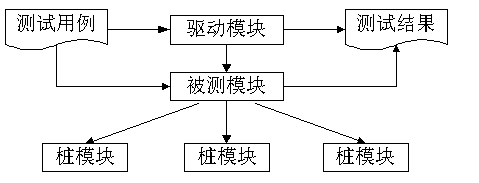

# 软件测试

软件测试可以验证软件是否满足软件需求规格说明和软件设计所规定的功能、性能及软件质量特性的要求，为软件质量的评价提供依据。

软件测试只是软件质量保证的手段之一，不能单凭测试来保证软件质量。

## 测试的类型

### 动态测试

- **黑盒测试法**

  测试人员完全不考虑程序的内部结构和处理过程，只在软件的接口处进行测试，依据需求规格说明书，检查程序是否满足功能要求。

  - **有等价类划分**

    把程序的输入域划分成若干部分，然后从每个部分中选取少数有代表性的数据作为测试用例，每一类代表性数据在测试中的作用等价于这一类中的其他值。

  - **边界值分析**

    不选择等价类的任意元素，而选择等价类边界的测试用例。

  - **错误推测**

    基于经验和直觉推测程序中所有可能存在的各种错误，有针对性地设计测试用例的方法

  - **因果图**

    从自然语言书写的程序规格说明的描述中找出因（输入条件）和果（输出或程序状态的改变），通过因果图转换为判定表

- **白盒测试法**

  测试人员须了解程序的内部结构和处理过程，以检查处理过程的细节为基础，对程序中尽可能多的逻辑路径进行测试，检验内部控制结构和数据结构是否有错，实际的运行状态与预期的状态是否一致。

  - **基本路径测试**

    通过分析控制结构的环路复杂性导出基本路径集合，然后设计测试用例，保证这些路径都至少通过一次

  - **循环覆盖测试**

    覆盖程序中所有的循环，包括单循环及嵌套循环

  - **逻辑覆盖测试**

    以程序内部逻辑为基础的测试技术，常用的有**语句覆盖、判定覆盖、条件覆盖、条件判定覆盖、修正的条件判断覆盖、条件组合覆盖、点覆盖、边覆盖和路径覆盖**等

- **灰盒测试法**

  灰盒测试结合了白盒测试和黑盒测试的要素，考虑了用户端、特定的系统知识和操作环境，在系统组件的协同性环境中评价应用软件的设计

  

### 静态测试

被测试程序不在机器上运行，而采用人工检测和计算机辅助静态分析的手段对程序进行检测。

- **桌前检查**

  由程序员自己检查自己编写的程序，对源程序代码进行分析、检验，并补充相关的文档，目的是发现程序中的错误。应避免主观片面性。

- **代码审查**

  代码审查是由若干程序员和测试员组成一个会审小组，通过阅读、讨论和争议，对程序进行静态分析的过程。

  1. 小组负责人提前把设计规格说明书、控制流程图、程序文本及有关要求、规范等分发给小组成员，作为评审的依据
  2. 召开程序审查会。首先由程序员逐句讲解程序的逻辑。在此过程中，程序员或其他小组成员可以提出问题，展开讨论，审查错误是否存在。

- **代码走查**

  代码走查与代码审查基本相同，不同的事在会上不是简单的读程序或者按照错误对照表进行检查，而是直接充当计算机，让测试用例走一遍。

## 测试阶段

### 单元测试

单元测试又称为模块测试，是针对软件设计的最小单位（程序模块）进行正确性检验的测试工作。其目的在于检查每个程序单元能否正确实现详细设计说明中的模块功能、性能、接口和设计约束等要求，以及发现各模块内部可能存在的各种错误。

**单元测试根据详细设计说明书进行测试**，通常由开发人员自己负责。包括模块接口测试、局部数据结构测试、路径测试、错误处理测试和边界测试等。常常要借助驱动模块（相当于用于测试模拟的主程序）和桩模块（子模块）完成。

**单元测试的计划通常是在软件详细设计阶段完成的，单元测试一般使用白盒测试方法**。

### 集成测试

集成测试也称为组装测试、联合测试（对于子系统而言，则称为部件测试）。它将已通过单元测试的模块集成在一起，**主要测试模块之间的协作性**。

**集成测试计划通常是在软件概要设计阶段完成的，集成测试一般采用黑盒测试方法**。

分为：

- 一次性组装

- 增量式组装（包括自顶向下、自底向上及混合式）

  - 桩模块
  - 驱动模块

  

`软件集成的过程是一个持续的过程，会形成多个临时版本。在不断的集成过程中，功能集成的稳定性是真正的挑战。在每个版本提交时，都需要进行“冒烟”测试，即对程序主要功能进行验证。冒烟测试也称为版本验证测试或提交测试`

### 确认测试

确认测试也称为有效性测试，**主要包括验证软件的功能、性能及其他特性是否与用户要求（需求）一致**。

**确认测试计划通常是在需求分析阶段完成的**。

- **内部确认测试**：主要由软件开发组织内部按软件需求说明书进行测试。
- **Alpha 测试**：由用户在开发环境下进行测试。
- **Beta 测试**：由用户在实际使用环境下进行测试。
- **验收测试**：针对软件需求说明书，在交付前以用户为主进行的测试

### 系统测试

如果项目不只包含软件，还有硬件和网络等，则要将软件与外部支持的硬件、外设、支持软件、数据等其他系统元素结合在一起，在实际运行环境下，对计算机系统进行一系列集成与确认测试。

系统测试的主要内容包括功能测试、健壮性测试、性能测试、用户界面测试、安全性测试、安装与反安装测试等。

**系统测试计划通常在系统分析阶段（需求分析阶段）完成**。

### 性能测试

性能测试是通过自动化的测试工具模拟多种正常、峰值及异常负载条件来对系统的各项性能指标进行测试。

负载测试和压力测试都属于性能测试，两者可以结合进行，统称为负载压力测试。

- **负载测试**，确定在各种工作负载下系统的性能，目标是**测试当负载逐渐增加时，系统各项性能指标的变化情况**。
- **压力测试**，是通过确定一个系统的瓶颈或不能接收的性能点，来获得**系统能提供的最大服务级别的测试**。

#### 性能测试的目的

- 评估系统的能力
- 识别体系中的弱点
- 系统调优
- 检测软件中的问题
- 验证稳定性和可靠性

#### 性能测试的类型

- 负载测试

  指数据在超负荷环境中运行，程序是否能够承担

- 强度测试

  在系统资源特别低的情况下考查软件系统运行情况

- 容量测试

  确定系统可处理的同时在线的最大用户数

#### 性能测试的步骤

（1）制定目标和分析系统。

（2）选择测试度量的方法。

（3）学习相关技术和工具。

（4）制定评估标准。

（5）设计测试用例。

（6）运行测试用例。

（7）分析测试结果.

#### 负载压力测试

系统的负载压力测试（负载测试）中的负载是指系统在某种指定软件、硬件及网络环境下承受的流量，例如并发用户数、持续运行时间、数据量等，其中并发用户数是负载压力的重要体现。系统在应用环境下主要承受并发访问用户数、无故障稳定运行时间和大数据量操作等负载压力。

负载压力测试的目的如下：

（1）在真实环境下检测系统性能，评估系统性能是否可以满足系统的性能设计要求

（2）预见系统负载压力承受力，对系统的预期性能进行评估。

（3）进行系统瓶颈分析、优化系统

在网络应用系统中，负载压力测试应重点关注客户端、网络及服务器（包括应用服务器和数据库服务器）的性能。应获取的关键测试指标如下：

（1）客户端：并发用户数、响应时间、交易通过率及吞吐量等。

（2）网络：带宽利用率、网络负载、延迟，以及网络传输和应用错误等。

（3）服务器：操作系统的CPU占用率、内存使用和硬盘I/O等；数据库服务器的会话执行情况、SQL执行情况、资源争用及死锁等；应用服务器的并发连接数、请求响应时间等。

## 测试自动化

为了提高软件测试的效率，运用既有的测试工具或开发相应的测试程序进行测试。

引入自动化测试的好处：

（1）提高测试执行的速度。

（2）提高运行效率。

（3）保证测试结果的准确性。

（4）连续运行测试脚本。

（5）模拟现实环境下受约束的情况。

仍然无法做到：

（1）所有测试活动都可以自动完成。

（2）减少人力成本。

（3）可以免费获得。

（4）降低测试工作量。

由于软件项目或产品都面临时间有限和资源有限的两个问题，软件测试自动化也就需要从这两个方面着手进行选择。虽然自动化测试包含的内容涉及测试的许多方面，但可以总结为以下3个类别：分析自动化（静态分析、动态分析）、功能测试类和系统测试类。

对于产品相对单一，或者是开发周期长的项目，我们更倾向于自己开发测试工具，无论是从节省测试成本还是从企业长远发展考虑，这都是有利的。

## 软件调试

调试主要由3个步骤组成，它从表示程序中存在错误的某迹象开始，首先确定错误的准确位置，也就是找出哪个模块或哪个语句引起的错误。然后仔细研究推断代码以确定问题的原因，并设法改正，最后进行回归测试。总的来说有三种调试的实现方法，分别是**蛮力法、回溯法、原因排除法**。

蛮力法的调试可能是为了找到错误原因而使用的最普通但是最低效的方法了。根据“让计算机自己来寻找错误”的思想，进行内存映象，激活运行时的跟踪。

回溯是在小程序中经常能够奏效的相当常用的调试方法。从发现症状的地方开始，开始（手工地）向回跟踪源代码，直到发现错误原因。

原因排除法是通过演绎和归纳，以及二分法来实现的。

软件调试与测试的区别主要体现在以下几个方面：

（1）测试的目的是找出存在的错误，而调试的目的是定位错误并修改程序以修正错误.

（2）调试是测试之后的活动，测试和调试在目标，方法和思路上都有所不同。

（3）测试从一个已知的条件开始，使用预先定义的过程，有预知的结果；调试从一个未知的条件开始，结束的过程不可预计。

（4）测试过程可以事先设计，进度可事先确定；调试不能描述过程或持续时间。

## 测试设计

就每一项测试而言，软件测试过程包括测试计划、测试设计、测试执行和测试评估等阶段。测试设计是整个测试过程中非常重要的一个环节，测试设计的输出结果是测试执行活动依赖的执行标准，测试设计的充分性决定了整个软件过程的测试质量。

从以下几个层次来进行测试设计：

- **用户层**： 测试是面向产品最终的使用操作者的测试，重点突出的是从操作者角度上，测试系统对用户支持的情况，用户界面的规范性、友好性、可操作性，以及数据的安全性等。
- **应用层**： 测试是针对产品工程应用或行业应用的测试，重点站在系统应用的角度，模拟实际应用环境，对系统的兼容性、可靠性、性能等进行测试。
- **功能层**： 测试是针对产品具体功能实现的测试，主要包括功能覆盖测试、功能分解测试、功能组合测试和功能冲突测试。
- **子系统层**： 测试是针对产品内部结构性能的测试，重点关注子系统内部的性能、模块间接口的瓶颈。
- **协议层**： 测试是针对系统支持的协议的测试，主要包括协议一致性测试和协议互通测试。

## 测试管理

为了保证软件的开发质量，软件测试应贯穿开发的整个过程，包括对设计和所有实现结果的检测。要成立专门的测试管理组，由测试管理组对测试进行统一、规范的管理。测试管理组包括评审小组、测试小组和支持小组。

软件测试管理大致分为 ：

- 测试团队管理
- 测试计划管理
- 缺陷跟踪管理
- 测试件管理