# 系统性能与配置

（1）信息系统综合知识：包括系统配置方法（双份、双重、热备份、容错、集群）；）性能计算（响应时间、吞吐量、TAT）；性能设计（系统调整、Amdahl解决方案、响应特性、负载均衡）；性能指标（SPEC-Int、SPEC-Fp、TPC、Gibsonmix、响应时间）；性能评估；了解系统故障管理的基本方法，如处理手续、监视过程、恢复过程、预防措施等。

（2）系统分析设计案例：包括系统的故障模型和可靠性模型；系统的可靠性分析和可靠度计算；提高系统可靠性的措施；系统的故障对策和系统的备份与恢复；在理解系统可靠性分析和计算技术的基础上，结合具体案例，给出系统的可靠性分析和计算。

（3）系统分析设计论文：包括系统失效与系统恢复。

## 响应时间

米勒曾经给出了3个经典的有关响应时间的建议，至今仍有参加价值：

（1）0.1秒：用户感觉不到任何延迟。

（2）1秒：用户愿意接受的系统立即响应的时间极限。即当执行一项任务的有效反馈时间在0.1～1秒之内时，用户是愿意接受的。超过此数据值，则意味着用户会感觉到有延迟，但只要不超过10秒，用户还是可以接受的。

（3）10秒：用户保持注意力执行本次任务的极限，如果超过此数值时仍然得不到有效的反馈，用户会在等待计算机完成当前操作时转向其他的任务。

## 吞吐量

吞吐量就是在给定的时间内，系统的吞入能力与吐出能力是多少。

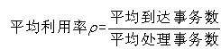               

例如，假设某计算机系统的用户在1秒钟内发出40个服务请求，这些请求（为M/M/1队列）的时间间隔按指数分布，系统平均服务时间为20ms。则该系统的吞吐量为1000/20=50（1s=1000ms），系统的平均利用率为40/50=0.8，系统的平均响应时间为20/(1-0.8)=100ms。

## 可靠性

- 平均无故障时间  MTTF

  从t=0时到故障发生时系统的持续运行时间的期望值；

  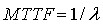      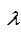为失效率  

  假设同一型号的1000台计算机，在规定的条件下工作1000小时，其中有10台出现故障。这种计算机千小时的可靠度R为(1000-10)/1000=0.99。失效率为10/ (1000×1000) =1×10-5。因为平均无故障时间与失效率的关系为MTTF=1/ λ，因此，MTTF=105小时。

- 平均故障修复时间 MTTR

  MTTR=1/μ

- 平均故障间隔时间 MTBF

  MTBF = MTTR + MTTF ，因为一般MTTR很小，所以通常认为MTBF≈MTTF

- 系统可用性

  可用性 = MTTF/(MTTF＋MTTR)×100%

### 串联系统

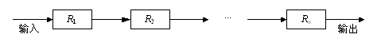

系统可靠性 ： 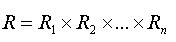

失效率： 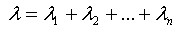

### 并联系统

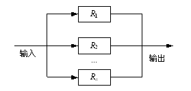

可靠性： 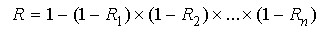

失效率： 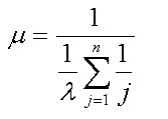

### 模冗余系统

由m个(m=2n+1为奇数)相同的子系统和一个表决器组成，有n+1个或n+1个以上子系统能正常工作，系统就能正常工作

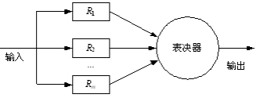

可靠性：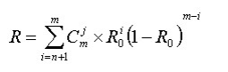

## 性能设计

系统分析与设计实际上是一种平衡设计，需要在功能性需求和非功能性需求（性能需求）上做妥协选择。

### 系统调整

性能调整是一项循环进行的工作，包括收集、分析、配置和测试4个反复的步骤。

准备工作：

- 识别约束

  那些是硬性条件，客户说死的，避开这些，在不受约束的因素上进行调整。

- 指定负载

  有多少服务，多少设备，客户的思考时间、负载的分布等等。

- 设置性能目标

  性能目标必须明确，包括识别用于调整的度量标准及其对应的基准值。例如吞吐量、响应时间等度量标准，以及每个标准的基准值。

开始循环

1. 收集

   对当前系统选一堆性能计数器来收集各个方面的性能，将这些量化数据作为基准值。

2. 分析

   对收集到的性能数据进行分析，哪些是瓶颈，哪些可优化

3. 配置

   根据分析出来的结果对系统的某个配置进行更改。这里要求一次只更改一个配置，因为同时改多个配置会导致相互影响，无法准确的分析每个配置更改后的影响。

4. 测试

   更改配置后进行测试，是否对原有系统有影响，影响是正向还是负向，性能是否达标，不达标就循环继续，达标就退出。

   

### 阿姆达尔解决方案

系统中对某部件采用某种更快执行方式，所获得的系统性能的改变程度，取决于这种方式被使用的频率，或所占总执行时间的比例。

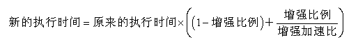

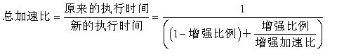

## 负载均衡

负载均衡是由多台服务器以对称的方式组成一个服务器集合，每台服务器都具有等价的地位，都可以单独对外提供服务而无须其他服务器的辅助。

- 基于DNS的负载均衡
- 代理服务器负载均衡
- 地址转换网关负载均衡
- 协议内部支持负载均衡
- NAT（Network Address Translation，网络地址转换）负载均衡
- 反向代理负载均衡
- 混合型负载均衡

## 系统性能评估

有**时钟频率法、指令执行速度法、等效指令速度法、数据处理速率法、综合理论性能法**和**基准程序法**

- 时钟频率法

  以时钟频率作为评估对象，例如：微机A的时钟周期为1/(20M)=50ns。因为“两个时钟周期组成一个机器周期”，则一个机器周期为2×50ns=100ns。“平均三个机器周期可完成一条指令”，则平均指令周期为3×100ns=300ns。也就是说，指令平均执行速度为1/(300ns)×3.33MIPS（Million Instructions Per 

  Second，每秒百万条指令数）。因为微机B的主频为60MHz，是微机A主频的60/20=3倍，所以，微机B的平均指令执行速度应该比微机A的快3倍，即微机B的指令平均执行速度为3.33×3≈10MIPS。

- 指令执行速度法

  用加法指令的运算速度来衡量计算机的速度。

- 等效指令速读法

  吉普森混合法或混合比例计算法，通过一系列指令执行时间来综合计算。T = 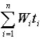 W为某类指令占比，t为这类指令运行时间。

- 数据处理速率法

  1991年9月停止使用PDR，取而代之的是CTP（综合理论性能法）

- 综合理论性能法

  CTP是美国政府为限制较高性能计算机出口所设置的运算部件综合性能估算方法。CTP的估算方法为首先算出处理部件每一计算单元的有效计算率R再按不同字长加以调整，得出该计算单元的理论性能TP，所有组成该处理部件的计算单元TP的总和即为综合理论性能CTP。

- **基准程序法**

  上述性能评价方法主要是针对CPU（有时包括内存），但没有考虑诸如I/O结构、操作系统、编译程序的效率等对系统性能的影响。

  基准程序法（benchmark）是目前一致承认的测试性能的较好方法，使用基准程序来进行评估。

## 系统故障模型

系统故障是指由于部件的失效、环境的物理干扰、操作错误或不正确的设计引起的硬件或软件中的错误状态。

故障或错误有如下几种表现形式： 永久性、间歇性、瞬时性

故障模型是对故障的表现进行抽象，可以建立4个级别的故障模型：

- 逻辑级的故障模型

  固定型故障、短路故障、开路故障、桥接故障等

- 数据结构级的故障模型

  独立差错(一个二进制位变了)、算数差错（一个值增减了）、单向差错（二进制位向某个方向改变了）

- 软件故障和软件差错

  非法转移、误转移、死循环、空间溢出、数据执行、非法数据

- 系统级的故障模型

  系统输出与系统设计说明的不一致

一般来说，故障模型建立的级别越低，进行故障处理的代价也越低，但故障模型覆盖的故障也越少。如果在某一级的故障模型不能包含故障的某些表现，则可以用更高一级的模型来概括

## 系统可靠性设计

分为避错技术和容错技术。避错是预防和避免系统在运行中出错。例如，软件测试就是一种避错技术；容错是指系统在其某一组件故障存在的情况下不失效，仍然能够正常工作的特性。容错功能一般通过冗余组件设计来实现，计算机系统的容错性通常可以从系统的可靠性、可用性和可测性等方面来衡量。

### 冗余技术

冗余是指所有对于实现系统规定功能来说是多余的那部分的资源，包括硬件、软件、信息和时间。

#### 结构冗余

- 静态冗余

  常用的有三模冗余和多模冗余。静态冗余通过表决和比较来屏蔽系统中出现的错误。

- 动态冗余

  动态冗余的主要方式是多重模块待机储备，当系统检测到某工作模块出现错误时，就用一个备用的模块来顶替它并重新运行。

- 混合冗余

  它兼有静态冗余和动态冗余的长处

#### 信息冗余

添加一些信息，以保证运行结果正确性的方法。例如，纠错码就是信息冗余的例子。

#### 时间冗余

时间冗余以重复执行指令（指令复执）或程序（程序复算）来消除瞬时错误带来的影响。

#### 冗余附加技术

指为实现上述冗余技术所需的资源和技术，包括程序、指令、数据、存放和调动他们的空间和通道等。

### 故障恢复

故障的恢复策略一般有两种，分别是**前向恢复和后向恢复**。前向恢复是指使当前的计算继续下去，把系统恢复成连贯的正确状态，弥补当前状态的不连贯情况，这需要有错误的详细说明；后向恢复是指系统恢复到前一个正确状态，继续执行，这种方法显然不适合实时处理场合。

### 软件容错

#### 恢复块方法

后向恢复

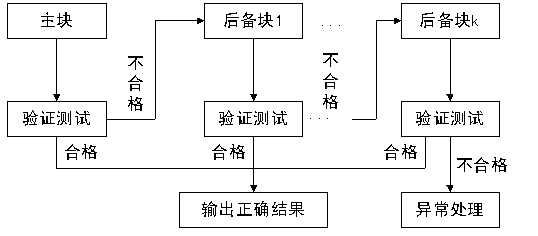

#### N-版本程序设计

前向恢复

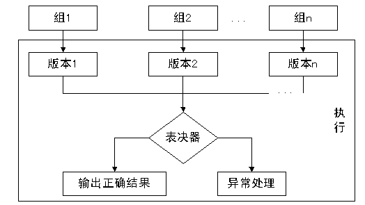

#### 防卫式程序设计

防卫式程序设计是一种不采用任何一种传统的容错技术就能实现软件容错的方法，对于程序中存在的错误和不一致性，防卫式程序设计的基本思想是通过在程序中包含错误检查代码和错误恢复代码，使得一旦错误发生，程序能撤消错误状态，恢复到一个已知的正确状态中去。其实现策略包括错误检测、破坏估计和错误恢复三个方面。

## 集群技术

