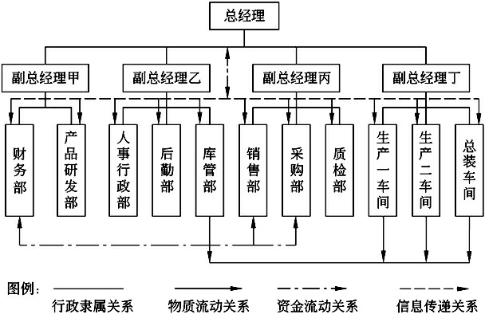
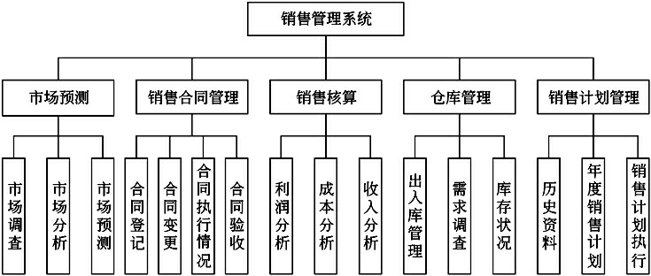
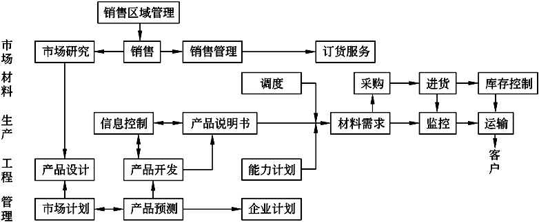
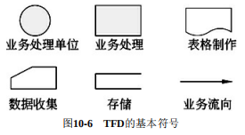
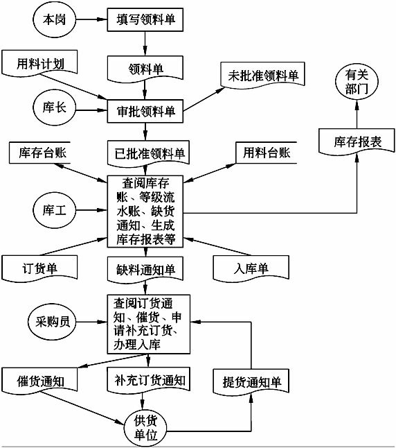
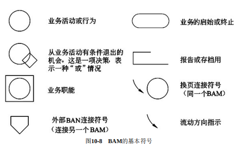
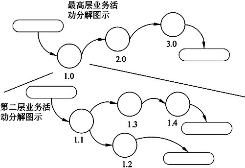
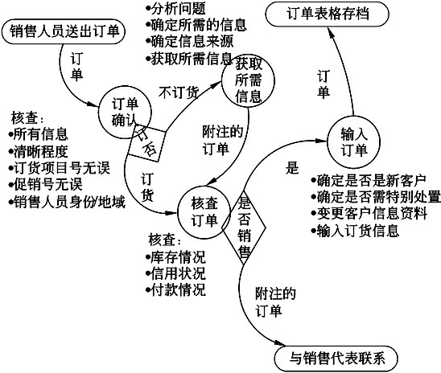

# 系统分析

系统分析阶段也称为逻辑设计阶段，其任务是根据系统设计任务书所确定的范围，对现有系统进行详细调查，描述现有系统的业务流程，指出现有系统的局限性和不足之处，确定新系统的基本目标和逻辑功能要求，即提出新系统的逻辑模型。

## 概述

实践证明，系统分析工作的好坏，在很大程度上决定了信息系统的成败

### 	任务

系统分析阶段的基本任务是系统分析师和用户在充分了解用户需求的基础上，把双方对新系统的理解表达为**系统需求规格说明书**

### 	难点

- 与用户对系统的理解不同
- 与用户沟通困难
- 环境的不断变化

### 	要求

- 具有扎实的专业知识外
- 具有管理科学的知识
- 具有较强的系统观点和逻辑分析能力
- 具备较好的口头和书面表达能力
- 具有较强的组织能力，善于与人共事

## 详细调查

系统规划阶段进行了初步调查，分析阶段要进行详细调查。

### 	原则

- 自顶向下展开

  要从系统总目标全面展开，逐步分解，逐步求精，这样可以站在一定高度去考虑和分析系统。

- 用户参与

  不能拍脑袋，详细调查不是闭门造车，要有用户单位的业务人员、主管人员、设计人员等等参与，共同研讨才可。

- 分析系统有无改进的可能

  存在即合理，现有系统是这个鸟样一定有他的道理，不要先入为主的觉得这玩意是个垃圾，要先了解他人的意见和具体的情况，客观的了解实际问题，再带入自己的经验去分析有无优化的可能性，尊重客观管理的需要

- 采用工程化的工作方式

  如果是一个大型的信息系统的调查，一般由多个分析师共同完成，一定要使用工程化的方式进行，要先计划，再分析，再分工，再工作的方式来进行。并且要先制定好调查所用的各个表格、图例的规范，按规范办事，并且要把结果整理归档。

- 点面结合

  如果要建设整个企业的信息系统，开展全面的调查工作是必然的，但对于近期内只需要建设某个部门的信息系统，要重点关注，即点面结合的进行调研。自顶向下全面展开，但轻重有序，侧重与部门相关的分支，略去与部门无关的业务调查。

- 主动沟通和友善的工作方式

  人际关系要搞好，说话要合适，不能Diss人家。

### 	内容

- 现有系统的环境和状况
- 组织结构
- 业务流程
- 系统功能
- 数据和数据流程
- 资源情况
- 薄弱环节

### 	方法

（这个跟需求获取的方法差不多）

- 收集资料
- 开调查会
- 个别采访
- 书面调查
- 抽样调查
- 现场观摩
- 参加业务实践
- 阅读文档

## 现有系统的分析

在研究现有系统时千万不要“闭门造车”，应该多与用户进行沟通，了解他们对现有系统的认识和评价。而且，最重要的是获得他们对现有系统的负面评价，这些问题都将是新系统必须克服和解决的，这些信息对于系统分析师来说，是十分珍贵的。应该从现有系统的物理模型出发，通过研究、分析建立起其较高层的逻辑模型描述。然后，在此基础上吸取各种问题的考虑，发展成为新系统的逻辑模型，再根据新系统的逻辑模型构建出相应的物理模型。

1. 获取现有系统的物理模型
2. 抽象现有系统的逻辑模型
3. 建立新系统的逻辑模型
4. 建立新系统的物理模型

## 组织结构分析

组织结构是一个企业内部部门的划分及其相互之间的关系。每个企业都有自己的组织结构图，它将企业分成若干部分，标明行政隶属关系。组织结构图是一种类树结构，树的分枝是根据上下级和行政隶属关系绘制的。

### 	组织结构的调查

​	通过组织结构调查，系统分析师可以掌握企业组织结构的现状和存在的问题。注意两方面：

- 切实了解各部门的职责
- 明确企业边界

## 系统功能分析

在了解企业的组织结构之后，就可以掌握系统的功能体系，并用功能体系图来表示。功能体系图是一个完全以业务功能为主体的树形图，其目的在于描述企业内部各部门的业务和功能

确定了系统的所有功能后，还需要分析各功能之间的关系和流程，一般使用功能流程图来描述，功能流程图可以检验是否识别出所有的功能。

`可以参考BSP方法中的“定义企业过程”步骤`

## 业务流程分析

业务流程分析的目的是了解各个业务流程的过程，明确各个部门之间的业务关系和每个业务处理的意义，为业务流程的合理化改造提供建议，为系统的数据流程变化提供依据。

### 概述

业务流程分析是工作量大，烦琐而又细致的工作。它的主要任务是调查系统中各环节的业务活动，掌握业务的内容和作用，以及信息的输入、输出、数据存储和信息处理方法及过程等，为建立系统数据模型和逻辑模型打下基础。业务流程分析的具体步骤如下：通过调查掌握基本情况、描述现有业务流程、确认现有业务流程、对业务流程进行分析、发现问题并提出解决方案、提出优化后的业务流程。

### 方法

- **价值链分析法 VCA**

  价值链分析法找出或设计出那些能够使顾客满意，实现顾客价值最大化的业务流程。

- **客户关系分析法 CRM**

  客户关系分析法就是把CRM用在业务流程的分析上。

- **供应链分析法 SCM**

  供应链分析法是从企业供应链的角度分析企业的业务流程，它源于SCM。

- **基于ERP的分析法 ERP**

  ERP的基本思想是将企业的业务流程看作是一个紧密联接的供应链，将供应商和企业内部的采购、生产、销售，以及客户紧密联系起来，对供应链上的所有环节进行有效管理，实现对企业的动态控制和各种资源的集成和优化，从而提升企业基础管理水平，追求企业资源的合理、高效利用。

- **业务流程重组 BPR**

  通过重新审视企业的价值链，从功能成本的比较分析中，确定企业在哪些环节具有比较优势。在此基础上，以顾客满意为出发点进行价值链的分解与整合，改造原有的业务流程，实现业务流程的最优化。

### 业务流程图 TFD

TFD是分析和描述现有系统的传统工具，是业务流程调查结果的图形化表示。

在绘制TFD时，要依据业务调查的语义描述进行分析，其关键是找出业务流程中的**内部实体**（业务处理单位）和**外部实体**，它们的主要区别是，**外部实体是为系统传递信息或接收系统处理后的信息的实体**，而**内部实体是参与系统的信息处理过程**，完成某一处理动作的角色、岗位或部门。

### 业务活动图示 BAM

BAM是一个有效的业务流程描述工具，其主要功能是提供业务流程情况的全面模型。由于BAM的作用是识别企业的业务流程，因此，系统分析师必须持有一种科学的、客观的态度，要能容纳做事情的各种方法，不要带自己的主观色彩去看问题。BAM中的信息必须是事实，而不能是系统分析师的解释。这就要求系统分析师注意从业务活动参与者本身的角度来反映和理解业务活动，需有高度的灵活性和宽容度。

BAM的启动一般是从部门的职责开始，根据部门职责列出一连串的业务活动。根据业务复杂程度大小，可将复杂的业务分成若干较低层次的细小活动。通常，一项业务可能分成3到4个层次，最复杂的业务甚至可以分成7个层次。

业务流程分解的目的是让系统分析师充分理解各项业务活动，从最高层次的业务到最低层次的业务职能层，所有与其他职能的相互作用都要列入BAM中，从而确定业务之间的相互关系。

### 业务流程建模 BPM

企业业务流程包含三个要素，分别是实体、对象和活动。业务流程发生在实体之间，它们可以是企业间的、功能间的，也可以是人与人之间的；业务流程的功能就是对对象进行操作，这些对象既可以是物理的（例如，订单等），也可以是逻辑的（例如，信息等）；业务流程涉及管理活动和业务操作活动。

BPM可分为三个层次：

1. 模型的要素，即目标、知识和数据

   建模的目的，知识包括现有系统的知识和模型构造知识，数据是指系统的原始信息，这三个方面构成了BPM的输入

2. 模型的构造

   具体的建模技术的运用的过程。

3. 层次是对模型的可信性分析

   指分析所建模型能否满足系统目标。

业务流程建模可以采取两种方式：自顶向下和自底向上。

- 自顶向下的方法从企业任务目标出发，根据流程上的价值链来确定最基本的流程，逐层分析业务目标直至底层。此过程涉及到将业务需求细化为系统需求，再将系统需求细化为功能。
- 自底向上的方法分析现有系统，从已有业务流程活动及其联系出发，用于明确业务细节问题。

描述业务流程模型最常见的方法是形式化描述和图示化描述。形式化描述方法的特点是精确、严谨，易于系统以后的实现，但难以掌握和理解，模型可读性差。

图式化：

- 标杆瞄准

- **IDEF**

  **IDEF0**（**功能建模**）、IDEF1（信息建模）、IDEF1X（数据建模）、IDEF2（仿真建模设计）、IDEF3（过程描述获取）、IDEF4（面向对象设计）、IDEF5（本体论描述获取）、IDEF6（设计原理获取）、IDEF7（信息系统审计）、IDEF8（用户界面建模）、IDEF9（场景驱动信息系统设计）、IDEF10（实施架构建模）、IDEF11（信息制品建模）、IDEF12（组织建模）、IDEF13（三模式映射设计）和IDEF14（网络规划）

  在IDEF方法中，IDEF0可以用来对业务流程进行建模。

- Demo

- Petri网
- 业务流程建模语言
- 基于服务的BPM

## 数据与数据流程分析

数据与数据流程分析是以后建立数据库系统和设计功能模块处理过程的基础。

### 数据汇总分析

1. 将系统调查中所收集到的数据资料，按业务流程进行分类编码，按处理过程的顺序排放在一起。
2. 按业务流程自顶向下的对数据进行整理
3. 原始数据和最终输出数据分类整理
4. 确定数据的字长及精度

### 数据属性分析

- 静态分析
  - 类型长度
  - 取值范围
  - 发生的业务量
  - 哪些业务使用？（CU矩阵中的U）
  - 重要程度与保密程度
- 动态分析
  - 固定值属性
  - 固定个体变动属性
  - 随即变动属性

### 数据存储分布

区分数据动态特性的目的是为了确定数据和数据库表（或文件）的关系，也就是确定哪些数据存储在哪种数据文件中。

在数据资源分析中，不仅需要确定数据的存储文件，还需要确定数据在整个系统中的存储分布状况。

### 数据流程分析

数据流程是指在系统中产生、传输、加工处理、使用、存储的过程，数据流程分析把数据在企业内部的流动情况抽象地独立出来，舍去了具体的企业组织结构、信息载体、物质、材料等，单从数据流动过程来考查实际业务的数据处理模式。

数据流程分析主要包括对数据的输入、输出、流动、传递、处理和存储的分析。

SA是一种面向数据流的分析方法，在SA中，DFD是数据流程分析所使用的主要工具之一，DFD用少量几种符号综合地反映出信息在系统中的流动、处理和存储情况，具有抽象性和概括性的特点。

## 需求规格说明书 SRS

系统需求规格说明书也称为系统分析报告，或简称为系统说明书，它是系统分析阶段的技术文档，也是系统分析阶段的工作成果。

包含：

- 引言
- 引用文件
- 需求
- 合格性规定
- 需求可追踪性
- 非技术性需求
- 尚未解决的问题
- 注解
- 附录

### 评审

系统需求规格说明书在整个系统开发中占有非常重要的地位，应该对其进行正式的评审，参加评审的人员有核心开发人员、企业领导、业务代表、系统分析师和外聘的专家等。在评审中，如果有关人员发现较大的差错或遗漏，或者对系统需求规格说明书中所提出的方案不满意，则需要返工，重新进行系统调查和分析，直到系统需求规格说明书通过为止。

一旦通过评审，系统需求规格说明书将成为系统开发中的权威性文件，是系统设计阶段的主要依据。同时，系统需求规格说明书也是承建方与建设方之间的技术合同，是将来对系统进行验收的标准之一。
