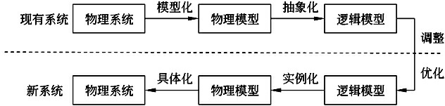

# 系统分析

系统分析阶段也称为逻辑设计阶段，其任务是根据系统设计任务书所确定的范围，对现有系统进行详细调查，描述现有系统的业务流程，指出现有系统的局限性和不足之处，确定新系统的基本目标和逻辑功能要求，即提出新系统的逻辑模型。

## 概述

实践证明，系统分析工作的好坏，在很大程度上决定了信息系统的成败

### 	任务

系统分析阶段的基本任务是系统分析师和用户在充分了解用户需求的基础上，把双方对新系统的理解表达为**系统需求规格说明书**

### 	难点

- 与用户对系统的理解不同
- 与用户沟通困难
- 环境的不断变化

### 	要求

- 具有扎实的专业知识外
- 具有管理科学的知识
- 具有较强的系统观点和逻辑分析能力
- 具备较好的口头和书面表达能力
- 具有较强的组织能力，善于与人共事

## 详细调查

系统规划阶段进行了初步调查，分析阶段要进行详细调查。

### 	原则

- 自顶向下展开

  要从系统总目标全面展开，逐步分解，逐步求精，这样可以站在一定高度去考虑和分析系统。

- 用户参与

  不能拍脑袋，详细调查不是闭门造车，要有用户单位的业务人员、主管人员、设计人员等等参与，共同研讨才可。

- 分析系统有无改进的可能

  存在即合理，现有系统是这个鸟样一定有他的道理，不要先入为主的觉得这玩意是个垃圾，要先了解他人的意见和具体的情况，客观的了解实际问题，再带入自己的经验去分析有无优化的可能性，尊重客观管理的需要

- 采用工程化的工作方式

  如果是一个大型的信息系统的调查，一般由多个分析师共同完成，一定要使用工程化的方式进行，要先计划，再分析，再分工，再工作的方式来进行。并且要先制定好调查所用的各个表格、图例的规范，按规范办事，并且要把结果整理归档。

- 点面结合

  如果要建设整个企业的信息系统，开展全面的调查工作是必然的，但对于近期内只需要建设某个部门的信息系统，要重点关注，即点面结合的进行调研。自顶向下全面展开，但轻重有序，侧重与部门相关的分支，略去与部门无关的业务调查。

- 主动沟通和友善的工作方式

  人际关系要搞好，说话要合适，不能Diss人家。

### 	内容

- 现有系统的环境和状况
- 组织结构
- 业务流程
- 系统功能
- 数据和数据流程
- 资源情况
- 薄弱环节

### 	方法

（这个跟需求获取的方法差不多）

- 收集资料
- 开调查会
- 个别采访
- 书面调查
- 抽样调查
- 现场观摩
- 参加业务实践
- 阅读文档

## 现有系统的分析

在研究现有系统时千万不要“闭门造车”，应该多与用户进行沟通，了解他们对现有系统的认识和评价。而且，最重要的是获得他们对现有系统的负面评价，这些问题都将是新系统必须克服和解决的，这些信息对于系统分析师来说，是十分珍贵的。应该从现有系统的物理模型出发，通过研究、分析建立起其较高层的逻辑模型描述。然后，在此基础上吸取各种问题的考虑，发展成为新系统的逻辑模型，再根据新系统的逻辑模型构建出相应的物理模型。

1. 获取现有系统的物理模型
2. 抽象现有系统的逻辑模型
3. 建立新系统的逻辑模型
4. 建立新系统的物理模型

