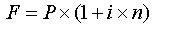
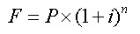
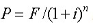
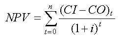
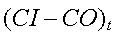
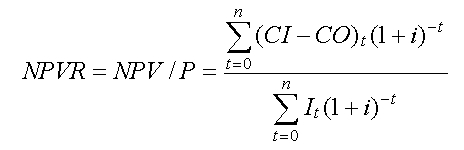
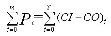
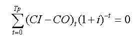
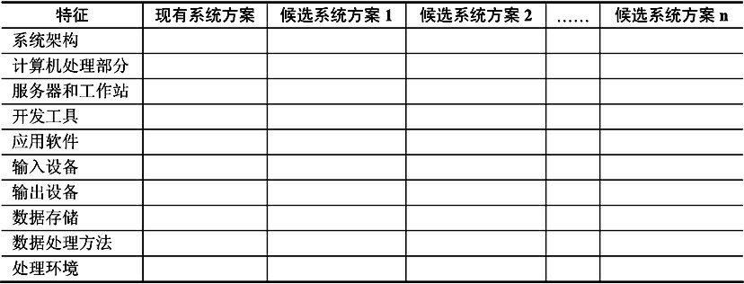
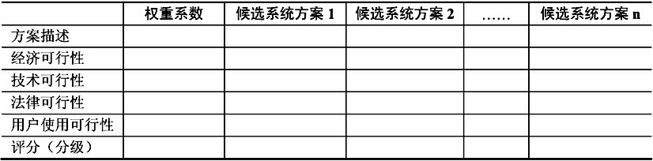

# 系统规划

## 概述

### 需求

为啥需要搞系统规划：

- 系统建设与企业目标的发展不匹配，
- 系统的建设周期太长
- 组织结构陈旧管理思想落后
- 企业人员技术水平过低
- 系统技术方案不合理
- 系统开发规范等混乱
- 企业处于原始积累的阶段

### 步骤

1. [初步调查](#初步调查)
2. 分析和确定系统目标
3. 分析子系统和基本功能
4. 拟定系统实施方案
5. [可行性研究](#可行性分析)
6. [制定系统建设方案](#系统建议方案报告)

 

## 项目的提出和选择

- 项目的立项目标和动机

  - 进行基础研究
  - 进行应用研发
  - 提供技术服务
  - 产品的使用者提出

- 立项的价值判断

  要学会PUA领导，让领导从合适的视角砍到新项目的价值。

- 项目的选择和确定

  - 选择有核心价值的项目

  - 评估所选择的项目
  - 项目优先级排序
  - 评估实施方式
  - 平衡选择方案

  

## 初步调查

- 目标

  初步调查的目标就是掌握用户的概况，从整体上了解企业信息系统建设的现状，对用户提出的各种问题和初始需求进行识别，明确系统的初步目标，为可行性研究提供工作基础

- 方式

  与高管座谈，或者与企业IT技术负责人座谈，收集宏观信息，了解企业架构以及不同位置的负责人对新系统建设的态度。

- 内容

  - 初步需求分析，了解用户对新系统的需求
  - 企业的基本情况
  - 企业的管理方式和基础数据的管理状况
  - 现有系统的状况

  

## 可行性分析

- 经济可行性

  投资收益分析、成本效益分析；评估建设成本、运行成本以及可能的收益。成本分固定、非固定，收益分有形无形、直接间接等。只有成本在企业可承受范围内，且值得建设才行。

- 技术可行性

  技术风险分析，分别分析 : 现有技术是否可以支撑、现有资源是否可以支撑、项目的目标调整。首先要立足实地，以现有公司的技术与资源来评估，不可以夸夸而谈。同时在技术分析的时候可以结合功能、性能等方面目标来进行评审，在可行性阶段各功能目标可以随意变动，到开发阶段再变动成本就高了。

- 法律法规可行性

  它需要从政策、法律、道德、制度等社会因素来论证信息系统建设的现实性，首先不能违法违规，例如使用了未认可的加密算法，使用了未授权的专利等

- 用户使用可行性

  执行可行性，需要从管理和运行的角度分别分析。

  - 管理可行性

    主管和企业内高管不支持，基本上就GG，所以要考虑管理可行性且要提供科学的管理方法

  - 操作可行性

    实际用的用户是否可以方便的使用？如果开发出来的是一坨屎，直接使用人员竭力反对，项目就有可能毫无用处。当然如果项目使用需要很高的技术或者学识水平，与当前实际不符，也不行。

### 	步骤

- 复查系统目标和规模

  访问关键人员、认真查阅资料、分析相关材料，要明确系统的目标、规模、限制等条件，尽可能的消除歧义，确保我们列出来的问题就是用户想要解决的问题，而不是拍脑袋得出的问题。

- 分析现有系统

  实地考察现有系统，读取他的资料及文档，了解他做了啥，有啥缺点，有啥可以优化的。如果可以的话可以画出来他的高层流程图，列出接口交互文档，并跟系统的开发人员进行确认，得到原系统的物理模型，推出逻辑模型。

- 导出新系统的高层逻辑模型

  从原系统的物理模型出发，导出原系统的逻辑模型，描述数据在系统中的流动与加工，并对新系统进行建模。

  - DFD 0层图， 也就是系统上下文关系范围图，可以界定系统的范围
  - E-R图，一些简单的数据模型，不需要很精细，只需要描述系统的主要实体和关系
  - 用例模型， 采用OO分析的方法得到用例模型
  - 领域模型，采用OO分析的方法找到主要的实体类，说明实体类主要特征和之间的关系，得到领域模型。
  - IPO，Input、Output、Process，输入、输出、处理间关系，即IPO图

- 用户复核

  上述得到的新系统模型是我们拍脑袋得到的，要跟用户确认，大家一起复核，如果模型与用户目标不一致，就得再次通过访谈、实地观摩对现有系统重新分析，修改模型，一直到用户觉得OK了为止。

- 提出评价和解决方案

  通过得到确认的新系统逻辑模型出发，列出多个高层次抽象的解决方案以供比较和选择，列出他们的优点、缺点进行综合分析。可以用用[候选系统方案矩阵](#候选系统方案矩阵)和[可行性分析矩阵](#可行性分析矩阵)，前者是用来记录候选方案之间的相同和不同的工具，后者是用来评定候选方案的工具。

  当然，要去掉那些明显不可行，一看就SB的方案，不要滥竽充数。

- 最终确定解决方案

  对各个解决方案进行分析和比较，要是这项目还能干，选一个最靠谱的方案出来，做较详细的成本效益分析，把方案提上去，看企业决策人员决定是否要立项。[系统建议方案报告](#系统建议方案报告)

- 草拟开发计划

  制订一个粗略的开发计划，要哪些资源、哪些人、干多少天等，作为项目开发计划的基础

- 编写可行性研究报告

  上述过程整理成文，编写可行性研究报告，提交给用户和管理层。

### 可行性研究报告

#### 格式

在国家标准GB/T 8567—2006中，提供了一个可行性研究报告的文档模板和编写指南，包含

- 引言
- 引用文件
- 可行性研究前提
- 可选方案
- 建议方案
- 技术可行性
- 经济可行性
- 法律法规可行性
- 用户管理/使用可行性
- 注解
- 附录

#### 论证会

编写完报告并提交给领导后，按规定召开论证会，需要所有相关部门负责人参加，也可邀请业内专家参加。

1. 介绍可行性分析结果
2. 大家讨论
3. 对各个方案进行分析
4. 得出结论

结论一般有两种可能

- 大家意见统一，OK，开干，立即执行； 修改目标、追加资源等；  搞不定，取消项目，GG；
- 大家意见不统一，如果不统一的意见不影响大局，那就先搁置，等到需求开发阶段再进行处理；如果不统一意见影响大局，那就返工，重新可行性分析，写报告，开会。

## 成本效益分析

### 成本

- 固定成本

  例如管理人员的工资、办公费、固定资产折旧费、员工培训费等

- 变动成本

  例如直接材料费、产品包装费、外包费用、开发奖金等

- 混合成本

  例如质量保证人员的工资、设备动力费等成本在一定业务量内是不变的，超过了这个量便会随业务量的增加而增加。

### 收益

- 有形收益

  money，可以用货币的时间价值、投资回收期、投资回收率等指标进行度量

- 无形收益

  从性质上、心理上进行衡量，很难直接进行量上的比较。

### 盈亏临界分析

盈亏临界点也称为盈亏平衡点或保本点，是指项目收入和成本相等的经营状态，也就是既不盈利又不亏损的状态。

`利润＝（销售单价－单位变动成本）× 销售量－总固定成本`

`盈亏临界点销售量＝总固定成本/（销售单价－单位变动成本）`

`盈亏临界点销售额＝总固定成本/（1－总变动成本/销售收入）`

#### 货币时间价值

单利： 

复利： 

折现值： 

i为利率，n为年期，P为本金，F为n年后收入

#### 净现值NPV分析

为第t年的净现金流量，CI为现金流入，CO为现金流出。i为折现率或行业基准收益率。

**净现值率NPVR**：

`P为项目投资总额现值`

### 投资回收期

静态投资回收期：

动态投资回收期：

### 投资回收率

投资回收率 = 1/动态投资回收期×100%

投资收益率＝投资收益/投资成本×100％

### 盈亏平衡点

BEP = TFC/(P-VC)

单位售价（P）、单位可变成本（VC）以及总固定成本（TFC）

## 候选方案的可行性评价

### 候选系统方案矩阵

矩阵的行表示候选系统方案的特征，列表示候选系统方案。系统分析师要考虑多个系统方案，其中至少有一个是现有系统的解决方案，将该方案作为其他候选系统方案的基准。

### 可行性分析矩阵

每个准则的具体权重系数，需要根据项目的实际情况而定。当对每个候选系统方案在每个可行性评价准则上评分（或分级）后，最终的评分（或分级）记录在最后一行。根据最终的评分（或分级），系统分析师可以选择一个整体最优的方案作为推荐方案。

## 系统建议方案报告

根据项目规模的大小，系统方案既可以单独形成文档（系统建议方案报告、系统方案说明书），也可以合并到可行性研究报告中。

如果单独形成文档：

- 前置部分。

  包括标题、目录和摘要。

- 系统概述。

  包括系统建议方案报告的目的、对问题的陈述、项目范围和报告内容的叙述性解释。

- 系统研究方法

- 候选系统方案及可行性分析

- 建议方案

- 结论

- 附录
