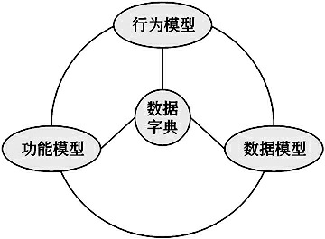

# 需求工程

## 概述

**软件需求是指用户对新系统在功能、行为、性能、设计约束等方面的期望。**

**需求的三个层次**

- **业务需求**

  业务需求是指反映企业或客户对系统高层次的目标要求，通常来自项目投资人、购买产品的客户、客户单位的管理人员、市场营销部门或产品策划部门等

- **用户需求**

  用户需求描述的是用户的具体目标，或用户要求系统必须能完成的任务。

- **系统需求**

  系统需求是从系统的角度来说明软件的需求，包括：

  - **功能需求**

    行为需求，它规定了开发人员必须在系统中实现的软件功能

  - **非功能需求**

    系统必须具备的属性或品质，又可细分为软件质量属性（例如，可维护性、可维护性、效率等）和其他非功能需求。

  - **设计约束**

    限制条件或补充规约，通常是对系统的一些约束说明

**QFD 是一种将用户要求转化成软件需求的技术，其目的是最大限度地提升软件工程过程中用户的满意度。其将需求分为：**

- **常规需求**
- **期望需求**
- **兴奋需求**

## 需求获取

- What：应该搜集什么信息。

  要获取的信息包括三大类：

  - 与问题域相关的信息（如业务资料、组织结构图、业务处理流程等）
  - 与要求解决的问题相关的信息
  - 用户对系统的特别期望与施加的任何约束信息。

- Where：从什么地方搜集这些信息。

  通常情况下，这些信息会藏于客户、原有系统、原有系统用户、新系统的潜在用户、原有产品、竞争对手的产品、领域专家、技术法规与标准里。

  在制定需求获取计划的时候，我们可以列出一个表格，第1列是我们想了解的信息，第2列是信息可能的来源，这样就能够建立起一一对应的关系，使得需求获取工作更加有的放矢，也更加高效

- How：用什么机制或者技术来搜集这些信息。

  需求捕获技术：

### 需求获取技术

#### 用户访谈

用户访谈是最基本的一种需求获取手段，其形式包括**结构化**和**非结构化**两种。

- 结构化是指事先准备好一系列问题，有针对地进行；
- 非结构化则是只列出一个粗略的想法，根据访谈的具体情况发挥。

最有效的访谈是结合这两种方法进行。

优点：

- 用户访谈具有良好的灵活性，用较宽广的应用范围，

缺点：

- 诸如客户经常较忙，难以安排到时间；

- 面谈时信息量大，记录较为困难
- 沟通需要很多技巧，同时需要分析人员有足够的领域知识；

- 在访谈时会遇到一些对于组织来说比较机密和敏感的话题。

解决方案：

- 需要分析人员拥有足够多的经验和较强的沟通能力。

步骤：

1. 访谈前：
   - 确定目的和对象，知道我要问啥，找谁问
   - 准备问题，开放式和非开放式两种问题结合
   - 访谈安排，约时间，找安静的场所，时间地点应该征求访问者的意见，也可以将问题发给被访问者，提前准备。
2. 访谈中：
   - 限制访谈时间，尽量在60-90分钟，如果没问完建议安排另外一次的访谈
   - 寻找异常和错误情况，要有意识的捕捉特殊的情况，与用户深入探讨和确认
   - 深入调查细节。要确保自己对规则和过程完全理解
   - 做好记录。做好笔记，或者在征得对方同意的前提下使用录音或者录像等记录下来。
   - 注意措辞，尽量避免用专业化语言
3. 访谈后：
   - 吸收理解和记录归纳所获得的信息
   - 访谈中未问完的问题和未回答的问题做好记录，以便下次访谈
   - 抄送备忘录给被访谈人员，维护关系

#### 问卷调查

即调查问卷，通过精心设计要问的问题，然后下发到相关的人员手里，让他们填写答案。

一张好的问卷调查表要花费大量的时间来进行设计与制作，包括确定问题及其类型、编写问题、设计问卷调查表的格式三个重要活动。

- 确定问题及其类型

  也分为开放式问题和封闭式问题。但问题需要较为精确，且有一定的组织顺序，循序渐进。

- 编写问题

  保持问题的简短，避免措词上的偏向，不适用含糊不清的词语。

- 设计调查表格式

  设计调查表的格式时，应该提供足够的空白空间让用户填写表格。对用户重要的问题放在最前面，内容相似的问题放在一起。

​	

优点：

- 可以解决用户访谈中很多关键的人员时间有限，不容易安排过多的时间；而且客户面经常较广，不可能一一访谈的问题。
- 在短时间内，以低廉的代价从大量的回答中收集数据
- 问卷调查的结果比较好整理和统计

缺点：

- 缺乏灵活性
- 双方未见面，分析人员无法从他们的表情等其它动作来获取一些更隐性的信息
- 客户不认真对待从而使得反馈的信息不全面

解决方案：

- 通过联系客户领导使客户从上而下的下发任务进行问卷调查，解决不认真对待问题
- 综合两种方式，先设计问题，制作成为用户调查表，下发填写完后，进行仔细的分组、整理、分析，以获得基础信息，然后再针对这个结果进行小范围的用户访谈，作为补充
- 设置奖品
- 向用户解释问卷的目的

#### 采样

采样是指从种群中系统地选出有代表性的样本集的过程，通过认真研究所选出的样本集，可以从整体上揭示种群的有用信息。

样本大小

**样本大小＝α  ×（可信度系数  /  可接受的错误）²，α称为启发式因子，一般取值为0.25**

#### 现场观摩

对于许多较为复杂的流程和操作而言，是比较难以用言语表达清楚的，分析团队可以就一些较复杂、较难理解的流程、操作采用现场观摩的方法来获取需求。

走到客户的工作现场，一边观察，一边听客户的讲解，甚至可以安排人员跟随客户工作一小段时间。这样就可以使得分析人员更加直观地理解需求。

#### 情节串联板

情节串联板通常就是一系列图片，系统分析师通过这些图片来讲故事。

情节串联板的类型包括被动式、主动式和交互式，其复杂程度依次递增。

- 被动式情节串联板通常由草图、图片、屏幕截图、幻灯片等组成
- 主动式情节串联板试图使用用户能够看到类似“电影样片”，它可以自动播放，描述系统在典型用法或典型场景中的行为方式
- 交互式情节串联板让用户体验系统的行为，系统需要用户的参与才能继续运行

情节串联板应该易于创建和修改，系统分析师不要企图将情节串联板制作得太好，因为情节串联板既不是原型，也不是真实事物的演示。

优点：

用户友好、交互性强，对用户界面提供了早期的评审

缺点：

花费的时间很多，使需求获取的速度大大降低

#### 阅读历史文档

对于一些数据流比较复杂的，工作表单较多的项目，有时是难以通过说，或者通过观察来了解需求细节的。可以借助于阅读历史文档的方法，对历史存在的一些文档进行研究，从中获得所需的信息。

缺点：

- 历史的文档可能与新系统的流程、数据有一些不吻合的地方，并且还可以承载一些原有系统的缺陷
- 历史的文档中记载的信息有可能涉及到客户的商业秘密

解决方案：

- 分析人员能够运用自己的聪明才智，将其与其它需求捕获技术结合对照，及时发现问题和避免问题。
- 加强保密工作和保密教育

#### 联合讨论会

JRP是JAD的一部分，JAD（联合应用开发），由企业主管部门经理、会议主持人、用户、协调人员、IT人员、秘书等共同组成的专题讨论组。由这个专题讨论组来定义并详细说明系统的需求和可选的技术方案。

JRP是一种相对来说成本较高的需求获取方法，但也是十分有效的一种。通过联合各个关键客户代表、分析人员、开发团队代表一起，通过有组织的会议来讨论需求。参与人数为6～18人，召开时间为1～5小时。

会议前：

- 做好准备，将与讨论主题相关的材料提前分发给所有将要参加会议的人

会议中：

- 让所有的与会者互相认识，以使交流在更加轻松的气氛下进行

- 针对所列举的问题进行逐项专题讨论

- 对原有系统、类似系统的不足进行开放性交流

- 上对新的解决方案进行一番设想

- 将这些想法、问题、不足记录下来，形成一个要点清单

- 将要点清单进行整理，明确优先级，并进行评审

  

JRP将会起到群策群力的效果，对于一些问题最有歧义的时候、对需求最不清晰的领域都是十分有用的一种技术。难点在于会议的组织和效率。

JRP会议后一般会让与会者完成一个评价性的调查问卷。JRP会议最后有一个总结性的报告，主要内容是与会者达成一致的需求和未解决的问题。

JRP的主要意图是收集需求，而不是对需求进行分析和验证。实施JRP时应把握以下

主要原则：

- 在JRP实施之前，应制订详细的议程，并严格遵照议程进行。
- 按照既定的时间安排进行。
- 尽量完整地记录会议期间的内容
- 在讨论期间尽量避免使用专业术语。
- 充分运用解决冲突的技能。
- 会议期间应设置充分的间歇时间。
- 鼓励团队取得一致意见。

- 保证参加JRP的所有人员能够遵守事先约定的规则

JRP将会起到群策群力的效果，对于一些问题最有歧义的时候、对需求最不清晰的领域都是十分有用的一种方法。这种方法最大的难度是会议的组织和相关人员的能力，要做到言之有物，气氛开放。否则，将难以达到预想的效果。

### 需求记录技术

- 任务卡片

  一种比较简单的工具，它特别适合对业务活动级的信息收集与整理

- 场景说明

  使用场景说明来对用户的描述进行整理，抽象出子任务

- 用户故事

  用户故事描述了对用户有价值的功能，可包括三个方面内容，分别是书面描述（用于计划和备忘）、交谈（细化故事）和测试用例（验证故事实现）。

- Volere白卡

  用户故事和Volere白卡定位的是最小的需求项，因此在实际应用中会导致量比较大，一般在敏捷方法中使用。

  

### 需求捕获的策略

在整个需求过程中，需求捕获、需求分析、需求定义、需求验证四个阶段不是瀑布式的发展，而且应该采用迭代式的演化过程。不可能一蹴而就的获取到所有需求后在进入下一阶段，而是应该在获取到一部分需求后，进入需求分析阶段进行分析，并针对分析中的问题在进行针对性的需求获取工作。

## 需求分析

- SA  结构化分析

  关注于功能的分层和分解，这非常符合人们自上而下、逐步分解问题直到可解决的自然思考方式。

- OOA  面向对象分析

  基于抽象、信息隐藏、功能独立和模块化这些基本理念对系统进行分析

- PDOA  面向问题领域分析

  PDOA更多地强调描述，而少强调建模

  - 关注问题域

  - 关注解系统（即系统实现）的待求行为

    

因地制宜地应用三种方法，不仅能够客观地认识问题域，创建出健全的解系统，还能够向用户和设计人员提供满意的需求文档

### 结构化分析方法 SA

**行为模型： STD 状态转换图**

**功能模型： DFD数据流图**

**数据模型： E-R图**

**数据字典**

#### 业务流程分析

业务流程分析的目的是了解各个业务流程的过程：

（1）通过调查掌握基本情况。

（2）描述现有业务流程（绘制业务流程图）。

（3）确认现有业务流程。

（4）对业务流程进行分析。

（5）发现问题，提出解决方案。

（6）提出优化后的业务流程

#### 数据流图DFD

**DFD： 是表达系统内数据的流动并通过数据流动来描述系统功能的一种方法**

DFD是结构化分析中的重要方法和工具。

**DFD从数据传递和加工的角度**，利用图形符号通过**逐层细分描述系统内各个部件的功能和数据在它们之间传递的情况**，来**说明系统所完成的功能**。

主要作用：

- **DFD是理解和表达用户需求的工具**，是系统分析的手段。由于DFD简明易懂，理解它不需要任何计算机专业知识，因此通过它同客户交流很方便。
- **DFD概括地描述了系统的内部逻辑过程**，是系统分析结果的表达工具，因而也是系统设计的重要参考资料，是系统设计的起点。 
- **DFD作为一个存档的文字材料**，是进一步修改和充实开发计划的依据。

DFD包含（四种元素）：

- **数据流**
- **加工**
- **数据存储**
- **外部实体**

DFD分层：

- 顶层图

  顶层图是描述系统最高层结构的DFD，它的特点是将整个待开发的系统表示为一个加工，将所有的外部实体和进出系统的数据流都画在一张图中。

  

- 逐层分解

  

画DFD的基本步骤，就是“自顶向下，逐层分解”，**DFD的原则**：

- **DFD中的所有图形符号只限于前述四种基本图形元素。顶层DFD必须包括前述四种基本元素，缺一不可**
- **顶层DFD中的数据流必须封闭在外部实体之间。**
- **每个加工至少有一个输入数据流和一个输出数据流。**
- **在DFD中，需按层给加工框编号。编号表明了该加工处在哪一层，以及上下层的父图与子图的对应关系。**
- **规定任何一个数据流子图必须与它上一层的一个加工对应，两者的输入数据流和输出数据流必须一致。此即父图与子图的平衡。**
- **可以在DFD中加入物质流，帮助用户理解DFD，但不可加控制流。**
- **图上每个元素都必须有名字。**
- **在整套DFD中，每个数据存储必须既有读的数据流，又有写的数据流。但是在某张子图中，可能只有读没有写，或者只有写没有读**

#### 状态转换图 STD

**STD： 通过描述系统的状态和引起系统状态转换的事件，来表示系统的行为。**

**状态是任何可以被观察到的系统行为模式，每个状态代表系统的一种行为模式**。在STD中，用圆形框或椭圆框表示状态，通常在框内标上状态名。状态规定了系统对事件的响应方式。系统对事件的响应可以是做一个（或一系列）动作，也可以是仅仅改变系统本身的状态。**STD描述了系统如何在各种状态之间移动**。

#### 数据字典

数据字典是关于数据的信息的集合，也就是对**DFD中包含的所有元素的定义的集合**。DFD和数据字典共同构成系统的逻辑模型。**数据字典+DFD共同构成了系统规格说明**。没有DFD，数据字典难以发挥作用；没有数据字典，DFD就不严格。

**数据字典包含**

- **数据元素**
- **数据结构**
- **数据流**
- **数据存储**
- **加工逻辑**
- **外部实体**

为了保证数据的一致性，数据字典必须由专人（数据管理员）管理，修改必须通过专人进行，更新时需要通知所有干系人。

### 面向对象分析方法 OOA

OOA的基本任务是运用OO方法，对问题域进行分析和理解，正确认识其中的事物及它们之间的关系，找出描述问题域和系统功能所需的类和对象，定义它们的属性和职责，以及它们之间所形成的各种联系。

#### UML 统一建模语言

UML是一种定义良好、易于表达、功能强大且普遍适用的建模语言。

##### 结构

- **构造块**

  - **事物**

    UML重要组成部分

  - **关系**

    把事物联系起来

  - **图**

    多个相互关系起来的事务组成的组

- **规则**

  - **范围**

    给一个名字以特定含义的语境

  - **可见性**

    怎样使用或看见名字

  - **完整性**

    事物如何正确、一致地相互联系

  - **执行**

    运行或模拟动态模型的含义是什么

  

- **公共机制**

  公共机制是指达到特定目标的公共UML方法，包含：

  - **规则说明**

    规格说明是事物语义的文本描述，它是模型真正的核心

  - **修饰**

    UML为每一个事物设置了一个简单的记号

  - **公共分类**

    - 类与对象
    - 接口和实现

  - **扩展机制**

    - 约束（添加新规则来扩展事物的语义）
    - 构造型（用于定义新的事物）
    - 标记值（添加新的特殊信息来扩展事物的规格说明）

###### 事物

- **结构事物**

  静态部分，代表概念上或物理上的元素，七种： 

  - 类

  - 接口

  - 协作

  - 用例

  - 活动类

  - 构件

  - 节点

- **行为事物**

  动态部分，代表时间和空间上的动作，分为两种：

  - 交互

    交互是由一组对象之间在特定的上下文中，为达到某个目的而进行的一系列信息交换组成的动作

  - 状态机

    状态机是一系列对象的状态组成

- **分组事物**

  组织部分，即 包，包是一种将有组织的元素分组的机制。结构事物、行为事物甚至其他的分组事物都有可能放在一个包中。

- **注释事物**

  注释事物是UML模型的解释部分

###### 关系

UML之间的关系：

- **依赖**

  一个事物发生变化会影响另一个事物

- **关联**

  描述一组对象之间连接的结构关系

- **泛化**

  一般化和特殊化的关系

- **实现**

  一个类指定了由另一个类保证执行的契约

  

###### 图

（1）类图（class diagram）：描述一组类、接口、协作和它们之间的关系。在面向对象系统的建模中，最常见的图就是类图。类图给出了系统的静态设计视图，活动类的类图给出了系统的静态进程视图。

（2）对象图（object diagram）：描述一组对象及它们之间的关系。对象图描述了在类图中所建立的事物实例的静态快照。和类图一样，这些图给出了系统的静态设计视图或静态进程视图，但它们是从真实案例或原型案例的角度建立的。 

（3）构件图（component diagram）：描述一个封装的类和它的接口、端口，以及由内嵌的构件和连接件构成的内部结构。构件图用于表示系统的静态设计实现视图。对于由小的部件构建大的系统来说，构件图是很重要的。构件图是类图的变体。

（4）组合结构图（composite structure diagram）：描述结构化类（例如构件或类）的内部结构，包括结构化类与系统其余部分的交互点。它显示联合执行包含结构化类的行为的构件配置。组合结构图用于画出结构化类的内部内容。

（5）用例图（use case diagram）：描述一组用例、参与者（一种特殊的类）及它们之间的关系。用例图给出系统的静态用例视图。这些图在对系统的行为进行组织和建模时是非常重要的。 

（6）顺序图（sequence diagram，序列图）：是一种交互图（interaction diagram），交互图展现了一种交互，它由一组对象或角色以及它们之间可能发送的消息构成。交互图专注于系统的动态视图。顺序图是强调消息的时间次序的交互图。

（7）通信图（communication diagram）：也是一种交互图，它强调收发消息的对象或角色的结构组织。顺序图和通信图表达了类似的基本概念，但每种图所强调的概念不同，顺序图强调的是时序，通信图则强调消息流经的数据结构。

（8）定时图（timing diagram，计时图）：也是一种交互图，它强调消息跨越不同对象或角色的实际时间，而不仅仅只是关心消息的相对顺序。

（9）状态图（state diagram）：描述一个状态机，它由状态、转移、事件和活动组成。状态图给出了对象的动态视图。它对于接口、类或协作的行为建模尤为重要，而且它强调事件导致的对象行为，这非常有助于对反应式系统建模。 

（10）活动图（activity diagram）：将进程或其他计算的结构展示为计算内部一步步的控制流和数据流。活动图专注于系统的动态视图。它对系统的功能建模特别重要，并强调对象间的控制流程。 

（11）部署图（deployment diagram）：描述对运行时的处理节点及在其中生存的构件的配置。部署图给出了体系结构的静态部署视图，通常一个节点包含一个或多个部署图。

（12）制品图（artifact diagram）：描述计算机中一个系统的物理结构。制品包括文件、数据库和类似的物理比特集合。制品图通常与部署图一起使用。制品也给出了它们实现的类和构件。 

（13）包图（package diagram）：描述由模型本身分解而成的组织单元，以及它们的依赖关系。

（14）交互概览图（interaction overview diagram）：是活动图和顺序图的混合物。

##### 4+1视图

（1）**逻辑视图**：以问题域的语汇组成的类和对象集合。

（2）**进程视图**：可执行线程和进程作为活动类的建模，它是逻辑视图的一次执行实例，描绘了所设计的并发与同步结构。

（3）**实现视图**：对组成基于系统的物理代码的文件和构件进行建模。

（4）**部署视图**：把构件部署到一组物理的、可计算的节点上，表示软件到硬件的映射及分布结构。

（5）**用例视图**：最基本的需求分析模型。

#### 用例模型

OOA的基本任务是运用面向对象方法，对问题域和系统责任进行分析和理解，正确认识其中的事物及它们之间的关系，找出描述问题域及系统责任所需的类和对象，定义它们的属性和服务，以及它们之间所形成的结构、静态联系和动态联系。最终产生一个符合用户需求，并能直接反映问题域和系统责任的OOA模型及其详细说明。

用例方法是一种需求合成技术，采用详细调查、需求获取等技术获取需求，记录下来，然后从这些零散的要求和期望中进行整理与提炼，从而建立用例模型。

用例图：

- 参与者
- 用例
- 通信关联

**构建用例模型4个阶段**：

1. **识别参与者**

   参与者是系统之外与系统进行交互的任何事物，参与者可以是使用系统的用户，也可以是其他外部系统、外部设备等外部实体，甚至是系统时钟。

2. **合并需求取得用例**

   为每一个参与者确定用例，将获取到的需求分配给相应的参与者，然后进行合并操作，最后绘制成用例图

   1. 需求分配给参与者
   2. 进行合并操作（合并前要知道Why，以及合并的目的）
   3. 合并后产生用例，使用用例图形式表示出来

   

   要注意：

   - 用例的命名

     动词（短语）＋名词（短语）的形式，例如开通课程、课程测试，最好对用例进行编号，以便跟需求进行对应。

   - 不能混淆用例和用例所包含的步骤

     例如，开通课程包含验证学生信息、检查权限、保存记录等等步奏，而这些步奏不能作为一个用例存在。

   - 区分业务用例和系统用例

     只需要识别出系统用例，而不需考虑业务用例

     

3. **细化用例描述**

   其内容至少包括**用例名、参与者、目标、事件流（主事件流、备选事件流）、前置条件、后置条件、简要说明**等，其他的还可以包括**非功能需求、用例优先级**等。

   

4. **调整用例模型**

   在建立了初步的用例模型后，还可以利用用例之间的关系来调整用例模型，以便于用例模型更容易维护。

   用例之间的关系：

   - **include** 包含

     当可以从两个或两个以上的原始用例中提取公共行为，或者发现能够使用一个构件来实现某一个用例很重要的部分功能时，应该使用包含关系来表示它们。

     

   - **extend** 扩展

     如果一个用例明显地混合了两种或两种以上的不同场景，即根据情况可能发生多种事情。

     

   - **泛化**

     用例可以被特别列举为一个或多个子用例，这被称做用例泛化。

     

     

#### 分析模型

但捕获了用例并不意味着分析的结束，还要对需求进行深入分析，获取关于问题域本质内容的分析模型。分析模型描述系统的基本逻辑结构，展示对象和类如何组成系统（静态模型），以及它们如何保持通信，实现系统行为（动态模型）。

领域模型又称为概念模型或域模型，也就是找到代表那些事物与概念的对象，即概念类。概念类可以从用例模型中获得灵感，经过完善将形成分析模型中的分析类。**每一个用例对应一个类图，描述参与这个用例实现的所有概念类**，而**用例的实现主要通过交互图**来表示。例如，**用例的事件流会对应产生一个顺序图**，描述相关对象如何通过合作来完成整个事件流，**复杂的备选事件流也可以产生一个或多个顺序图。所有这些图的集合就构成了系统的分析模型**。

分析模型的过程：

1. **发现领域对象，定义概念类**

   从名词与名词短语中提取候选的概念类或属性

   1. 阅读和理解需求文档或用例描述
   2. 筛选出名词或名词短语，建立初始类清单（候选类）
   3. 将候选类分成三类，分别是显而易见的类、明显无意义的类和不确定类别的类
   4. 舍弃明显无意义的类
   5. 小组讨论不确定类别的类，直到将它们都合并或调整到其他两个类别，并进行相应的操作

   

2. **识别对象的属性**

   属性是描述对象静态特征的一个数据项。可以与用户进行交谈，提出问题来帮助寻找对象的属性。

   定义属性的原则：

   - 仅定义与系统责任和系统目标有关的属性
   - 使用简单数据类型来定义属性
   - 不使用可由其他属性导出的属性（冗余属性）
   - 不为对象关联定义属性

   对属性加以说明，包括名称和解释、数据类型，以及其他的一些要求。

3. **识别类间关系**

   包括建立类的泛化关系、对象的关联关系，理清类之间的层次关系，决定类之间的关系类型，确定关系的多重性和角色的导向性。

   

   类间关系：

   - **关联关系**

     描述了给定类的单独对象之间语义上的连接。

   - **依赖关系**

     有两个元素X、Y，如果修改元素X的定义可能会引起对另一个元素Y的定义的修改，则称元素Y依赖于元素X。

   - **泛化关系**

     泛化关系描述了一般事物与该事物中的特殊种类之间的关系，也就是父类与子类之间的关系。

   - **聚合关系**

     聚合是一种特殊形式的关联，它是传递和反对称的。聚合表示类之间的关系是整体与部分的关系。部分可以脱离整体。例如汽车和车轮

   - **组合关系**

     比聚合更严谨，部分脱离不了整体，例如公司和部门。

   - **实现关系**

     将说明和实现联系起来。接口是对行为而非实现的说明，而类中则包含了实现的结构。

   

4. **为类添加职责**

   找到了反映问题域本质的主要概念类，而且还理清它们之间的协作关系之后，我们就可以为这些类添加其相应的职责：

   - **类所维护的知识**
   - **类能够执行的行为**

   对于类的责任的确定，可以根据用例描述中的动词来进行判断，然后再进行筛选，可以使用状态图来描述系统中单个对象的行为

   

5. **建立交互图**

   多个对象的行为通常采用对象交互来表示，UML 2.0提供的交互图有顺序图、交互概览图、通信图和定时图。最常用的是顺序图。

## 需求定义

需求定义的过程也就是形成需求规格说明书的过程，通常有两种需求定义的方法，分别是严格定义方法和原型方法。

- 严格定义（预先定义）

  是目前采用较多的一种需求定义方法。建立在以下假设上：

  - 所有需求都能够被预先定义。
  - 开发人员与用户之间能够准确而清晰地交流
  - 采用图形/文字可以充分体现最终系统

  缺陷：

  - 文档量大

  - 开发过程可见性差，来自用户的反馈太迟

  需求的严格定义的基本假设在许多情况下并不成立，传统的结构化方法面临着一些难以跨越的障碍。

  

- 原型法

  原型化的需求定义过程是一个开发人员与用户通力合作的反复过程。采用原型方法时需要注意的几个问题：

  - 并非所有的需求都能在系统开发前被准确地说明

  - 项目参加者之间通常都存在交流上的困难

  - 需要实际的、可供用户参与的系统模型

  - 有合适的系统开发环境

  - 反复是完全需要和值得提倡的

    

**需求一旦确定，就应遵从严格的方法**

- 严格定义需求的方法实际上抑制了用户在需求定义以后再改进的要求，这对提高最终系统的质量是有害的
- 原型方法的使用并不排除严格定义方法的运用，当通过原型并在演示中得到明确的需求定义后，应采用行之有效的结构化方法来完成最终系统的开发

## 软件需求说明书 SRS

软件需求说明书（Software Requirements Specification，SRS）是需求开发阶段的成果，代表用户和开发人员对软件系统的共同理解，是软件项目后期开发和维护的基础。

SRS需要把用户对软件的功能需求和非功能需求进行详细记录和准确描述，它应该尽可能完整地描述系统预期的外部行为和用户可视化行为。不应该包括设计、构造、测试或工程管理的细节，也不应该包括对算法的详细过程描述。

可以使用以下3种方法编写SRS：

（1）用好的结构化和自然语言编写文本型文档。

（2）建立图形化模型，这些模型可以描述转换过程、系统状态和它们之间的变化、数据关系、逻辑流或对象类和它们的关系。

（3）编写形式化规格说明，这可以通过使用数学上精确的形式化逻辑语言来定义需求。

## 需求验证

当以SRS为基础进行后续开发工作，如果在开发后期或在交付系统之后才发现需求存在问题，这时修补需求错误就需要做大量的工作。相对而言，在系统分析阶段，检测SRS中的错误所采取的任何措施都将节省相当多的时间和资金。

需求验证也称为需求确认，其活动是为了确定以下几个方面的内容：

- SRS正确地描述了预期的、满足项目干系人需求的系统行为和特征
- SRS中的软件需求是从系统需求、业务规格和其他来源中正确推导而来的
- 需求是完整的和高质量的
- 需求的表示在所有地方都是一致的
- 需求为继续进行系统设计、实现和测试提供了足够的基础

### 需求评审

在软件开发的每个阶段结束前，都需要进行技术评审。例如，需求评审就是需求开发阶段结束前进行的技术评审，此时的产品就是SRS。

技术评审可以分为以下三种类型：

- 评审
- 检查
- 走查

在实际工作中，技术评审可以分为正式评审和非正式评审。正式评审是指通过召开评审会的形式，非正式评审没有严格的组织形式。

非正式评审对于获得分散而随机的反馈是有效的，但非正式评审是非系统化的、不彻底的，它在实施过程中具有不一致性。非正式评审可以根据个人爱好的方式进行评审，而正式评审则需要遵循预先定义好的一系列步骤和过程。正式评审的内容需要记录在案，包括确定材料，评审小组对工作产品是否完整或者是否需要进一步工作的判定，以及对所发现的错误和所提出的问题的总结。

正式评审过程：

1. 计划
2. 准备
3. 进行评审
4. 对结果采取行动

如果做好需求评审：

- 分层次评审
- 正式和非正式相结合
- 分阶段评审
- 精心挑选评审人员
- 对评审人员进行培训
- 建立标准评审流程
- 充分利用评审检查单
- 做好评审后的跟踪工作
- 充分准备评审

### 需求测试

对于系统的功能需求，也可以用RAD工具建立界面原型，用户通过原型的操作来确定需求是否与期望相同。对于那些不合理的需求，需求测试人员要能够分辨得出来，并与用户进行核对，以确定用户的真实需求。从这个角度来看，可以说需求测试是由需求测试人员和用户共同来执行的。

在整个需求开发的过程中，需求获取、需求分析、需求定义、需求验证4个阶段不是瀑布式的发展，而是应该采用迭代式的演化过程。

## 需求管理

在CMM中，需求管理是可重复级的一个关键过程域，其目标是为软件需求建立一个基线，供软件开发及其管理使用，使软件计划、产品和活动与软件需求保持一致。

需求管理通常包括**定义需求基线、处理需求变更及需求跟踪**等方面的工作。

- 需求基线

  需求开发的结果应该有项目视图和范围文档、用例文档和SRS，以及相关的分析模型。经评审批准，这些文档就定义了开发工作的需求基线。

- 需求的状态

  

  在需求状态的变化中，项目管理人员首先需要关注的是那些被拒绝和被丢弃的需求。因为这些需求有可能是应该被接受和并被实现的需求，如果不是通过有管理的处理过程，就有可能因为疏忽而被遗漏。

- 需求变更

### 需求风险管理

带有风险的做法：

- 无足够用户参与
- 忽略用户分类
- 用户需求不断增加导致蔓延
- 模棱两可的需求
- 不必要的特性
- 过于精简的SRS
- 不准确的估算

在需求的各个阶段可能的风险

- 需求获取
  - 产品视图和范围不明确
  - 需求开发时间不定
  - 忽略市场对产品的反馈
  - 没有非功能需求
  - 客户反对产品需求
  - 忽略期望需求
  - 已有产品作为需求基线
- 需求分析
  - 未划分需求优先级
  - 技术困难
  - 不熟悉的技术
- 需求定义
  - 与用户对需求的理解歧义
  - SRS的完整性不足
  - 二义性术语
  - 需求说明中包含了设计
- 需求验证
  - 未经验证的需求
  - 审查有效性不足
- 需求管理
  - 需求变更过多
  - 变更过程执行不到位
  - 未实现的需求
  - 项目范围蔓延

## 需求跟踪

可跟踪性是软件需求的一个重要特征，需求跟踪是将单个需求和其他系统元素之间的依赖关系和逻辑联系建立跟踪，这些元素包括各种类型的需求、业务规则、系统架构和构件、源代码、测试用例，以及帮助文件等。

需求跟踪的主要目的如下：

（1）审核。跟踪能力信息可以帮助审核确保所有需求被应用。

（2）在增加、删除、修改需求时可以确保不忽略每个受到影响的系统元素。

（3）使得维护时能正确、完整地实施变更，从而提高生产率。

（4）获得计划功能当前实现状态的记录。

（5）再工程。可以列出旧系统中将要替换的功能，记录它们在新系统的需求和软件组件中的位置。

（6）重新利用跟踪信息可以帮助开发人员在新系统中对相同的功能利用旧系统相关资源。

（7）可以减少由于关键成员离开项目带来的风险。

（8）可以在测试出错时指出最可能有问题的代码段。

需求跟踪需要建立与维护需求跟踪矩阵（即表格），当需求文档或后续工作成果发生变更时，要及时更新需求跟踪矩阵。

